# DHCP Spoofing


---

## Topología de red


| Rol | Dispositivo | IP | Interfaz |
|---|---|---|---|
| Atacante | Kali Linux | 10.13.67.10/24 (DHCP) | e0 → Switch1 e0/0 |
| Víctima | PC Windows | 10.13.67.11/24 (DHCP) | NIC1 → Switch1 e0/1 |
| Servidor DHCP legítimo | Router1 | 10.13.67.1/24 | e0/0 → Switch1 e0/2 |

---

## 1. Configuración inicial vulnerable

**Switch1** — VLAN única (10), sin `DHCP Snooping`, sin distinción entre puertos confiables y no confiables:

```
enable
configure terminal
hostname Switch1

vlan 10
 name ATAQUE

interface e0/0
 switchport mode access
 switchport access vlan 10
 no switchport port-security
 spanning-tree portfast
 no shutdown

interface e0/1
 switchport mode access
 switchport access vlan 10
 no switchport port-security
 spanning-tree portfast
 no shutdown

interface e0/2
 switchport mode access
 switchport access vlan 10
 no switchport port-security
 spanning-tree portfast
 no shutdown

no ip dhcp snooping

end
write memory
```

**Router1** — servidor DHCP legítimo para la red 10.13.67.0/24:

```
enable
configure terminal
hostname Router1

interface e0/0
 ip address 10.13.67.1 255.255.255.0
 no shutdown
exit

ip dhcp excluded-address 10.13.67.1 10.13.67.9

ip dhcp pool POOL-VICTIMA
 network 10.13.67.0 255.255.255.0
 default-router 10.13.67.1
 dns-server 8.8.8.8
 lease 1

end
write memory
```

**Vulnerabilidades presentes:**
- ❌ `ip dhcp snooping` deshabilitado en el switch → no existe distinción entre el puerto confiable (e0/2, hacia Router1) y los no confiables (e0/0, e0/1) → cualquier puerto puede responder ofertas DHCP.
- ❌ Sin `port-security` → el atacante puede enviar múltiples solicitudes/ofertas sin restricción.
- ❌ Todas las interfaces en la misma VLAN 10 → visibilidad total de Capa 2 entre atacante, víctima y servidor legítimo, condición necesaria para que el Kali le gane la respuesta a Router1.

---

## 2. Línea base — Estado ANTES del ataque

**Bindings del servidor DHCP legítimo (Router1):**

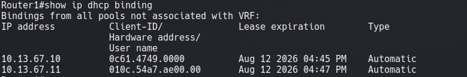

**Pool DHCP de Router1:**

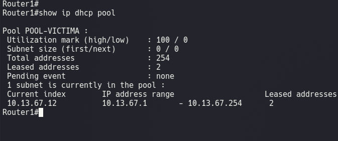

254 direcciones disponibles en el rango 10.13.67.1–10.13.67.254, 2 arrendadas correctamente antes de cualquier ataque.

**Configuración de red de la víctima:**

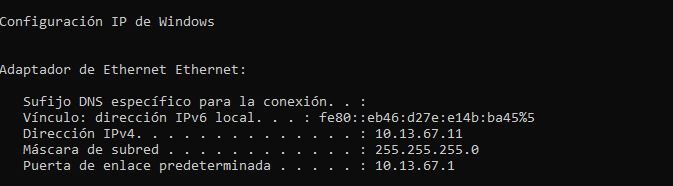
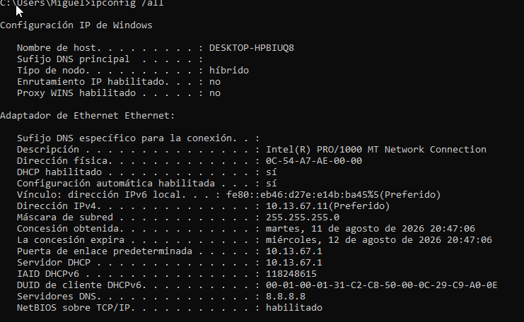

La víctima tiene IP legítima 10.13.67.11/24, gateway 10.13.67.1 y **Servidor DHCP: 10.13.67.1** (Router1) — esta última línea es la evidencia clave a comparar después del ataque.

**Tabla ARP de la víctima:**

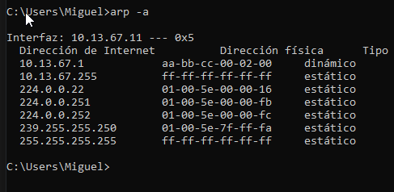

La víctima conoce correctamente la MAC real del gateway (10.13.67.1 → `aa:bb:cc:00:02:00`).

---

## 3. Ejecución del ataque

Ataque ejecutado desde Kali con script propio en Python (`DHCP_spoofing.py`), configurando un servidor DHCP falso escuchando en la VLAN 10.

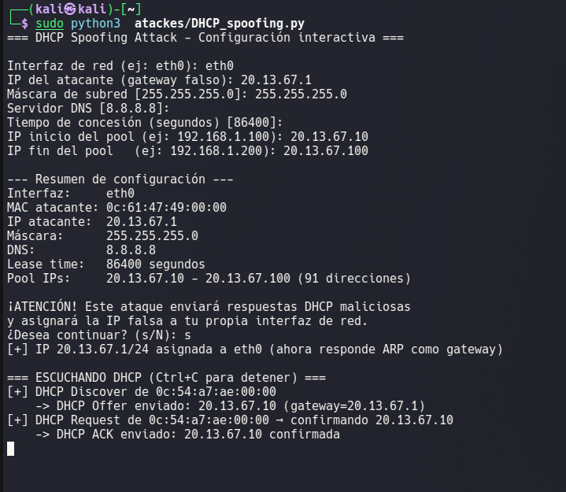

El script ganó la carrera contra Router1: capturó el `DHCPDISCOVER` de la víctima y respondió antes con un `DHCPOFFER`/`DHCPACK` malicioso.

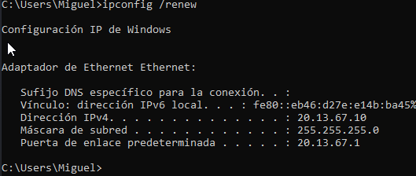

**Hallazgo relevante:** durante la configuración interactiva del script se ingresó `20.13.67.1` como gateway falso (en vez de `10.13.67.1`), por lo que el pool falso completo quedó en la subred `20.13.67.0/24`, ajena a la red real. Esto derivó en un ataque con impacto de **Denegación de Servicio (DoS)** en vez del MITM clásico con reenvío de tráfico: la víctima recibió una IP "válida" en apariencia, pero en una subred no enrutada por el atacante.

---

## 4. Verificación del ataque exitoso

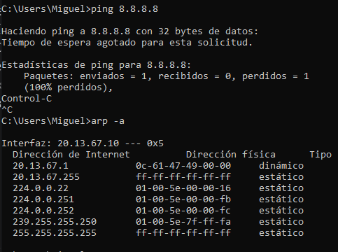

- `ping 8.8.8.8` → **100% de paquetes perdidos**, sin conectividad a internet.
- `arp -a` → el gateway falso `20.13.67.1` resuelve a la MAC del Kali (`0c:61:47:49:00:00`), confirmando que el atacante controla esa dirección — pero al no tener salida real hacia la red 10.13.67.0/24 ni internet, la víctima queda completamente aislada.

**Conclusión de esta fase:** el DHCP Spoofing se ejecutó con éxito (el Kali ganó la respuesta al servidor legítimo), con impacto de **DoS por aislamiento total** en vez de intercepción de tráfico — una variante igualmente válida y documentable del ataque.

---

## 5. Mitigación

**Configuración aplicada en Switch1:**

```
enable
configure terminal

ip dhcp snooping
ip dhcp snooping vlan 10
no ip dhcp snooping information option

interface e0/2
 ip dhcp snooping trust

interface e0/0
 ip dhcp snooping limit rate 10
 switchport port-security
 switchport port-security maximum 1
 switchport port-security violation restrict
 switchport port-security mac-address sticky

interface e0/1
 ip dhcp snooping limit rate 10
 switchport port-security
 switchport port-security maximum 1
 switchport port-security violation restrict
 switchport port-security mac-address sticky

end
write memory
```

**Explicación de cada comando:**

| Comando | Función |
|---|---|
| `ip dhcp snooping` + `vlan 10` | Activa la inspección de mensajes DHCP en la VLAN 10, distinguiendo puertos confiables de no confiables. |
| `no ip dhcp snooping information option` | Desactiva la inserción de la Opción 82 (Relay Agent Information) — necesario en este escenario porque Router1 no es un relay DHCP real y descartaba las solicitudes que llegaban con esa opción insertada. |
| `interface e0/2` → `ip dhcp snooping trust` | Marca el puerto hacia **Router1** como confiable — único puerto por el que se permite reenviar `DHCPOFFER`/`DHCPACK`. |
| `e0/0` y `e0/1` (no confiables) | Cualquier `DHCPOFFER`/`DHCPACK` proveniente de estos puertos (como el del Kali) es descartado automáticamente por el switch. |
| `ip dhcp snooping limit rate 10` | Limita a 10 paquetes DHCP/segundo en puertos no confiables, mitigando también DHCP Starvation. |
| `switchport port-security ...` | Refuerzo adicional: 1 MAC por puerto, evitando rotación de MAC para evadir el rate-limit. |

> **Nota de troubleshooting:** al activar `ip dhcp snooping` por primera vez, ninguna máquina lograba obtener IP — ni siquiera del servidor legítimo. La causa fue la inserción automática de la Opción 82 en las solicitudes reenviadas desde puertos no confiables, la cual Router1 (al no ser un relay real) rechazaba silenciosamente.

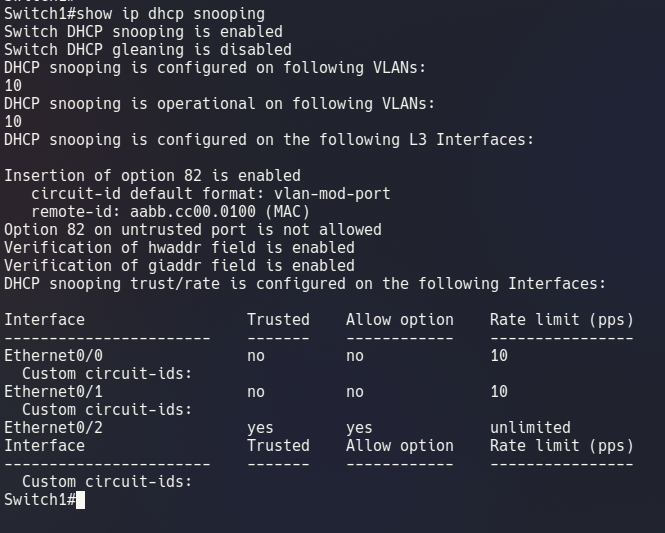

Corregido desactivando la inserción de la opción con `no ip dhcp snooping information option`:

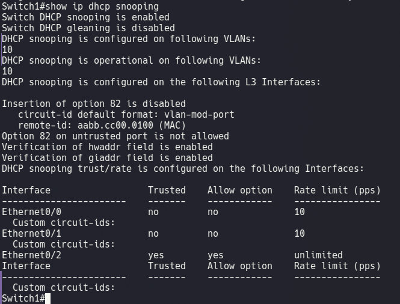

---

## 6. Reintento del ataque tras la mitigación

Se ejecuta nuevamente `DHCP_spoofing.py` desde Kali:

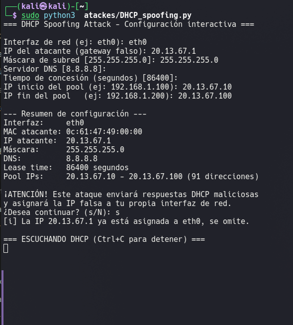

El script queda escuchando sin recibir ningún `DHCPDISCOVER` de la víctima para responder — el switch ya no reenvía las ofertas falsas desde el puerto no confiable e0/0.

Mientras tanto, la víctima renueva su IP correctamente contra el servidor legítimo:

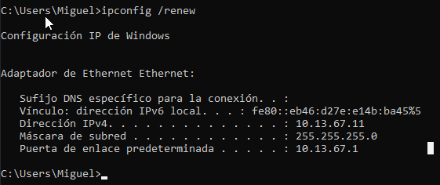

---

## 7. Verificación final post-mitigación

**Tabla ARP de la víctima:**

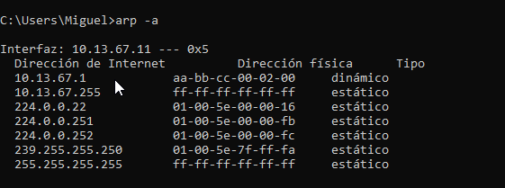

**Configuración de red completa de la víctima:**

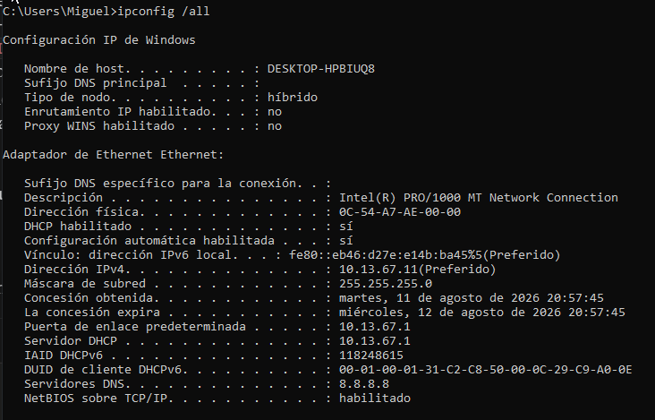

IP 10.13.67.11/24, gateway 10.13.67.1, **Servidor DHCP: 10.13.67.1** (Router1, el legítimo) — sin rastro del ataque.

**Bindings en Router1:**

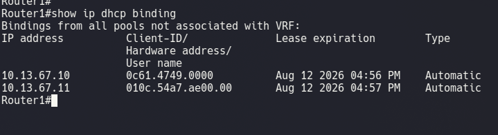

**Tabla de bindings de DHCP Snooping en Switch1:**

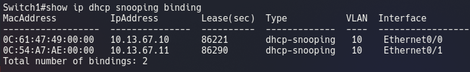

El switch construyó su propia tabla de confianza (MAC, IP, VLAN, puerto, lease) para ambos hosts, base que además habilitaría Dynamic ARP Inspection si se combinara con ese mecanismo.

---

## 8. Tabla comparativa — Antes / Durante / Después

| Indicador | Antes del ataque | Durante el ataque | Después de la mitigación |
|---|---|---|---|
| IP de la víctima | 10.13.67.11/24 (real) | 20.13.67.10/24 (falsa) ❌ | 10.13.67.11/24 (real) ✅ |
| Gateway asignado | 10.13.67.1 (real) | 20.13.67.1 (Kali) ❌ | 10.13.67.1 (real) ✅ |
| Servidor DHCP reportado | 10.13.67.1 (Router1) | N/A (subred falsa) | 10.13.67.1 (Router1) ✅ |
| DHCP Snooping | Deshabilitado | Deshabilitado | Habilitado, puerto e0/2 confiable |
| Conectividad a internet | Normal | 100% pérdida (DoS) | Normal, 0% pérdida |
| Resultado del ataque (`DHCP_spoofing.py`) | N/A | Exitoso (víctima aislada) | Bloqueado (sin `DHCPDISCOVER` recibido) |
| Puertos no confiables (e0/0, e0/1) | Sin restricción | Sin restricción | `DHCPOFFER`/`ACK` descartados + rate-limit 10 pps |

---

## 9. Conclusión

El ataque de **DHCP Spoofing** explotó la ausencia de `DHCP Snooping` en Switch1: al no existir distinción entre puertos confiables y no confiables, el servidor DHCP falso montado en Kali pudo competir libremente contra Router1 y ganar la respuesta hacia la víctima. En esta ejecución particular, un error de configuración en el gateway falso (`20.13.67.1` en vez de `10.13.67.1`) derivó en un impacto de **Denegación de Servicio** por aislamiento de subred, en lugar del MITM clásico con reenvío de tráfico — ambos son resultados posibles y documentables de la misma técnica, dependiendo de cómo el atacante configure su servidor falso.

La mitigación con **DHCP Snooping**, marcando únicamente el puerto hacia el servidor legítimo (Router1) como confiable, bloqueó por completo la capacidad del atacante de responder solicitudes DHCP, sin afectar el servicio legítimo. Un punto clave documentado en el proceso fue el conflicto entre la **inserción de la Opción 82** y un servidor DHCP no-relay (Router1): esta opción, habilitada por defecto junto con DHCP Snooping, provocó una interrupción total del servicio hasta ser desactivada — una consideración importante al implementar esta mitigación en entornos donde el servidor DHCP no es un dispositivo de tipo relay/IOS-XE con soporte nativo para Opción 82.

---

**Institución:** ITLA — Seguridad Informática
**Materia:** Seguridad de Redes (TSI-203)
**Profesor:** Jonathan Rondón
**Estudiante:** Miguel Ramirez Meli — Matrícula 2025-1367
