# DHCP Starvation


---

## Topología de red

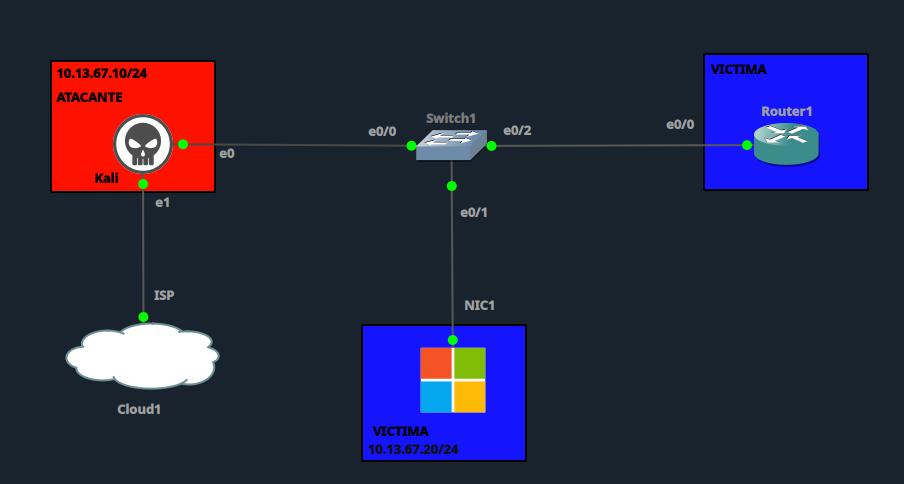

| Rol | Dispositivo | IP | Interfaz |
|---|---|---|---|
| Atacante | Kali Linux | 10.13.67.x/24 (DHCP) | e0 → Switch1 e0/0 |
| Víctima | PC Windows | 10.13.67.11/24 (DHCP) | NIC1 → Switch1 e0/1 |
| Servidor DHCP legítimo | Router1 | 10.13.67.1/24 | e0/0 → Switch1 e0/2 |

---

## 1. Configuración inicial vulnerable

**Switch1** — VLAN única (10), sin `DHCP Snooping` ni `Port Security`:

```
enable
configure terminal
hostname Switch1

vlan 10
 name ATAQUE

interface e0/0
 switchport mode access
 switchport access vlan 10
 no switchport port-security
 spanning-tree portfast
 no shutdown

interface e0/1
 switchport mode access
 switchport access vlan 10
 no switchport port-security
 spanning-tree portfast
 no shutdown

interface e0/2
 switchport mode access
 switchport access vlan 10
 no switchport port-security
 spanning-tree portfast
 no shutdown

no ip dhcp snooping

end
write memory
```

**Router1** — servidor DHCP legítimo para la red 10.13.67.0/24, pool completo:

```
enable
configure terminal
hostname Router1

interface e0/0
 ip address 10.13.67.1 255.255.255.0
 no shutdown
exit

ip dhcp excluded-address 10.13.67.1

ip dhcp pool POOL-VICTIMA
 network 10.13.67.0 255.255.255.0
 default-router 10.13.67.1
 dns-server 8.8.8.8
 lease 0 0 10

end
write memory
```

**Vulnerabilidades presentes:**
- ❌ `ip dhcp snooping` deshabilitado → sin límite de mensajes `DHCPDISCOVER` por puerto ni verificación de MAC de origen.
- ❌ Sin `port-security` → el atacante puede generar tráfico con miles de MACs de origen distintas (spoofing de MAC) sin ninguna restricción del switch.
- ❌ `lease 0 0 10` (10 minutos) → concesión corta usada para que las pruebas del laboratorio no tomen horas, pero que en producción también facilitaría un ciclo de agotamiento más rápido si se combina con starvation sostenido.

> **Nota de configuración:** durante la preparación se probó primero con un pool reducido artificialmente (10 direcciones, vía exclusiones) para acelerar la demostración inicial del ataque; luego se reinició el pool a su rango completo (253 direcciones disponibles) para un escenario más realista, documentado en la sección 3.

---

## 2. Línea base — Estado ANTES del ataque

**Bindings y pool del servidor DHCP legítimo (Router1), pool completo tras el reinicio:**

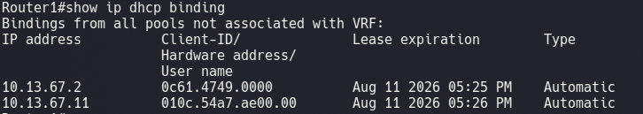
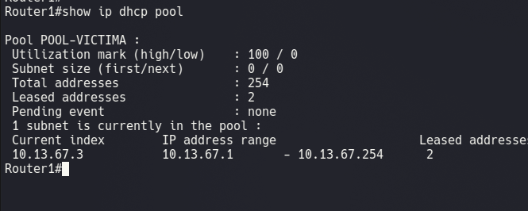

Rango completo disponible: 10.13.67.2–10.13.67.254 (253 direcciones), solo 2 arrendadas (Kali y víctima) antes del ataque.

**Configuración de red de la víctima:**

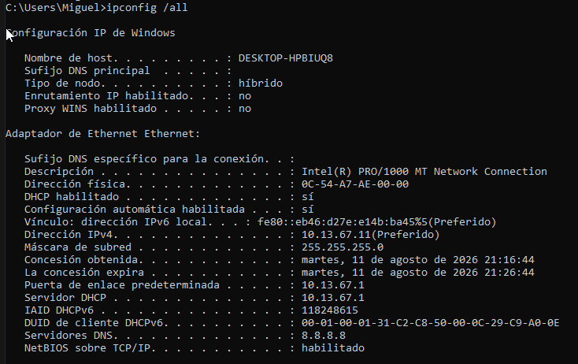

IP legítima 10.13.67.11/24, gateway y Servidor DHCP 10.13.67.1 (Router1), concesión de 10 minutos.

---

## 3. Ejecución del ataque

Ataque ejecutado desde Kali con script propio en Python (`DHCP_Starvation.py`), enviando **1000 solicitudes `DHCPDiscover` con MACs de origen falsificadas y distintas** (delay de 0.01s entre cada una), simulando 1000 clientes falsos compitiendo por el pool.

**Primera corrida (validación con pool reducido a 10 direcciones):**

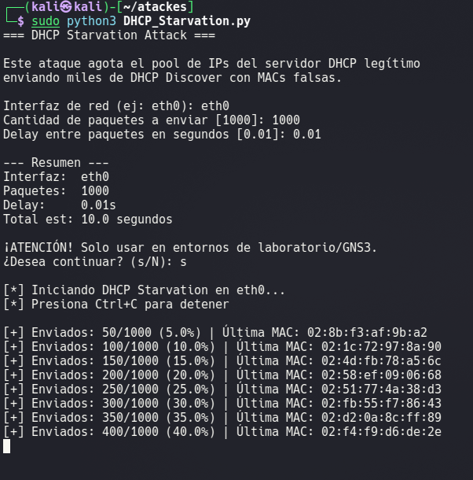

El pool acotado (10.13.67.10–19) se agotó por completo:

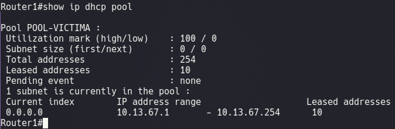

> **Hallazgo importante:** al forzar `ipconfig /renew` en la víctima tras este primer agotamiento, esta **sí logró obtener IP**, porque su dirección ya tenía un binding activo previo a su MAC — el servidor DHCP prioriza renovar la misma IP a un cliente ya conocido en vez de negarla. El impacto real del starvation afecta a clientes **nuevos**, sin binding previo.

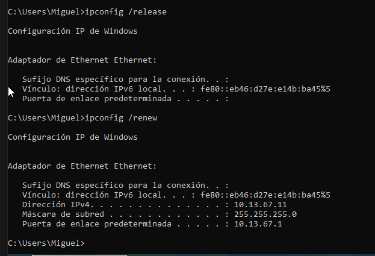

**Segunda corrida (pool completo, 253 direcciones, escenario definitivo):**

Se reinició el pool de Router1 (`clear ip dhcp binding *`, exclusiones ajustadas a solo la IP del gateway) y se repitió el ataque:

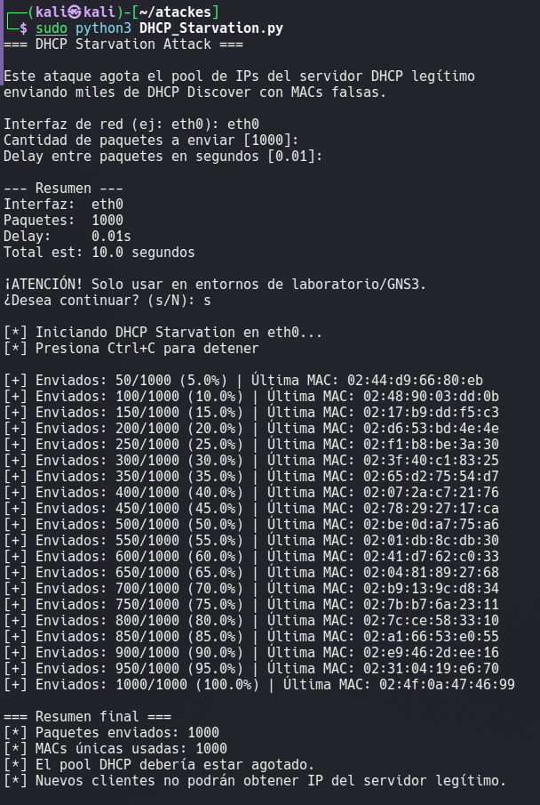

1000 paquetes enviados, 1000 MACs únicas generadas.

---

## 4. Verificación del ataque exitoso

**Pool completamente agotado:**

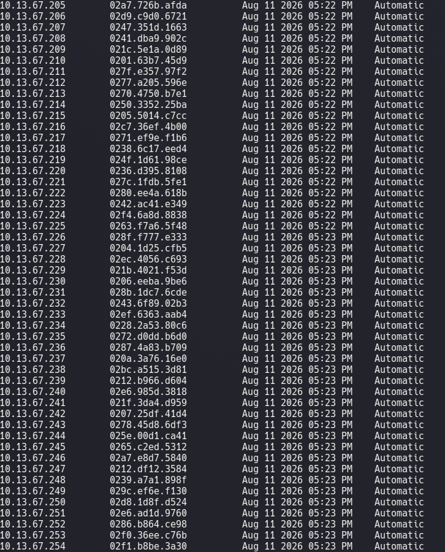

La tabla de bindings llega hasta la última dirección del rango (10.13.67.254) — las 253 direcciones disponibles quedaron ocupadas, en su mayoría por MACs falsas generadas por el ataque.

**Impacto confirmado en la víctima:**

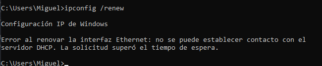

`ipconfig /renew` falla con **"no se puede establecer contacto con el servidor DHCP. La solicitud superó el tiempo de espera."**

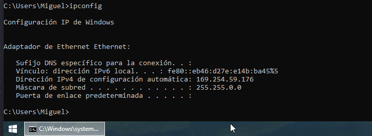

La interfaz cae a una dirección **APIPA (169.254.x.x)**, sin gateway — la víctima queda completamente desconectada de la red real, sin poder obtener ni renovar una IP válida porque el pool del servidor legítimo está agotado.

---

## 5. Mitigación

**Configuración aplicada en Switch1:**

```
enable
configure terminal

ip dhcp snooping
ip dhcp snooping vlan 10
no ip dhcp snooping information option

interface e0/2
 ip dhcp snooping trust

interface e0/0
 ip dhcp snooping limit rate 5
 switchport port-security
 switchport port-security maximum 1
 switchport port-security violation restrict
 switchport port-security mac-address sticky

interface e0/1
 ip dhcp snooping limit rate 5
 switchport port-security
 switchport port-security maximum 1
 switchport port-security violation restrict
 switchport port-security mac-address sticky

end
write memory
```

**Explicación de cada comando:**

| Comando | Función |
|---|---|
| `ip dhcp snooping` + `vlan 10` | Activa la inspección DHCP en la VLAN, base para el resto de protecciones. |
| `interface e0/2 trust` | Marca el puerto hacia Router1 como confiable — sin esto, DHCP dejaría de funcionar del todo. |
| `ip dhcp snooping limit rate 5` | Limita a 5 paquetes DHCP/segundo en los puertos no confiables — mitigación específica contra el volumen de `DHCPDiscover` que genera el starvation. |
| `switchport port-security maximum 1 + sticky + restrict` | **Mitigación principal en este escenario**: limita cada puerto a una única MAC real aprendida. Como el ataque depende de generar miles de MACs de origen falsas, esta única política ya bloquea el ataque en la práctica, sin necesidad de que se dispare siquiera el rate-limit de DHCP Snooping. |

Verificación de la mitigación aplicada:

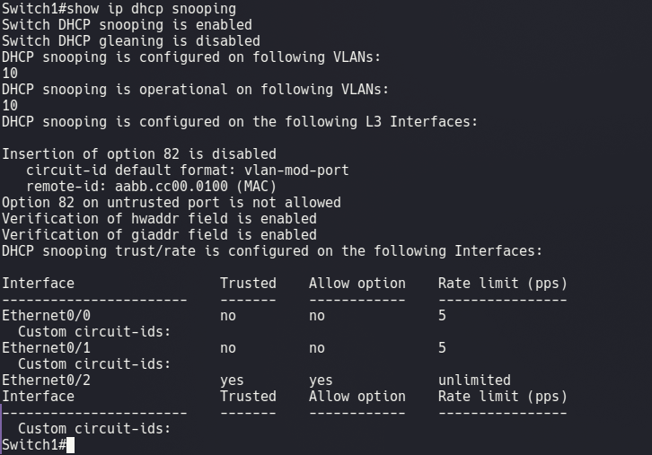

`show ip dhcp snooping` confirma la Opción 82 deshabilitada (lección aprendida del laboratorio de DHCP Spoofing) y el rate-limit de 5 pps activo en los puertos no confiables. `show errdisable recovery` confirma que el timer de auto-recuperación para `dhcp-rate-limit` está deshabilitado — un puerto que caiga en err-disable por esta causa requeriría reactivación manual (`shutdown` / `no shutdown`).

**Se reinició el pool antes de continuar** (`clear ip dhcp binding *`), confirmando que el tráfico legítimo de la víctima sigue funcionando con la mitigación activa:

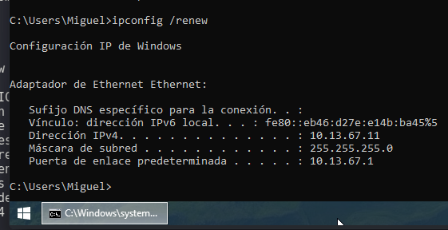
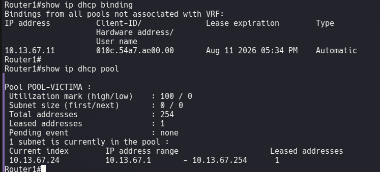

---

## 6. Reintento del ataque tras la mitigación

Se ejecuta nuevamente `DHCP_Starvation.py` desde Kali (1000 paquetes):

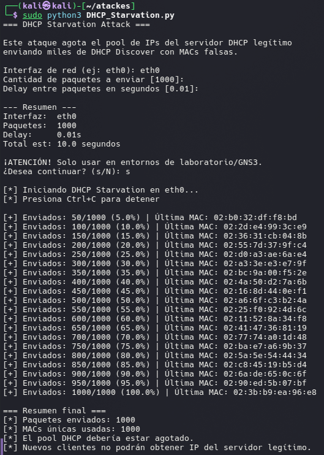

El switch bloqueó el ataque de inmediato mediante **Port Security**, registrando **1000 violaciones de seguridad** en el puerto e0/0 (una por cada MAC falsa distinta a la ya aprendida), sin apagar el puerto (modo `restrict`):

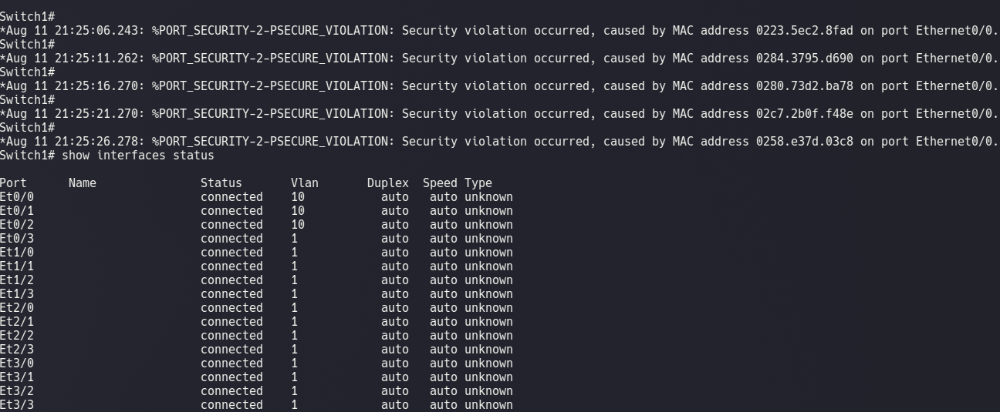

`show interfaces status` confirma que el puerto e0/0 permanece **`connected`** — el tráfico ilegítimo se descarta paquete por paquete sin interrumpir la conectividad del puerto para la MAC legítima.

---

## 7. Verificación final post-mitigación

**Pool del servidor DHCP prácticamente intacto:**

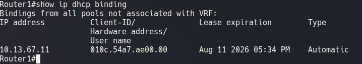
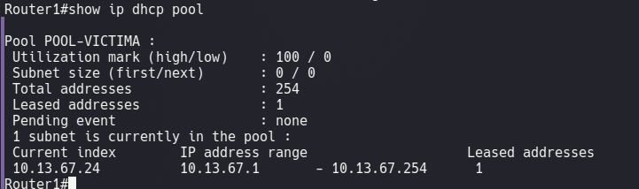

Solo 1 dirección arrendada (la de la víctima) de 254 disponibles — el ataque de 1000 paquetes no logró consumir ni una dirección adicional del pool.

**Conectividad de la víctima sin afectaciones:**

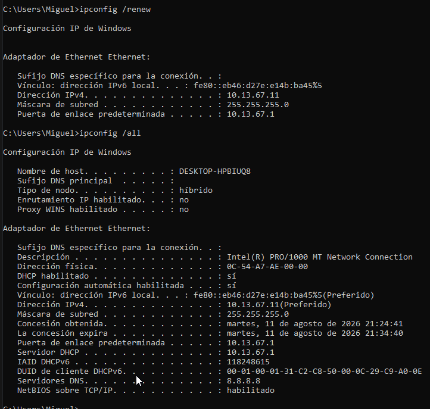

**Estado final de Port Security en el switch:**

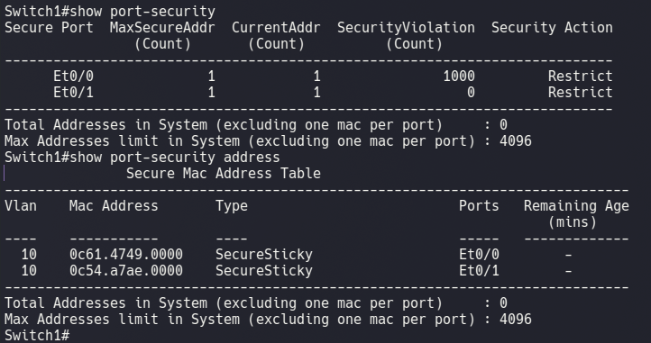

Solo dos MACs seguras aprendidas (Kali y víctima), tipo `SecureSticky`, una por puerto.

**Pool final en Router1:**

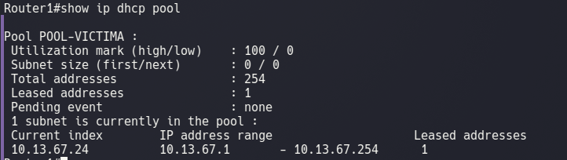

---

## 8. Tabla comparativa — Antes / Durante / Después

| Indicador | Antes del ataque | Durante el ataque | Después de la mitigación |
|---|---|---|---|
| Direcciones arrendadas en el pool | 2 de 253 | 253 de 253 (agotado) ❌ | 1 de 254 (intacto) ✅ |
| IP de la víctima | 10.13.67.11/24 (real) | APIPA 169.254.x.x ❌ | 10.13.67.11/24 (real) ✅ |
| `ipconfig /renew` en la víctima | Exitoso | Falla ("timeout" con servidor DHCP) | Exitoso, 0% pérdida |
| Violaciones de Port Security en e0/0 | 0 | N/A (sin mitigación) | 1000 (todas bloqueadas, modo restrict) |
| Estado del puerto e0/0 | `connected` | `connected` (sin protección) | `connected` (protegido, tráfico ilegítimo descartado) |
| MACs únicas usadas por el ataque | N/A | 1000 (todas aceptadas por el pool) | 1000 (todas rechazadas por Port Security) |
| Resultado del ataque (`DHCP_Starvation.py`) | N/A | Exitoso (pool agotado, DoS confirmado) | Bloqueado (pool intacto) |

---

## 9. Conclusión

El ataque de **DHCP Starvation** explotó la ausencia de `DHCP Snooping` y `Port Security` en Switch1: al no existir ningún límite sobre la cantidad de solicitudes `DHCPDiscover` ni verificación de la MAC de origen, el script del atacante pudo generar 1000 solicitudes con MACs falsificadas distintas, agotando por completo el pool de 253 direcciones disponibles en Router1. El impacto resultante fue una **Denegación de Servicio (DoS)** clara: clientes legítimos nuevos no podían obtener una IP válida, cayendo a direcciones APIPA sin conectividad real.

Un hallazgo relevante durante las pruebas fue que un cliente **ya conocido** por el servidor (con un binding activo previo) no se ve afectado al renovar su propia IP, incluso con el pool agotado — el impacto del starvation recae específicamente sobre clientes nuevos que aún no tienen una concesión reservada a su nombre.

La mitigación combinando **DHCP Snooping (rate-limit de 5 pps)** y, sobre todo, **Port Security (máximo 1 MAC por puerto, modo restrict)** resultó completamente efectiva: de las 1000 MACs falsas generadas en el reintento, ninguna logró pasar del switch, evidenciado en las 1000 violaciones de seguridad registradas y en un pool que se mantuvo prácticamente intacto. Port Security demostró ser la defensa más directa contra este ataque específico, ya que ataca la causa raíz de la técnica (la generación masiva de MACs falsas) antes incluso de que el tráfico llegue a ser evaluado por el rate-limit de DHCP Snooping.

---

**Institución:** ITLA — Seguridad Informática
**Materia:** Seguridad de Redes (TSI-203)
**Profesor:** Jonathan Rondón
**Estudiante:** Miguel Ramirez Meli — Matrícula 2025-1367
