# DNS Spoofing / DNS Poisoning mediante ARP Poisoning (MITM)


---

## 📌 Descripción del laboratorio

Este laboratorio documenta un ataque de **DNS Spoofing / DNS Poisoning**, apoyado en **ARP Poisoning** para posicionar al atacante como Man-in-the-Middle (MITM) entre la víctima y el gateway. El objetivo del atacante es que la víctima, al intentar resolver el dominio `itla.edu.do`, sea redirigida a un servidor web falso (clon del portal de login del ITLA) controlado por el atacante, en lugar del servidor legítimo.

Se documenta el ciclo completo: configuración vulnerable → línea base → ataque exitoso → verificación → mitigación (incluyendo un intento fallido y su corrección) → reintento del ataque → verificación final.

---

## 🗺️ Topología de red

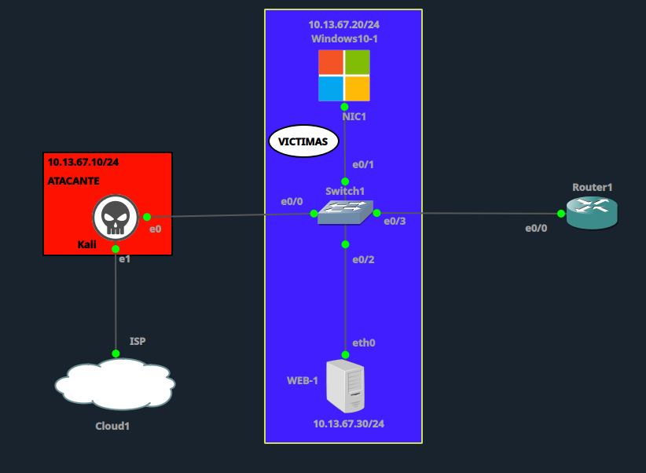

| Dispositivo | Rol | IP | Interfaz |
|---|---|---|---|
| **Kali (ATACANTE)** | Atacante | 10.13.67.10/24 | e0 → Switch1 e0/0 |
| **Windows10-1 (VICTIMAS)** | Víctima | 10.13.67.20/24 | NIC1 → Switch1 e0/1 |
| **WEB-1** | Servidor web legítimo (`itla.edu.do`) | 10.13.67.30/24 | eth0 → Switch1 e0/2 |
| **Router1** | Gateway + Servidor DNS local | 10.13.67.1/24 | e0/0 → Switch1 e0/3 |
| **Switch1** | Switch L2 (VLAN 10) | — | e0/0, e0/1, e0/2, e0/3 |
| **Cloud1** | Salida a ISP (fuera del alcance del ataque) | — | — |

El servidor **WEB-1 (10.13.67.30)**, conectado por `e0/2`, es el que aloja el contenido legítimo de `itla.edu.do` y debe ser el destino de la resolución DNS en condiciones normales.

---

## ⚙️ 1. Configuración vulnerable

### Router1 — Gateway + servidor DNS local

```
enable
configure terminal
hostname Router1

interface e0/0
 description Enlace hacia Switch1 (LAN VICTIMAS)
 ip address 10.13.67.1 255.255.255.0
 no shutdown
exit

ip dns server
ip host itla.edu.do 10.13.67.30
ip domain lookup

end
write memory
```

### Switch1 — Sin protecciones de capa 2

```
enable
configure terminal
hostname Switch1

vlan 10
 name VICTIMAS
exit

interface e0/0
 description Enlace hacia ATACANTE (Kali)
 switchport mode access
 switchport access vlan 10
 no shutdown
exit

interface e0/1
 description Enlace hacia PC (VICTIMA)
 switchport mode access
 switchport access vlan 10
 no shutdown
exit

interface e0/2
 description Enlace hacia WEB-1
 switchport mode access
 switchport access vlan 10
 no shutdown
exit

interface e0/3
 description Enlace hacia Router1 (Gateway/DNS)
 switchport mode access
 switchport access vlan 10
 no shutdown
exit

end
write memory
```

**Vector de ataque:** sin DHCP Snooping, sin Dynamic ARP Inspection (DAI) y sin Port Security, cualquier host conectado a la VLAN 10 (incluido el atacante) puede enviar respuestas ARP falsificadas sin ninguna validación por parte del switch, habilitando un ataque MITM clásico como base para el DNS Spoofing.

---

## ✅ 2. Línea base (antes del ataque)

Configuración IP de la víctima y resolución DNS en condiciones normales, sin manipulación.

| Verificación | Resultado esperado | Resultado obtenido |
|---|---|---|
| Configuración IP Windows10-1 | IP 10.13.67.20, Gateway/DNS 10.13.67.1 | ✅ Correcto |
| `nslookup itla.edu.do` | Resuelve a 10.13.67.30 | ✅ **10.13.67.30** |
| Navegación a `http://itla.edu.do` | Carga el sitio legítimo (WEB-1) | ✅ Login legítimo del ITLA |

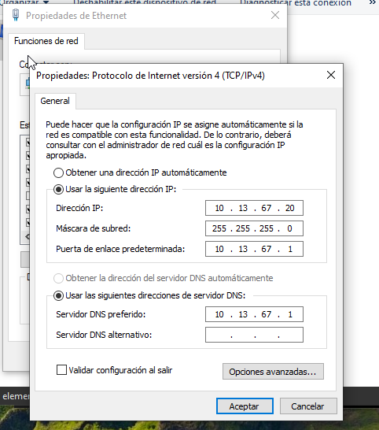
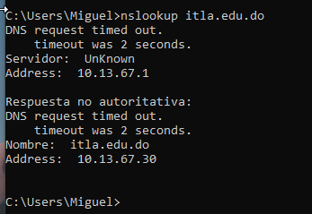
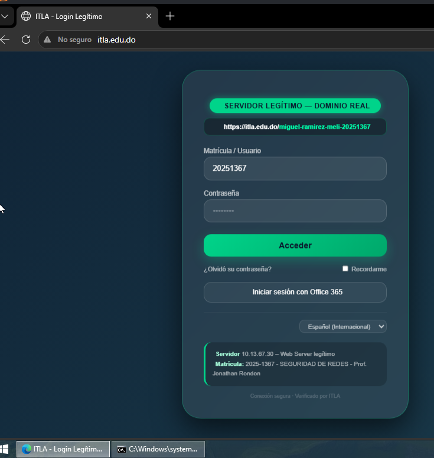

---

## 💀 3. Ejecución del ataque

**Herramienta:** script propio `DNS-Spoofing.py`, ejecutado desde Kali, que combina:

1. **ARP Poisoning bidireccional** — envenena la caché ARP de la víctima (10.13.67.20) y del gateway (10.13.67.1) simultáneamente, posicionando a Kali como MITM del tráfico entre ambos.
2. **DNS Spoofing** — intercepta las consultas DNS de la víctima para `itla.edu.do` y responde con la IP del atacante (10.13.67.10) en lugar de la IP legítima (10.13.67.30).
3. **Servidor web falso** — sirve un clon del portal de login del ITLA desde `/home/kali/url`, para capturar credenciales.

```bash
sudo python3 DNS-Spoofing.py
```

Parámetros usados:
- Interfaz: `eth0`
- IP víctima: `10.13.67.20`
- IP gateway/DNS legítimo: `10.13.67.1`
- Dominio a spoofear: `itla.edu.do` → `10.13.67.10`

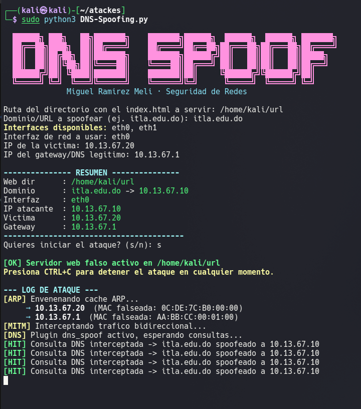

### Verificación del ataque (exitoso)

| Verificación | Resultado esperado (atacante) | Resultado obtenido |
|---|---|---|
| `nslookup itla.edu.do` (víctima) | Resuelve a 10.13.67.10 | ❌ **10.13.67.10** (comprometido) |
| Navegación a `http://itla.edu.do` | Carga página falsa | ❌ Página de login **clonada**, servida por Kali |

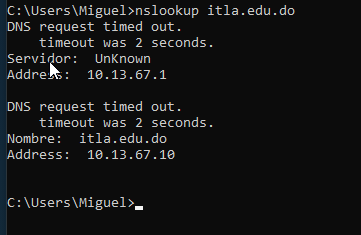
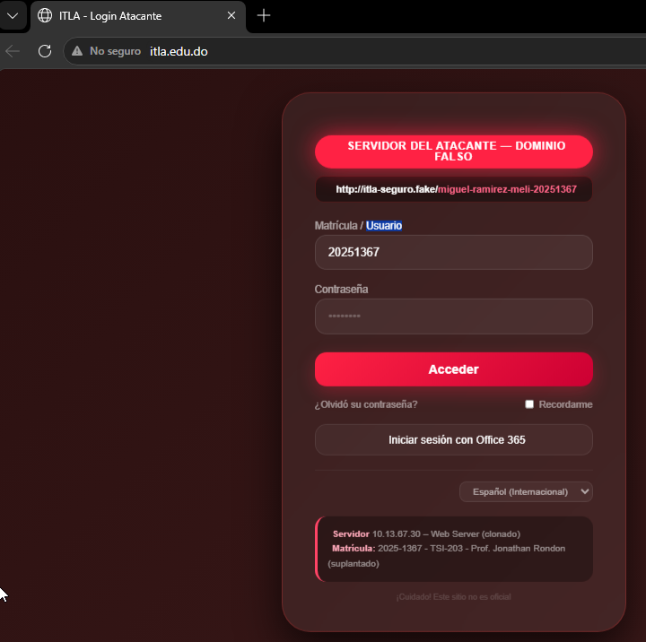

El ataque queda confirmado: la víctima fue redirigida exitosamente al servidor del atacante mediante DNS Spoofing, apoyado en ARP Poisoning para lograr el MITM.

---

## 🛡️ 4. Mitigación

La mitigación se implementa en **Switch1**, combinando **Dynamic ARP Inspection (DAI)** con una **ARP ACL estática**, ya que los hosts de la topología usan **IP estática** (no hay transacciones DHCP reales que permitan poblar la tabla dinámica de bindings de DHCP Snooping).

### ⚠️ Intento fallido (documentado como parte del proceso)

Un primer intento de ACL incluyó una regla comodín para no tener que registrar todas las MACs de la red:

```
arp access-list PROTEGER-GATEWAY
 permit ip host 10.13.67.1 mac host aabb.cc00.0100
 permit ip any mac any   ← ERROR: anula la protección
exit
```

Al evaluarse en orden, la segunda línea (`permit ip any mac any`) hacía match con **cualquier** paquete ARP, incluyendo los falsificados por el atacante, dejando `ACL Drops` en 0 y el ataque seguía funcionando sin ninguna restricción real.

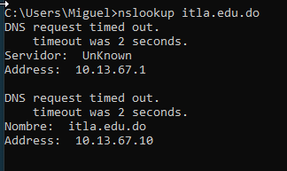

**Lección:** un catch-all al final de una ARP ACL diseñada para DAI anula por completo la protección, ya que permite cualquier combinación IP-MAC no contemplada explícitamente.

### ✅ Configuración final corregida — Switch1

```
enable
configure terminal
hostname Switch1

! --- ACL con los 4 bindings legítimos, SIN catch-all ---
arp access-list PROTEGER-GATEWAY
 permit ip host 10.13.67.1 mac host aabb.cc00.0100
 permit ip host 10.13.67.10 mac host 0c61.4749.0000
 permit ip host 10.13.67.20 mac host 0cde.7cb0.0000
 permit ip host 10.13.67.30 mac host 0242.477b.4100
exit

! --- DAI valida contra la ACL estática en la VLAN 10 ---
ip arp inspection filter PROTEGER-GATEWAY vlan 10 static
ip arp inspection vlan 10

! --- Puerto hacia el gateway como confiable ---
interface e0/3
 description Enlace hacia Router1 (Gateway/DNS) - TRUSTED
 ip arp inspection trust
exit

! --- Limitar tasa de ARP en puertos de acceso (anti flooding) ---
interface e0/0
 description Enlace hacia ATACANTE (Kali)
 ip arp inspection limit rate 15
exit

interface e0/1
 description Enlace hacia PC (VICTIMA)
 ip arp inspection limit rate 15
exit

! --- Port Security como capa adicional (violation restrict, no shutdown) ---
interface e0/0
 switchport port-security
 switchport port-security maximum 1
 switchport port-security violation restrict
 switchport port-security mac-address sticky
exit

interface e0/1
 switchport port-security
 switchport port-security maximum 1
 switchport port-security violation restrict
 switchport port-security mac-address sticky
exit

end
write memory
```

**Bindings IP–MAC registrados en la ACL:**

| Host | IP | MAC |
|---|---|---|
| Router1 (gateway/DNS) | 10.13.67.1 | `aabb.cc00.0100` |
| Kali (atacante) | 10.13.67.10 | `0c61.4749.0000` |
| Windows10-1 (víctima) | 10.13.67.20 | `0cde.7cb0.0000` |
| WEB-1 (servidor legítimo) | 10.13.67.30 | `0242.477b.4100` |

**Cómo funciona:** al eliminar el catch-all, cualquier paquete ARP que no coincida exactamente con uno de los 4 bindings permitidos cae en el **deny implícito** de la ACL y es descartado por DAI. Cuando el atacante intenta suplantar al gateway (10.13.67.1) con una MAC distinta a la real, el switch descarta el paquete y el envenenamiento ARP falla, cortando el MITM en el que se apoya el DNS Spoofing.

---

## 🔁 5. Reintento del ataque (post-mitigación)

Se ejecuta nuevamente `DNS-Spoofing.py` desde Kali contra el mismo objetivo, con la mitigación ya activa en Switch1.

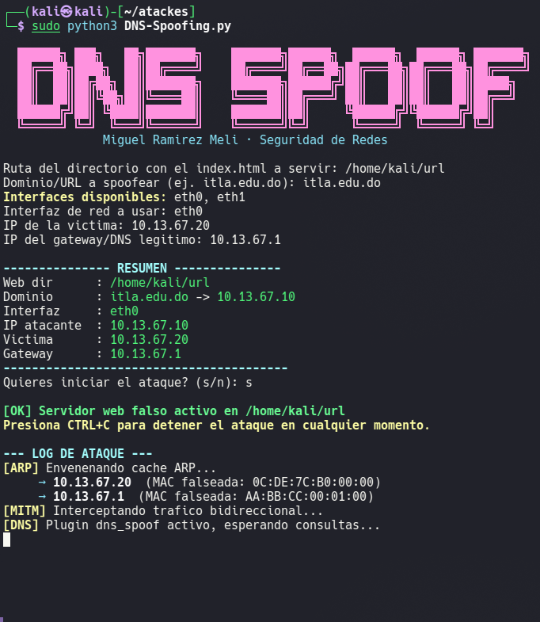

El script queda **esperando consultas indefinidamente**, sin lograr ningún `[HIT]` — a diferencia del ataque original, donde el envenenamiento ARP se completaba y las consultas DNS eran interceptadas de inmediato.

### Evidencia técnica en el switch

```
Switch1#show ip arp inspection statistics vlan 10

 Vlan      Forwarded        Dropped     DHCP Drops      ACL Drops
 ----      ---------        -------     ----------      ---------
   10            193             50              0             50
```

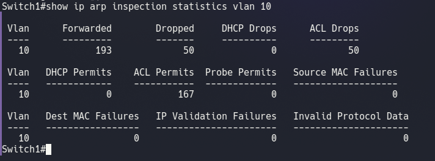

**ACL Drops: 50** — prueba directa de que Switch1 está descartando activamente los paquetes ARP falsificados enviados por el atacante.

---

## 🏁 6. Verificación final

| Verificación | Resultado esperado | Resultado obtenido |
|---|---|---|
| `nslookup itla.edu.do` (víctima) | Resuelve a 10.13.67.30 | ✅ **10.13.67.30** |
| Navegación a `http://itla.edu.do` | Carga el sitio legítimo (WEB-1) | ✅ Login legítimo del ITLA |
| Log de Kali | Sin `[HIT]`, ARP poisoning fallido | ✅ Confirmado |
| `show ip arp inspection statistics` | ACL Drops > 0 | ✅ **50 drops** |

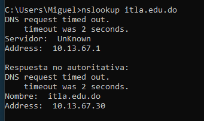
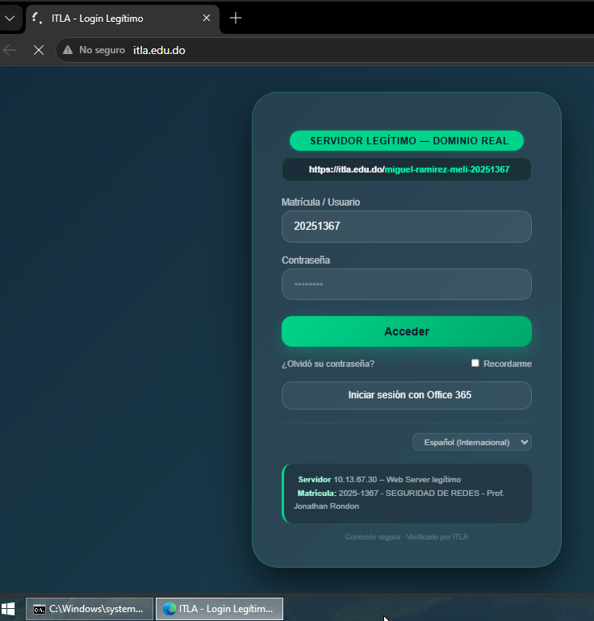

---

## 📊 Tabla comparativa: antes vs. después de la mitigación

| Aspecto | 🔴 Antes (vulnerable) | 🟢 Después (mitigado) |
|---|---|---|
| Resolución `nslookup itla.edu.do` | 10.13.67.10 (atacante) | 10.13.67.30 (legítimo) |
| Página cargada | Login falso/clonado (phishing) | Login legítimo del ITLA |
| ARP Poisoning | Exitoso (envenena víctima y gateway) | Bloqueado (deny implícito de la ACL) |
| DAI / ACL Drops | No aplicaba (sin DAI) | 50 paquetes descartados |
| Protección L2 | Ninguna | DAI + ARP ACL estática + Port Security |
| Superficie de ataque | MITM completo sobre la VLAN | Bindings IP-MAC fijos, MITM no viable |

---

## 🧠 Conclusiones

- El DNS Spoofing en una LAN plana depende críticamente de lograr un **MITM previo vía ARP Poisoning**; sin protección de capa 2, esto es trivial para cualquier host conectado a la VLAN.
- **DHCP Snooping no es viable** como base de DAI en redes con IP estática, ya que la tabla de bindings nunca se puebla y termina bloqueando todo el tráfico legítimo.
- La alternativa correcta es una **ARP ACL estática**, pero debe declarar explícitamente **todos** los bindings IP-MAC legítimos — un catch-all (`permit ip any mac any`) al final anula por completo la protección, como se documentó en el intento fallido.
- Con DAI + ACL correctamente configurados, el switch descarta activamente los paquetes ARP falsificados (evidenciado en `ACL Drops`), impidiendo el MITM y, por lo tanto, el DNS Spoofing.

---

## 📁 Estructura del repositorio

```
.
├── README.md
└── screenshots/
    ├── 01-topologia-inicial.png
    ├── 02-linea-base-ipconfig-windows.png
    ├── 03-linea-base-nslookup.png
    ├── 04-linea-base-web-legitima.png
    ├── 05-ataque-nslookup-envenenado.png
    ├── 06-ataque-kali-dns-spoofing-log.png
    ├── 07-ataque-web-falsa-phishing.png
    ├── 08-topologia-web1-destacado.png
    ├── 09-switch1-puerto-e02-web1.png
    ├── 10-mitigacion-v1-fallida-nslookup.png
    ├── 11-verificacion-final-dai-acl-drops.png
    ├── 12-verificacion-final-kali-sin-hit.png
    ├── 13-verificacion-final-nslookup-correcto.png
    └── 14-verificacion-final-web-legitima.png
```
