# VLAN Hopping vía DTP (Dynamic Trunking Protocol)

-red)

-blue)


## Descripción

Laboratorio de explotación y mitigación de **VLAN Hopping mediante DTP (Dynamic Trunking Protocol)**. El objetivo es convertir un puerto de acceso conectado a un host atacante en un enlace **trunk**, negociando maliciosamente DTP en modo *Desirable*, para obtener visibilidad y acceso a VLANs a las que el atacante no debería tener alcance.

Adicionalmente, se documenta un vector agravante: **VTP sin autenticación**, que amplifica el impacto de un trunk no autorizado.

## Topología

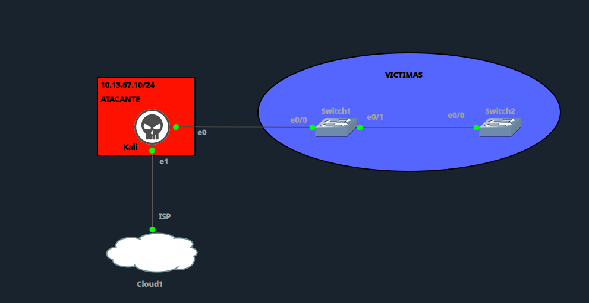

| Elemento | Detalle |
|---|---|
| Atacante (Kali) | `10.13.67.10/24`, conectado a `Switch1 e0/0` |
| Switch1 ↔ Switch2 | Enlace troncal legítimo (`Switch1 e0/1` — `Switch2 e0/0`) |
| VLANs víctimas | VLAN 10 (`VICTIMAS_A`), VLAN 20 (`VICTIMAS_B`), VLAN 30 (`IT`) |
| Dominio VTP | `miguel.local`, versión 2 |

---

## 1. Configuración inicial vulnerable

### Switch1

```
hostname Switch1
!
vtp domain miguel.local
vtp mode server
vtp version 2
! (sin password -> dominio VTP sin autenticación)
!
vlan 10
 name VICTIMAS_A
vlan 20
 name VICTIMAS_B
!
interface e0/0
 description Enlace hacia ATACANTE (Kali)
 switchport mode dynamic auto
 switchport trunk encapsulation dot1q
 no switchport nonegotiate
!
interface e0/1
 description Enlace hacia Switch2
 switchport mode dynamic desirable
 switchport trunk encapsulation dot1q
!
end
```

### Switch2

```
hostname Switch2
!
vtp domain miguel.local
vtp mode client
vtp version 2
!
vlan 10
 name VICTIMAS_A
vlan 20
 name VICTIMAS_B
!
interface e0/0
 description Enlace hacia Switch1
 switchport mode dynamic desirable
 switchport trunk encapsulation dot1q
!
interface e0/1
 description Host victima VLAN 10
 switchport mode access
 switchport access vlan 10
!
interface e0/2
 description Host victima VLAN 20
 switchport mode access
 switchport access vlan 20
!
end
```

**Punto vulnerable:** `Switch1 e0/0` en `dynamic auto` sin `switchport nonegotiate` permite que el puerto **responda** afirmativamente a una solicitud DTP Desirable, migrando de acceso a trunk. El dominio VTP `miguel.local` sin password agrava el impacto al no exigir autenticación para sincronizar la base de datos VLAN.

---

## 2. Línea base (estado previo al ataque)

`show interfaces e0/0 switchport` — Administrative Mode `dynamic auto`, Operational Mode `static access`:

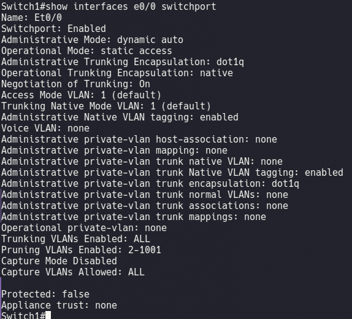

`show vlan brief` — VLANs activas 10, 20, 30 existentes en el switch, sin visibilidad para el atacante en este punto:

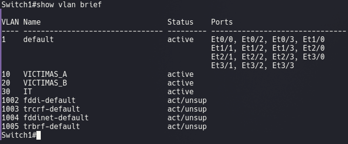

`show vtp status` — dominio `miguel.local`, modo Server, sin autenticación:

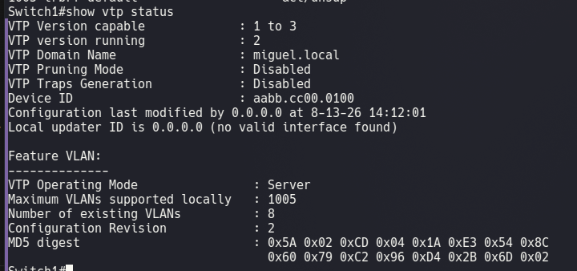

---

## 3. Ataque

Script de ataque: [`MiguelRamirezMeli_2025-1367_DTP_Attack.py`](MiguelRamirezMeli_2025-1367_DTP_Attack.py)

El script construye manualmente un paquete DTP con Scapy (`Dot3/LLC/SNAP`) y envía 10 tramas **DTP Desirable** hacia `01:00:0c:cc:cc:cc`, forzando la negociación de trunk en `Switch1 e0/0`.

### Primer intento (fallido — TLV Status mal formado)

El primer intento usó un byte de Status TLV inválido (`0xa5`), que no corresponde a ningún valor definido de Administrative Status en el protocolo DTP, por lo que el switch no interpretó la solicitud como *Desirable* y el puerto permaneció en `static access`.

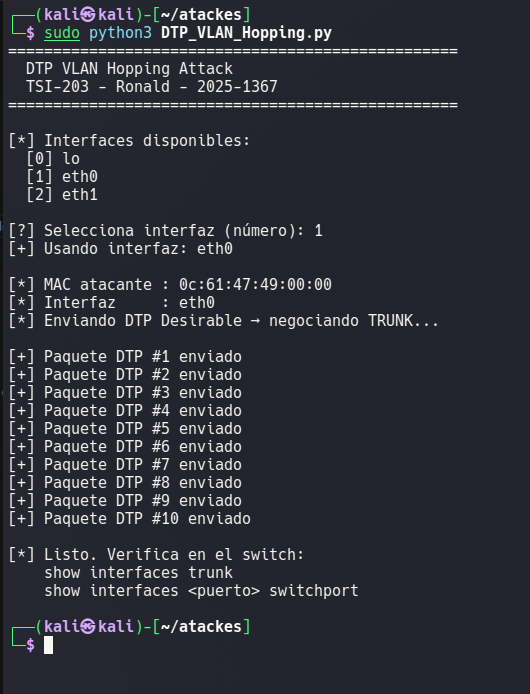
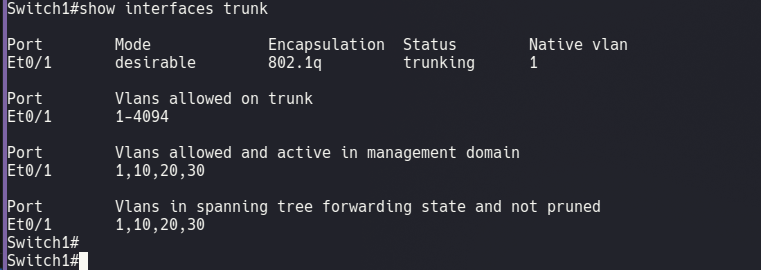
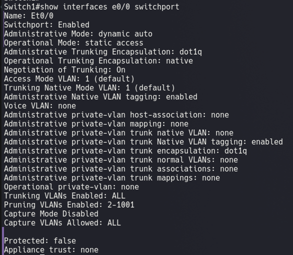

**Corrección aplicada:** el byte de Status TLV se corrigió a `0x03` (Operating Access / Administrative **Desirable**), y se añadió el nombre real del dominio VTP (`miguel.local`) al TLV de Domain.

### Segundo intento (exitoso)

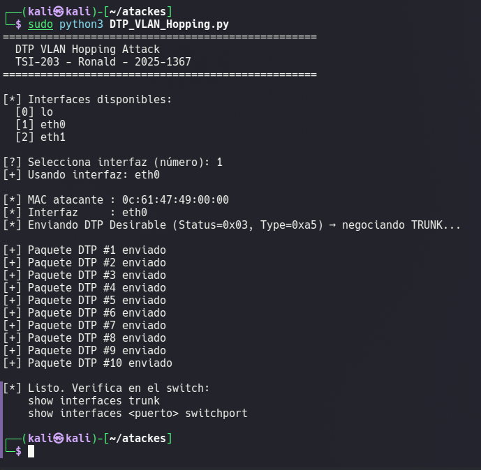

`show interfaces trunk` — `e0/0` ahora aparece como puerto trunking, con VLANs activas 1, 10, 20, 30:

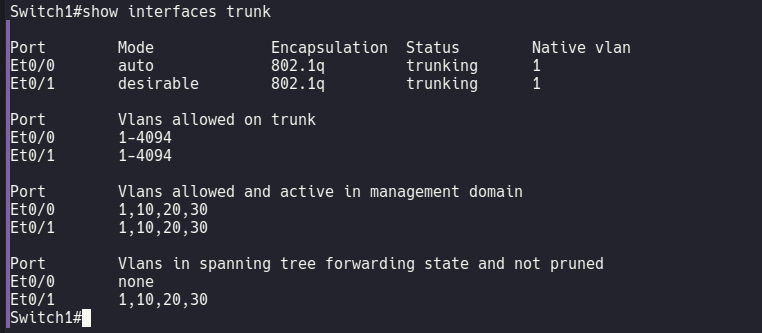

`show interfaces e0/0 switchport` — `Operational Mode: trunk` (antes `static access`):

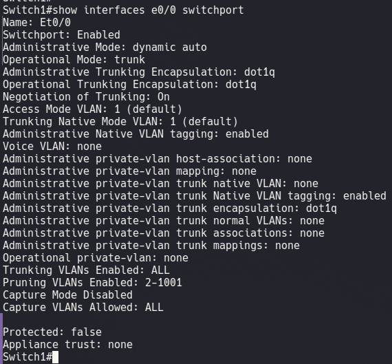

---

## 4. Verificación del impacto

Captura de tráfico en Kali (`eth0`) mostrando tramas **PVST+** — solo visibles en un enlace trunk, ya que STP envía un BPDU independiente por cada VLAN activa (Bridge ID `32768/10/...`, etc.). Esto confirma que Kali quedó participando de la topología de Spanning Tree por VLAN, algo imposible desde un puerto de acceso normal:

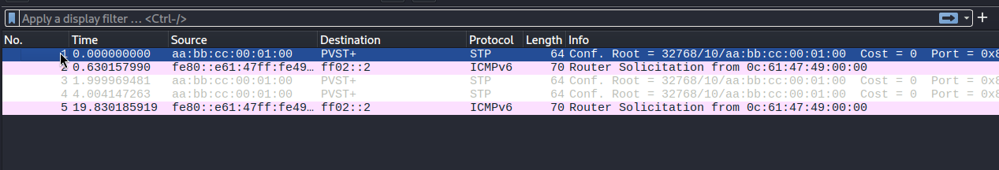

---

## 5. Mitigación

### Switch1

```
interface e0/0
 switchport mode access
 switchport access vlan 1
 switchport nonegotiate
!
interface e0/1
 switchport mode trunk
 switchport nonegotiate
!
end
```

### Switch2

```
interface e0/0
 switchport mode trunk
 switchport nonegotiate
!
interface e0/1
 switchport mode access
 switchport access vlan 10
 switchport nonegotiate
!
interface e0/2
 switchport mode access
 switchport access vlan 20
 switchport nonegotiate
!
end
```

### VTP (autenticación del dominio)

```
Switch1(config)# vtp password C1sc0VTP!2026
Switch2(config)# vtp password C1sc0VTP!2026
```

**Razonamiento:**
- `switchport mode access` fuerza el puerto a un estado estático — deja de aceptar cualquier negociación dinámica.
- `switchport nonegotiate` deshabilita el envío/procesamiento de tramas DTP en el puerto. Solo tiene efecto real combinado con `access` o `trunk` fijo (no con `dynamic auto/desirable`).
- La contraseña VTP evita que un dispositivo no autorizado —incluso si lograra un trunk— pueda sincronizarse con el dominio VTP y modificar la base de datos de VLANs.

---

## 6. Reintento del ataque (post-mitigación)

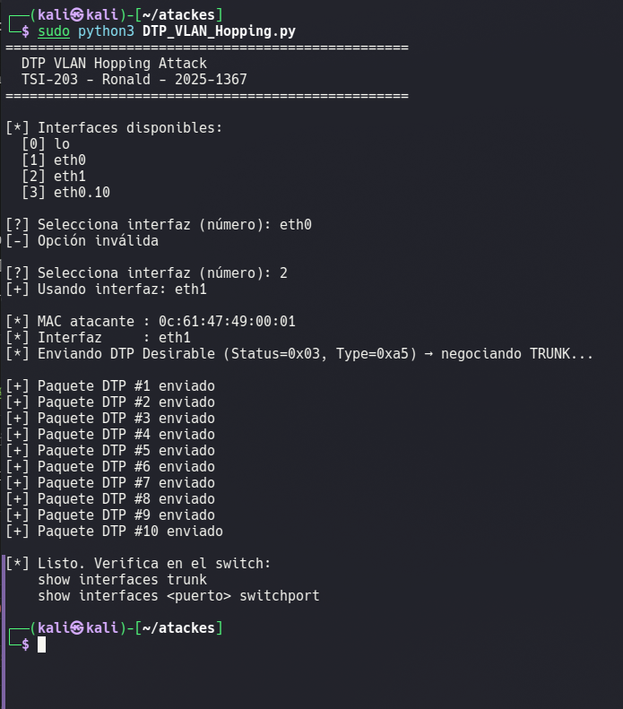

`show interfaces trunk` — `e0/0` ya no aparece listado como puerto trunking:

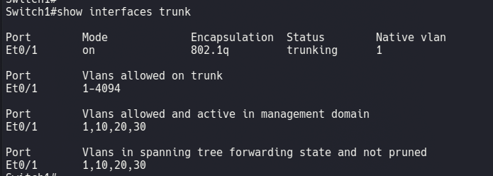

`show interfaces e0/0 switchport` — `Administrative Mode: static access`, `Negotiation of Trunking: Off`:

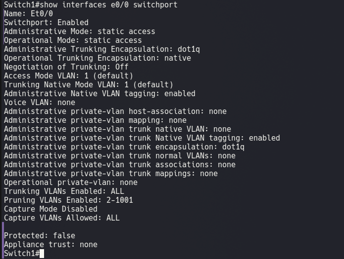

> **Observación:** en el primer intento de reintento post-mitigación, el ataque se ejecutó accidentalmente sobre `eth1` (interfaz hacia el ISP/Cloud1) en lugar de `eth0` (interfaz conectada a `Switch1 e0/0`), por selección incorrecta del índice de interfaz en el script. El resultado obtenido (`e0/0` permaneciendo en `static access` con `Negotiation of Trunking: Off`) es consistente con la mitigación aplicada, pero se documenta esta salvedad ya que el reintento no impactó directamente sobre el puerto objetivo original.

---

## 7. Tabla comparativa

| Verificación | Antes del ataque | Después del ataque | Después de la mitigación |
|---|---|---|---|
| Administrative Mode (`e0/0`) | dynamic auto | dynamic auto | static access |
| Operational Mode (`e0/0`) | static access | **trunk** | static access |
| Negotiation of Trunking | On | On | **Off** |
| VLANs visibles desde Kali | Ninguna (solo VLAN 1) | **1, 10, 20, 30** | Ninguna |
| Tráfico PVST+ visible en Kali | No | **Sí** | No |
| VTP domain | miguel.local (sin password) | miguel.local (sin password) | miguel.local (**con password**) |
| Resultado del ataque | — | Exitoso | Bloqueado |

---

## 8. Conclusión

El ataque de VLAN Hopping vía DTP fue posible por dejar el puerto de acceso hacia el host final en modo `dynamic auto` sin `switchport nonegotiate`, permitiendo que un atacante externo negociara un trunk enviando tramas DTP Desirable correctamente formadas. Esto expuso el tráfico de las VLANs 10, 20 y 30 (incluyendo BPDUs PVST+ por VLAN) a un host que debía estar aislado en una sola VLAN. La combinación con un dominio VTP sin autenticación agravaba el riesgo, al permitir en teoría la sincronización no autorizada de la base de datos VLAN. La mitigación mediante `switchport mode access` + `switchport nonegotiate` en los puertos de acceso, `switchport mode trunk` + `nonegotiate` en los enlaces troncales legítimos, y contraseña VTP en el dominio, bloqueó exitosamente el vector de ataque.

---

**Autor:** Miguel Ramírez
**Curso:** Seguridad de Redes
**Entorno:** GNS3 (IOL) sobre Fedora Linux
