    


# Laboratorio: Ataque DoS mediante CDP y su Mitigación

Este documento demuestra la resolución completa del laboratorio: identificación de la vulnerabilidad por CDP, ejecución del ataque DoS, verificación de su impacto y aplicación de la mitigación correspondiente.

## Topología de la red

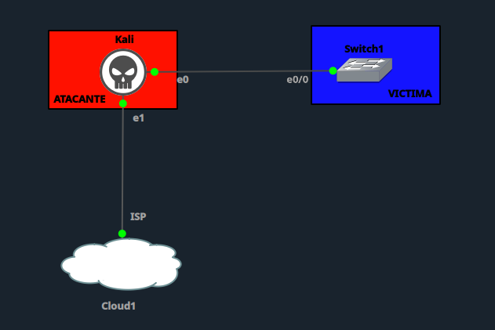

- **Kali (ATACANTE)**: `e0` conectado al `Switch1`, `e1` conectado a la nube `ISP` (`Cloud1`).
- **Switch1 (VÍCTIMA)**: recibe la conexión del atacante por el puerto `e0/0`.

---

## 1. Configuración inicial del switch (vulnerable)

Antes del ataque, el `Switch1` tenía CDP habilitado por defecto en todas sus interfaces, incluyendo la que da directamente hacia el equipo atacante. Esto lo dejaba expuesto a un ataque de inundación CDP (CDP flooding), ya que el switch procesa y almacena en su tabla cualquier anuncio CDP que reciba sin validar su origen.

```
cdp run
!
vlan 10
 name ATACANTE
!
interface Ethernet0/0
 description Conexion-Kali-ATACANTE
 switchport access vlan 10
 switchport mode access
 cdp enable
```

Como se observa, el puerto `Ethernet0/0` (conectado directamente al Kali) no tenía ninguna restricción sobre CDP, permitiendo que el atacante inundara la tabla de vecinos del switch sin ningún tipo de control.

---

## 2. Estado del switch antes del ataque

Se toma una línea base de vecinos CDP, uso de CPU y memoria del switch antes de lanzar el ataque.

**`show cdp neighbors`** — sin vecinos falsos, solo la topología real:

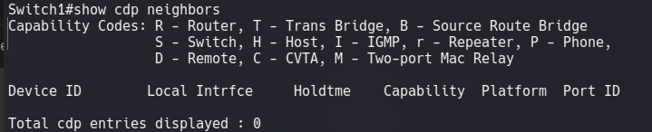

**`show processes cpu sorted | include CPU`** — CPU en 0%:

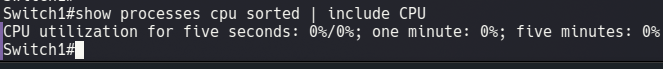

**`show memory statistics`** — memoria usada normal (~52 MB de 959 MB):

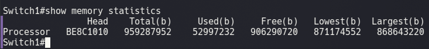

| Métrica | Antes del ataque |
|---|---|
| Vecinos CDP | 0 |
| CPU (5 seg) | 0% |
| Memoria usada | 52,997,232 b (~53 MB) |
| Memoria libre | 906,290,720 b (~906 MB) |

---

## 3. Ejecución del ataque

**Paso 1 — Ejecutar el script de ataque en el Kali**

```bash
sudo python3 dos-cdp.py
```
https://github.com/miguel34d/RED-TEAM/blob/main/Attacks/DoS%20x%20CDP/dos-cdp.py

Se selecciona la interfaz `eth0` y número de paquetes `0` (infinito), iniciando la inundación de la tabla CDP del switch:

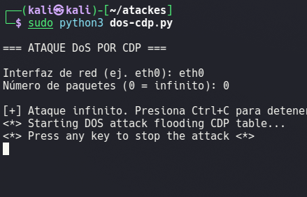

**Paso 2 — Verificar que el ataque fue exitoso**

Con el ataque en curso, se repiten los mismos comandos en el `Switch1` para comprobar el impacto:

**`show cdp neighbors`** — decenas de vecinos falsos generados por Yersinia:

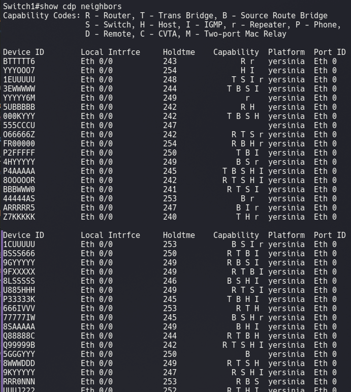

**`show processes cpu sorted | include CPU`** — CPU sube de 0% a 73%-76%:

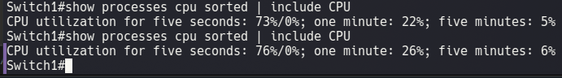

**`show memory statistics`** — memoria usada sube de ~53 MB a ~439 MB:

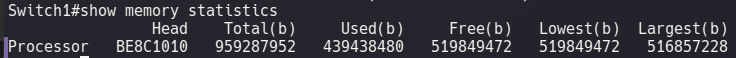

**`show cdp traffic`** — cientos de miles de paquetes CDP de entrada:

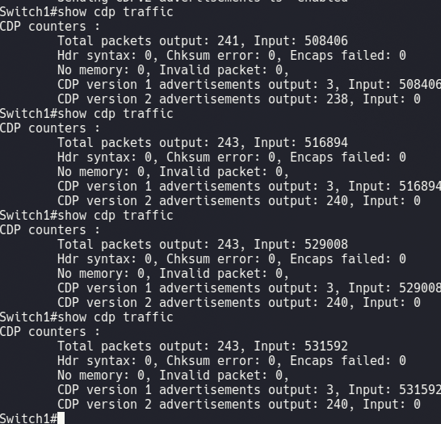

| Métrica | Antes | Durante el ataque |
|---|---|---|
| Vecinos CDP | 0 | +30 (falsos, generados por Yersinia) |
| CPU (5 seg) | 0% | 73% - 76% |
| Memoria usada | ~53 MB | ~439 MB |
| Paquetes CDP recibidos (Input) | 0 | 500,000+ |

El ataque confirma un **DoS efectivo**: saturación de la tabla de vecinos, alto consumo de CPU y memoria en el switch.

---

## 4. Mitigación

Se detiene el ataque (`Ctrl+C` en el Kali) y se aplica la mitigación en el `Switch1`, deshabilitando CDP únicamente en la interfaz expuesta al atacante, sin afectar el resto de la red:

```
configure terminal
cdp run
interface Ethernet0/0
 no cdp enable
exit
exit
write memory
```

- `cdp run` → asegura que CDP siga activo a nivel global en el resto del switch.
- `no cdp enable` en `Ethernet0/0` → desactiva CDP **solo** en el puerto conectado al atacante, cerrando el vector de ataque sin perder CDP en los enlaces internos confiables.

---

## 5. Reintento del ataque tras la mitigación

Se vuelve a ejecutar el mismo script de ataque desde el Kali para confirmar que el switch ya no es vulnerable:

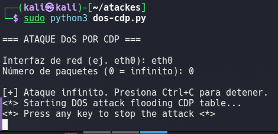

---

## 6. Resultados después de la mitigación

Con el ataque nuevamente en curso, se verifica el estado del `Switch1`:

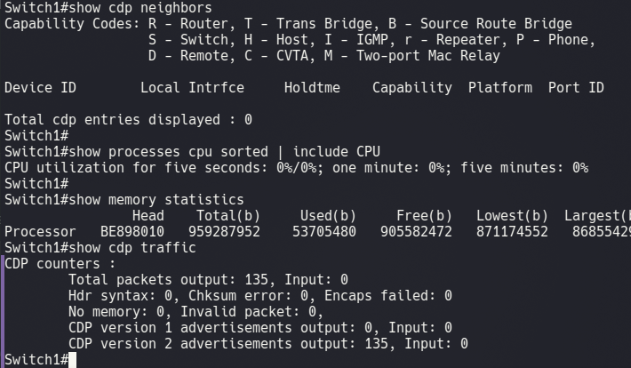

| Métrica | Antes del ataque | Durante el ataque | Después de la mitigación |
|---|---|---|---|
| Vecinos CDP | 0 | +30 (falsos) | **0** |
| CPU (5 seg) | 0% | 73% - 76% | **0%** |
| Memoria usada | ~53 MB | ~439 MB | **~53.7 MB** |
| Paquetes CDP de entrada (Input) | 0 | 500,000+ | **0** |

`Ethernet0/0` ya no procesa ni responde a los anuncios CDP del atacante: `show cdp neighbors` vuelve a mostrar 0 entradas, la CPU regresa a 0%, la memoria vuelve a sus niveles normales y `show cdp traffic` no registra nuevos paquetes de entrada aunque el script de ataque siga corriendo en el Kali.

---
LINK DEL VIDEO
https://www.youtube.com/watch?v=p8nBV-QHDwI


## 7. Conclusión

El laboratorio quedó **resuelto exitosamente**: se identificó la vulnerabilidad por CDP habilitado en el puerto expuesto al atacante, se ejecutó el ataque DoS confirmando su impacto real sobre CPU, memoria y tabla de vecinos del `Switch1`, y se aplicó la mitigación (`no cdp enable` en `Ethernet0/0`) que neutralizó por completo el ataque sin afectar la operatividad del resto de la red.
