# Laboratorio: HSRP Hijacking (Secuestro del Router Activo)

    

 

---

## Topología de red

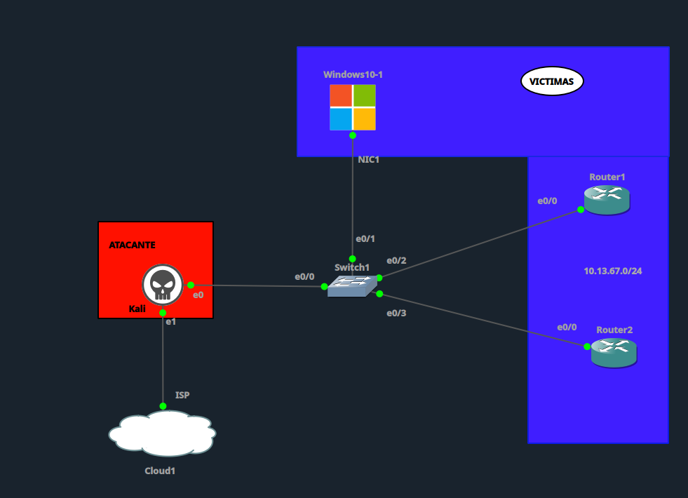

| Dispositivo | Rol | IP | Detalle |
|---|---|---|---|
| Kali | Atacante | 10.13.67.10/24 | Conectado a Switch1 (e0/0), salida a Internet vía Cloud1 (e1) |
| Windows10-1 | Víctima | 10.13.67.20/24 | Gateway configurado: 10.13.67.1 (IP virtual HSRP) |
| Router1 | Gateway (Active) | 10.13.67.2/24 | Grupo HSRP 1, prioridad 110, preempt habilitado |
| Router2 | Gateway (Standby) | 10.13.67.3/24 | Grupo HSRP 1, prioridad 100 |
| Switch1 | Switch de acceso | — | VLAN 10, sin protecciones L2 (sin Port Security / DHCP Snooping / DAI) |

Red: **10.13.67.0/24** — Kali, Windows10-1, Router1 y Router2 comparten el mismo dominio de broadcast (VLAN 10) a través de Switch1, condición necesaria para el ataque HSRP.

---

## Configuración vulnerable inicial

### Router1 (Active)

```
hostname Router1

interface Ethernet0/0
 description LAN - HSRP Group
 ip address 10.13.67.2 255.255.255.0
 no shutdown
 standby 1 ip 10.13.67.1
 standby 1 priority 110
 standby 1 preempt
```

### Router2 (Standby)

```
hostname Router2

interface Ethernet0/0
 description LAN - HSRP Group
 ip address 10.13.67.3 255.255.255.0
 no shutdown
 standby 1 ip 10.13.67.1
 standby 1 priority 100
```

### Switch1

```
hostname Switch1

vlan 10
 name LAN_VICTIMAS

interface range e0/0 - 3
 switchport mode access
 switchport access vlan 10
 no shutdown
```

**Vulnerabilidad:** el grupo HSRP 1 (IP virtual `10.13.67.1`) no tiene `standby 1 authentication` configurado en ningún router. Cualquier dispositivo dentro de la VLAN 10 puede inyectar paquetes Hello HSRP falsificados con una prioridad más alta y forzar su elección como router Active, sin que los routers legítimos puedan detectar ni rechazar el paquete.

---

## Ejecución del ataque

Desde Kali, se ejecutó un script en Python que escucha el tráfico HSRP existente, detecta las prioridades reales de los routers e inyecta paquetes Hello forjados anunciando `state=active` con prioridad `200` (superior a los 110 de Router1) hacia el grupo multicast `224.0.0.2`, cada 3 segundos.

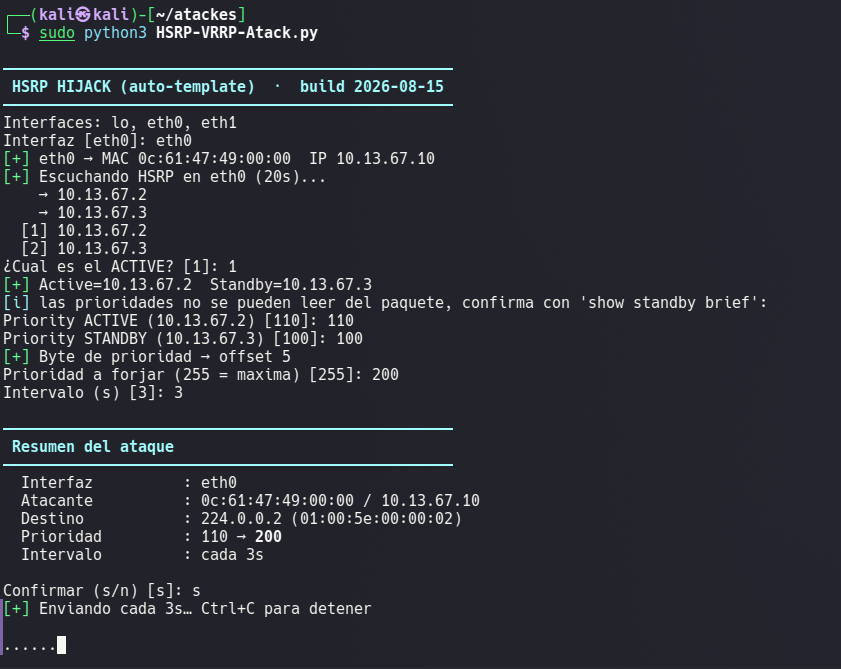

---

## Tabla comparativa: Antes / Durante / Después

| Verificación | Antes del ataque | Durante el ataque | Después de mitigación |
|---|---|---|---|
| Estado Router1 | Active (local, pri. 110) | **Standby** (Active=10.13.67.10) | Active (local, pri. 110) |
| Estado Router2 | Standby (pri. 100) | **Listen** | Standby (pri. 100) |
| Tabla MAC Switch1 (MAC virtual `0000.0c07.ac01`) | Puerto Et0/2 (Router1) | Sin cambios (Et0/2) | Sin cambios (Et0/2) |
| ARP en víctima (10.13.67.1) | Resuelto a MAC virtual | Sin cambios | Sin cambios |
| Ping víctima → gateway | — | **100% perdido** | 0% perdido |
| Tráfico HSRP (tcpdump) | Hellos limpios (20 bytes), Router1 active / Router2 standby | Hello forjado de Kali `state=active` pri. 200 aceptado por la red | Hellos legítimos de 50 bytes (con MD5); paquetes de Kali (20 bytes, sin auth) descartados |

---

## Capturas — Antes del ataque (línea base)

| Captura | Descripción |
|---|---|
| 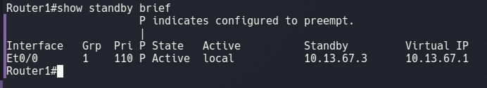 | Router1 — `show standby brief`: Active |
| 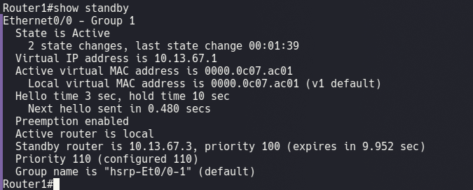 | Router1 — `show standby`: detalle sin autenticación |
| 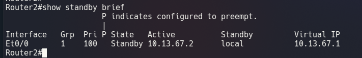 | Router2 — `show standby brief`: Standby |
| 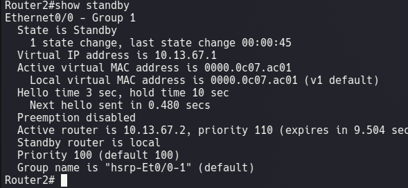 | Router2 — `show standby`: detalle sin autenticación |
| 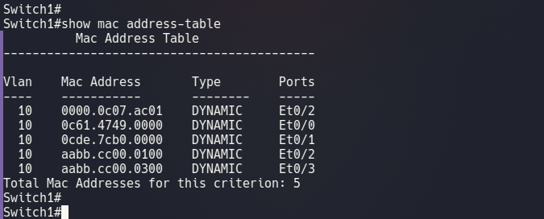 | Switch1 — tabla MAC: MAC virtual en Et0/2 |
| 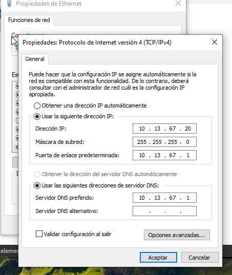 | Windows10-1 — configuración IP y gateway |
| 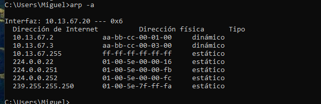 | Windows10-1 — caché ARP inicial |
| 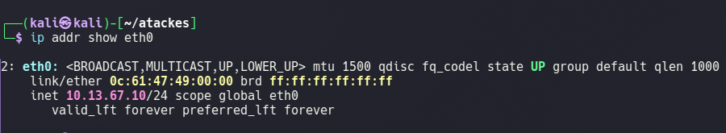 | Kali — configuración de interfaz eth0 |
|  | Kali — caché ARP inicial |
| 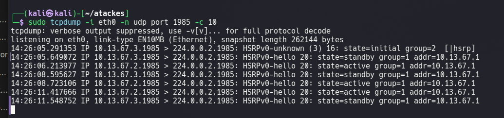 | Kali — tráfico HSRP legítimo (tcpdump) |

## Capturas — Durante el ataque

| Captura | Descripción |
|---|---|
| 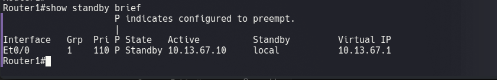 | Router1 pasa a Standby |
| 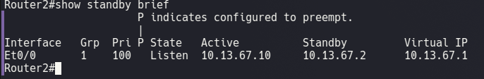 | Router2 pasa a Listen |
| 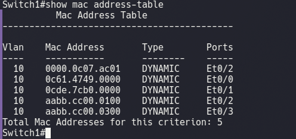 | Switch1 — tabla MAC sin cambios |
| 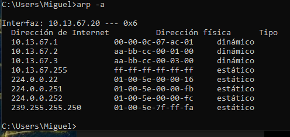 | Windows10-1 — ARP sin cambios |
| 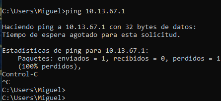 | Windows10-1 — ping al gateway falla (DoS) |
| 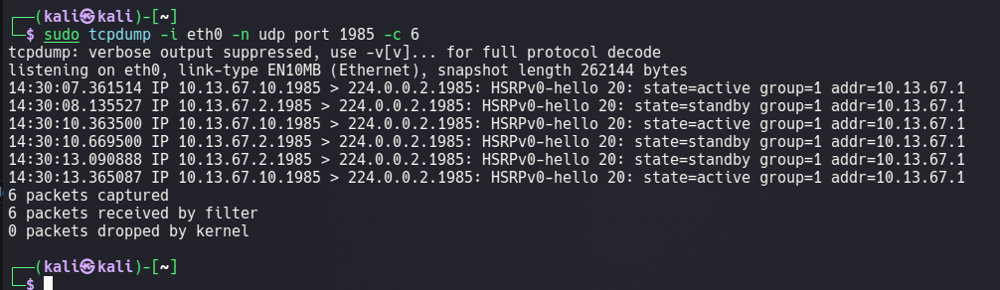 | Kali — tcpdump confirmando Hello forjado aceptado |

## Capturas — Mitigación y reintento

| Captura | Descripción |
|---|---|
| 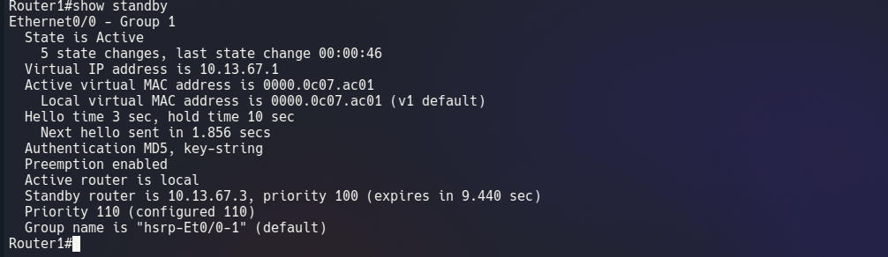 | Router1 — autenticación MD5 aplicada |
| 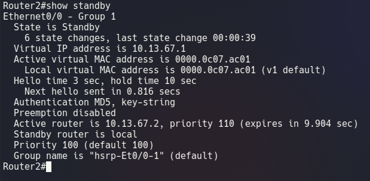 | Router2 — autenticación MD5 aplicada |
| 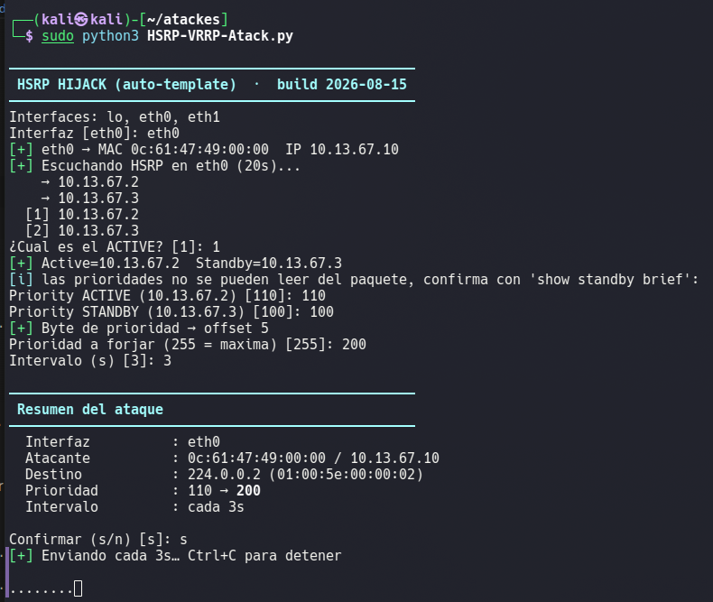 | Kali — reintento del ataque tras mitigación |
| 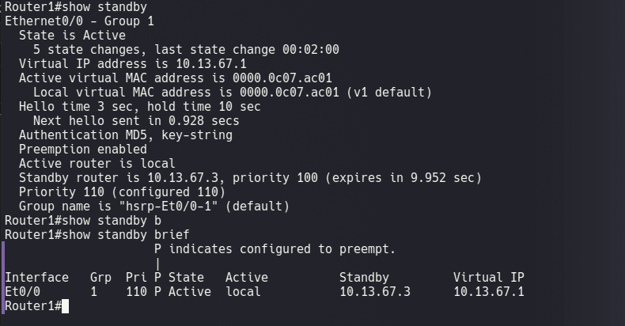 | Router1 — permanece Active a pesar del ataque |

## Capturas — Verificación final post-mitigación

| Captura | Descripción |
|---|---|
| 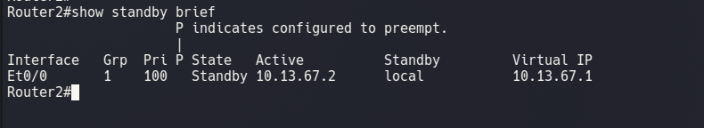 | Router2 — vuelve a Standby normal |
| 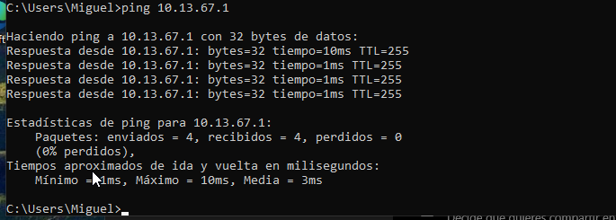 | Windows10-1 — ping al gateway exitoso (0% perdido) |
| 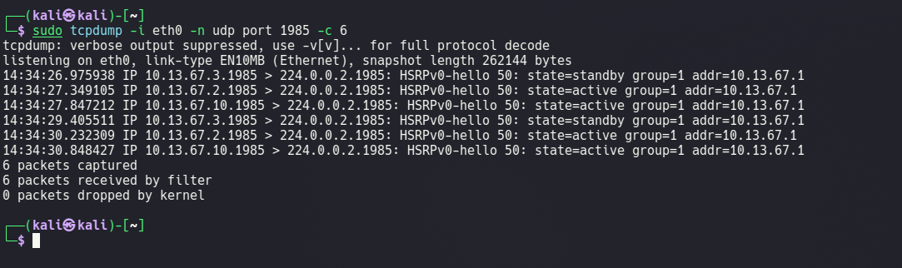 | Kali — Hellos legítimos con MD5 (50 bytes) vs. paquetes forjados descartados |

---

## Mitigación aplicada

En **Router1** y **Router2**:

```
enable
configure terminal
interface Ethernet0/0
 standby 1 authentication md5 key-string HSRP_S3cr3t_2026
exit
end
write memory
```

- `standby 1 authentication md5 key-string ...`: habilita autenticación MD5 en el grupo HSRP 1. Cada Hello debe incluir un hash calculado con la clave compartida configurada en ambos routers; cualquier paquete que no traiga el hash correcto (como los inyectados por un atacante que desconoce la clave) es descartado sin afectar la elección del router Active.

---

## Conclusión

El grupo HSRP 1 (`10.13.67.1`) fue configurado inicialmente sin autenticación, lo que permitió desde Kali —ubicado en el mismo dominio de broadcast que Router1 y Router2— inyectar paquetes Hello HSRP falsificados con una prioridad artificialmente alta (200) y forzar el rol Active en el protocolo de control HSRP. Router1 pasó a Standby y Router2 a Listen, evidenciando el hijacking a nivel de protocolo.

Sin embargo, la verificación de la tabla MAC del switch mostró que la dirección MAC virtual (`0000.0c07.ac01`) nunca cambió de puerto, ya que Kali no realizó envenenamiento ARP (Gratuitous ARP) ni activó IP forwarding. Como consecuencia, el tráfico de la víctima siguió siendo conmutado hacia el puerto físico de Router1, que ya no respondía como Active, resultando en una **denegación de servicio (DoS) del gateway** en lugar de una intercepción efectiva de tráfico (MITM completo). Esta distinción es relevante: el ataque comprometió la disponibilidad del enrutamiento aunque no logró interceptar el tráfico de datos, lo cual habría requerido combinar el HSRP hijacking con ARP spoofing.

La mitigación mediante **autenticación MD5** en el grupo HSRP resolvió el problema de raíz: al reintentar el ataque exactamente igual que antes, los paquetes forjados fueron descartados por ambos routers al no incluir el hash MD5 válido, y el grupo se mantuvo estable (Router1 Active, Router2 Standby) durante todo el reintento, confirmado por la recuperación de la conectividad de la víctima hacia su gateway (0% de pérdida en el ping final).

**Recomendaciones adicionales:**
- Habilitar `standby 1 authentication md5` (o su equivalente en VRRP) en todo despliegue de redundancia de primer salto, nunca dejarlo sin autenticar.
- Complementar con **DHCP Snooping**, **Dynamic ARP Inspection (DAI)** y **Port Security** en Switch1 para prevenir ataques relacionados como ARP Spoofing, que sí lograrían interceptar el tráfico de datos.
- Monitorear cambios de estado HSRP (`%STANDBY-6-STATECHANGE`) mediante syslog/SNMP para detectar intentos de hijacking en tiempo real.
