# MAC Flooding


---

## Topología de red

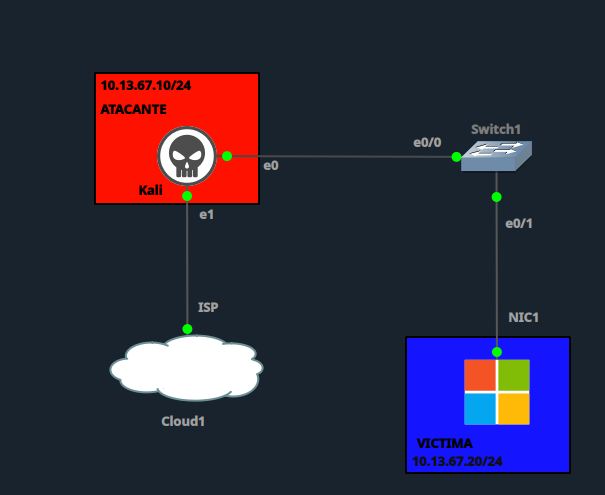

| Rol | Dispositivo | IP | Interfaz |
|---|---|---|---|
| Atacante | Kali Linux | 10.13.67.10/24 | e0 → Switch1 e0/0 |
| Víctima | PC Windows | 10.13.67.20/24 | NIC1 → Switch1 e0/1 |
| Gateway (SVI) | Switch1 (VLAN 10) | 10.13.67.1/24 | — |

---

## 1. Configuración inicial vulnerable

**Switch1** — VLAN única (10), sin `port-security`, sin ningún límite de aprendizaje de direcciones MAC por puerto:

```
enable
configure terminal
hostname Switch1

vlan 10
 name ATAQUE

interface e0/0
 switchport mode access
 switchport access vlan 10
 no switchport port-security
 spanning-tree portfast
 no shutdown

interface e0/1
 switchport mode access
 switchport access vlan 10
 no switchport port-security
 spanning-tree portfast
 no shutdown

end
write memory
```

**Vulnerabilidades presentes:**
- ❌ Sin `port-security` en ninguna interfaz → cualquier puerto puede aprender un número prácticamente ilimitado de direcciones MAC.
- ❌ Sin límite de tasa de aprendizaje de MAC por puerto → el atacante puede enviar miles de tramas con MACs de origen falsificadas y distintas en segundos, llenando la tabla CAM del switch.
- **Impacto teórico esperado:** una vez saturada la tabla CAM, el switch entra en modo *fail-open*: cualquier trama cuya MAC destino no esté en la tabla se **inunda (flood) por todos los puertos** de la VLAN, comportándose como un hub — permitiendo sniffing pasivo del tráfico ajeno sin necesidad de ARP Spoofing.

---

## 2. Línea base — Estado ANTES del ataque

**Tabla MAC del switch (limpia):**

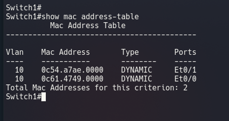

Solo las 2 entradas legítimas: Kali (Et0/0) y víctima (Et0/1).

**Capacidad de la tabla CAM:**

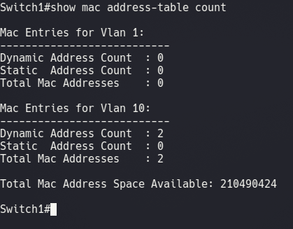

**Espacio total disponible: 210,490,424 entradas.** Dato clave para el análisis: este switch virtualizado en GNS3 tiene una tabla CAM mucho más grande que un switch físico real (típicamente 8,000–16,000 entradas), lo cual condiciona el resultado del ataque, según se documenta más adelante.

---

## 3. Ejecución del ataque

Ataque ejecutado desde Kali con script propio en Python (`MAC-Floooding.py`), enviando tramas ARP con **direcciones MAC de origen aleatorias**, en modo continuo (sin límite de tramas, sin retardo).

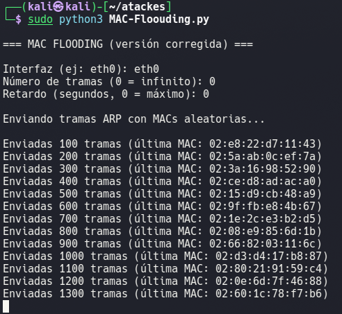

**Resultado en la tabla CAM tras la primera corrida:**

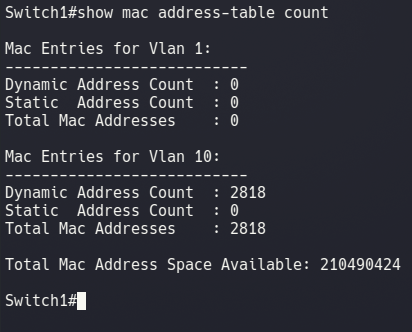

La tabla creció de **2 a 2,818 entradas** en segundos — el mecanismo del ataque (inyección masiva de MACs falsas) quedó confirmado.

---

## 4. Verificación del ataque exitoso

Se intentó confirmar el efecto de **flooding** (modo fail-open) capturando tráfico en Kali mientras la víctima generaba tráfico hacia otro destino:

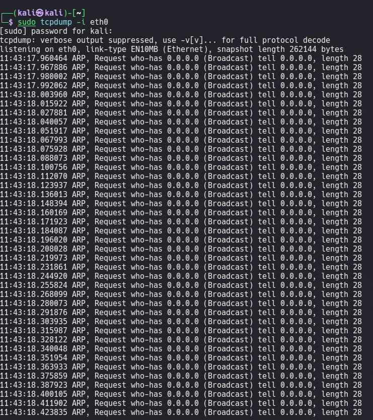

Esta primera captura resultó ser tráfico propio del ataque (no concluyente). Se repitió la prueba capturando tráfico ARP broadcast de la víctima hacia el gateway (SVI del switch, 10.13.67.1):

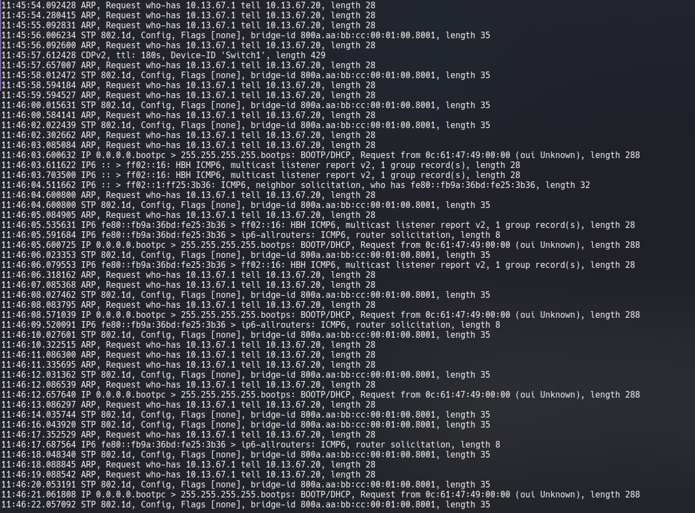
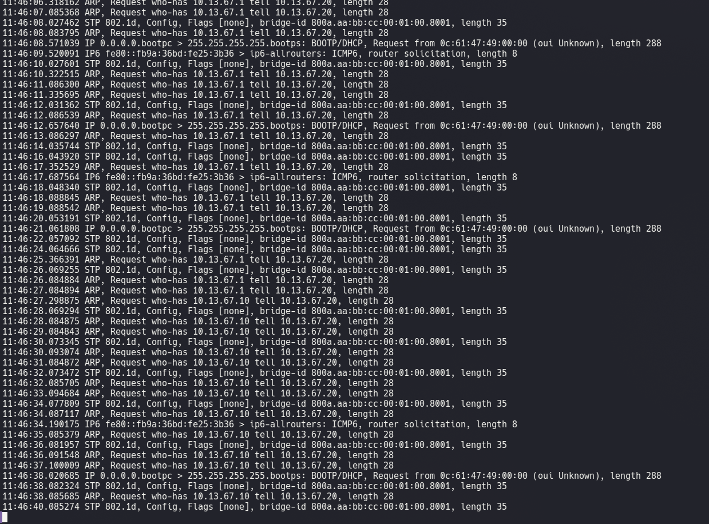

Sin embargo, estas tramas son **broadcast** (`who-has`), las cuales todo puerto de la VLAN recibe por diseño, independientemente de si la tabla CAM está saturada — no son evidencia válida de fail-open.

**Prueba concluyente — tráfico unicast (ping):**

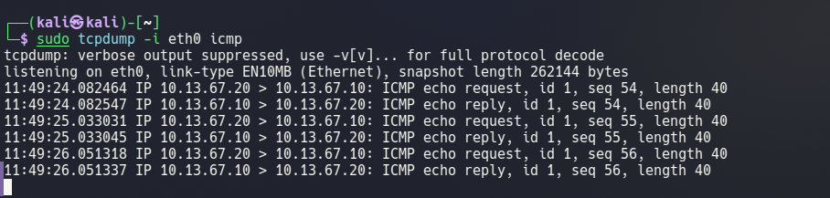

Al filtrar tráfico ICMP en Kali mientras la víctima hacía ping al **switch** (10.13.67.1, no al Kali), **no se observó ningún paquete ajeno** en la interfaz del atacante.

**Mientras tanto, el ataque siguió corriendo en segundo plano** (modo continuo/infinito), llevando la tabla CAM a:

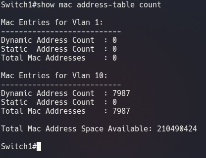

**7,987 entradas** — el ataque nunca dejó de inyectar MACs falsas durante todo el proceso de verificación.

**Conclusión de esta fase:** el mecanismo del ataque (saturación acelerada de la tabla CAM con MACs falsas) fue exitoso y está plenamente demostrado (2 → 7,987 entradas). Sin embargo, el **impacto completo** (modo fail-open / sniffing pasivo) **no se alcanzó**, debido a que el espacio total de la tabla CAM en este switch virtualizado (210 millones de entradas) es órdenes de magnitud mayor que la cantidad de MACs falsas inyectadas. En un switch físico real, con una tabla CAM típica de 8,000–16,000 entradas, este mismo ataque sí habría saturado la tabla y forzado el modo fail-open.

---

## 5. Mitigación

**Configuración de Port Security en Switch1:**

```
enable
configure terminal

interface e0/0
 switchport port-security
 switchport port-security maximum 1
 switchport port-security violation restrict
 switchport port-security mac-address sticky

interface e0/1
 switchport port-security
 switchport port-security maximum 1
 switchport port-security violation restrict
 switchport port-security mac-address sticky

end
write memory
```

**Qué hace esto:** limita cada puerto a **una sola MAC aprendida**. En cuanto el atacante intenta enviar tramas con una MAC distinta a la ya asegurada desde el mismo puerto físico (e0/0), el switch la descarta de inmediato (modo `restrict`), impidiendo que la tabla CAM crezca más allá de las MACs legítimas — esta mitigación ataca la causa raíz del ataque (generación masiva de MACs falsas) sin depender de que la tabla llegue a saturarse primero.

Se reinició la tabla MAC dinámica para partir de un estado limpio antes del reintento:

```
enable
clear mac address-table dynamic
```

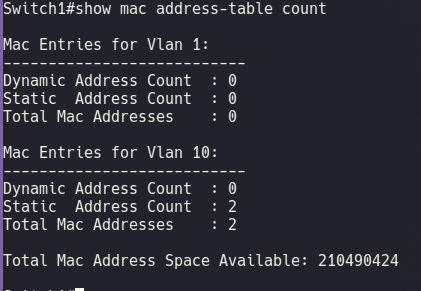

Solo las 2 MACs legítimas permanecen, ahora como entradas `SecureSticky` gracias a Port Security.

---

## 6. Reintento del ataque tras la mitigación

Se ejecuta nuevamente `MAC-Floooding.py` desde Kali:

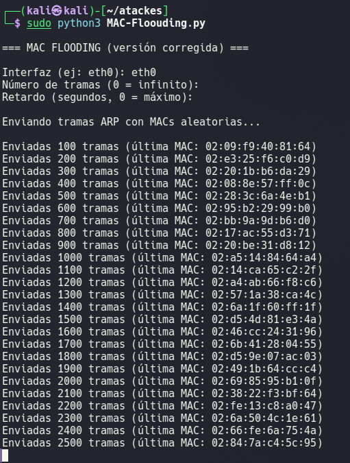

El switch bloqueó el ataque de inmediato mediante **Port Security**:

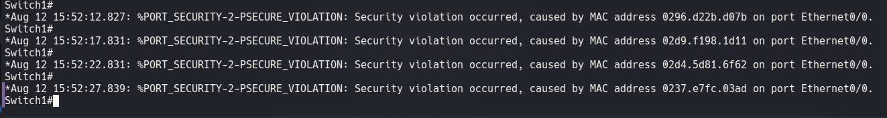

Log `%PORT_SECURITY-2-PSECURE_VIOLATION` disparado repetidamente en Et0/0, una vez por cada trama con MAC distinta a la ya asegurada.

---

## 7. Verificación final post-mitigación

**Tabla MAC — se mantuvo intacta a pesar del ataque sostenido:**

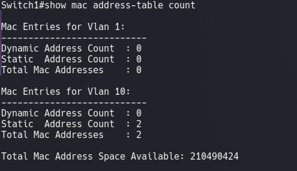

**Estadísticas de Port Security:**

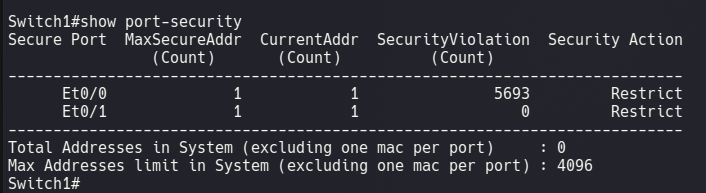

**5,693 violaciones** registradas y bloqueadas en Et0/0, 0 en Et0/1 — la tabla MAC permaneció en exactamente 2 entradas durante todo el reintento.

**MACs seguras finales:**

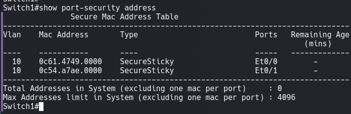

**Conectividad legítima intacta:**

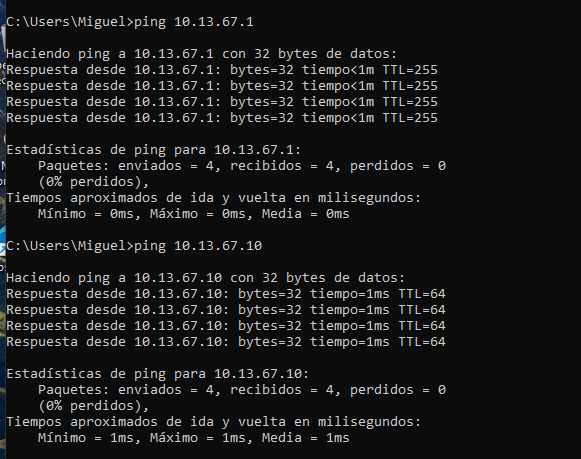

Ping de la víctima tanto al switch (10.13.67.1) como al Kali (10.13.67.10), **0% de pérdida** en ambos.

---

## 8. Tabla comparativa — Antes / Durante / Después

| Indicador | Antes del ataque | Durante el ataque | Después de la mitigación |
|---|---|---|---|
| Entradas en la tabla CAM (VLAN 10) | 2 | 7,987 (creciendo continuamente) ❌ | 2 (intacta) ✅ |
| Port Security | Deshabilitado | Deshabilitado | Habilitado (1 MAC, sticky, restrict) |
| Violaciones de seguridad registradas | 0 | N/A (sin mitigación) | 5,693 (todas bloqueadas) |
| Efecto fail-open / sniffing pasivo | N/A | No alcanzado (tabla CAM del entorno demasiado grande) | No aplica (ataque bloqueado en origen) |
| Conectividad legítima (víctima ↔ switch/Kali) | Normal | Normal (ataque no afectó tráfico unicast existente) | Normal, 0% pérdida |
| Resultado del ataque (`MAC-Floooding.py`) | N/A | Mecanismo exitoso, impacto parcial | Bloqueado desde el primer paquete ilegítimo |

---

## 9. Conclusión

El ataque de **MAC Flooding** explotó la ausencia de `port-security` en Switch1: sin ningún límite de direcciones MAC por puerto, el script del atacante pudo inyectar miles de tramas con MACs de origen falsificadas, haciendo crecer la tabla CAM de 2 a 7,987 entradas en cuestión de minutos. Este resultado confirma el **mecanismo** del ataque de forma contundente.

Sin embargo, el laboratorio reveló un hallazgo importante sobre el **entorno de simulación**: el espacio total de la tabla CAM en este switch virtualizado en GNS3 (210,490,424 entradas) es varios órdenes de magnitud mayor que el de un switch físico real (típicamente 8,000–16,000 entradas), por lo que el **impacto completo** del ataque — forzar al switch a modo *fail-open* y habilitar sniffing pasivo del tráfico ajeno — no llegó a manifestarse en las pruebas realizadas. Esto no invalida el ataque ni su peligrosidad: en hardware real, la misma técnica con el mismo volumen de tramas sí habría saturado la tabla y comprometido la confidencialidad del tráfico de la VLAN.

La mitigación con **Port Security** (máximo 1 MAC por puerto, modo `restrict`, `sticky`) resultó completamente efectiva independientemente de la capacidad de la tabla CAM: al limitar el número de MACs aceptadas por puerto físico, el ataque queda neutralizado en su origen, sin necesidad de que la tabla llegue a saturarse. De las miles de tramas con MACs falsas enviadas en el reintento, ninguna logró registrarse en la tabla, evidenciado en las 5,693 violaciones bloqueadas y una tabla MAC que permaneció intacta durante todo el ataque, sin afectar en ningún momento la conectividad legítima entre los hosts reales de la red.

---

**Institución:** ITLA — Seguridad Informática
**Materia:** Seguridad de Redes (TSI-203)
**Profesor:** Jonathan Rondón
**Estudiante:** Miguel Ramirez Meli — Matrícula 2025-1367
