# MitM mediante ARP (ARP Spoofing)


---

## Topología de red

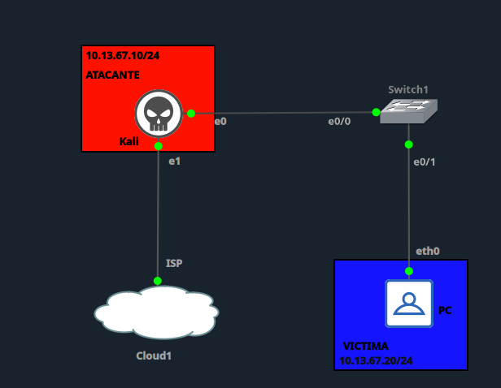

| Rol | Dispositivo | IP | Interfaz |
|---|---|---|---|
| Atacante | Kali Linux | 10.13.67.10/24 | e0 → Switch1 e0/0 |
| Víctima | PC | 10.13.67.20/24 | eth0 → Switch1 e0/1 |
| Gateway | VLAN 10 (SVI) | 10.13.67.1/24 | Switch1 |

---

## 1. Configuración inicial vulnerable

Configuración de **Switch1** antes de aplicar cualquier medida de seguridad. VLAN única (10) sin `DHCP Snooping`, sin `Dynamic ARP Inspection` y sin `Port Security`, condiciones necesarias para que el ARP Spoofing sea efectivo.

```
enable
configure terminal
hostname Switch1

vlan 10
 name ATAQUE

interface e0/0
 switchport mode access
 switchport access vlan 10
 no switchport port-security
 spanning-tree portfast
 no shutdown

interface e0/1
 switchport mode access
 switchport access vlan 10
 no switchport port-security
 spanning-tree portfast
 no shutdown

interface Vlan10
 ip address 10.13.67.1 255.255.255.0
 no shutdown
exit

no ip dhcp snooping
no ip arp inspection vlan 10

end
write memory
```

**Vulnerabilidades presentes:**
- ❌ `ip dhcp snooping` deshabilitado — no existe tabla de bindings confiable.
- ❌ `ip arp inspection` deshabilitado en VLAN 10 — el switch no valida los pares IP-MAC de los paquetes ARP.
- ❌ Sin `port-security` en e0/0 ni e0/1 — cualquier MAC puede circular sin restricción.
- ❌ Atacante y víctima comparten la misma VLAN 10 (10.13.67.0/24), condición necesaria para el ataque.

---

## 2. Línea base — Estado ANTES del ataque

**Tabla ARP de la víctima:**

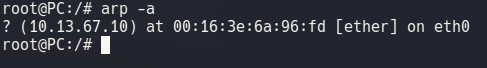

La víctima conoce correctamente la MAC real del atacante (10.13.67.10) y en capturas posteriores se confirma la MAC real del gateway (10.13.67.1 → `aa:bb:cc:80:02:00`).

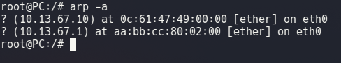

**Tabla ARP del switch (`show ip arp`):**

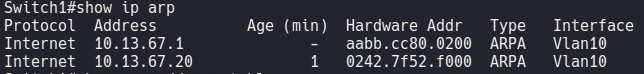

**Tabla MAC del switch (`show mac address-table`):**

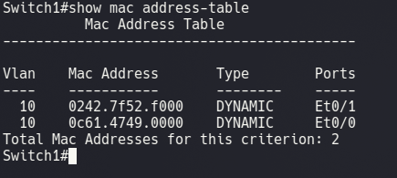

Ambas entradas MAC son `DYNAMIC`, aprendidas normalmente por el switch en los puertos correctos (Kali → Et0/0, víctima → Et0/1).

---

## 3. Ejecución del ataque

Ataque ejecutado desde Kali con script propio en Python/Scapy (`arp-mmt.py`), envenenando simultáneamente a la víctima (10.13.67.20) y al gateway (10.13.67.1), con IP Forwarding activado para mantener el flujo de tráfico y no delatar el ataque.

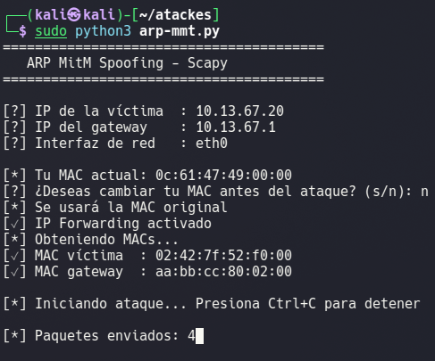

---

## 4. Verificación del ataque exitoso

**Tabla ARP de la víctima (envenenada):**

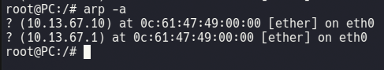

La entrada de 10.13.67.1 (gateway) ahora resuelve a la MAC del Kali (`0c:61:47:49:00:00`), idéntica a la entrada del propio atacante. Envenenamiento ARP confirmado.

**Tabla ARP y MAC del switch (post-ataque):**

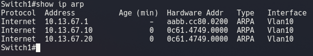
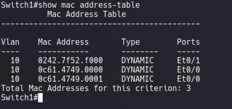

El switch conserva las MACs reales en sus puertos físicos — el ARP Spoofing es un ataque a nivel de host, no de switch.

**Evidencia de interceptación (MITM):**

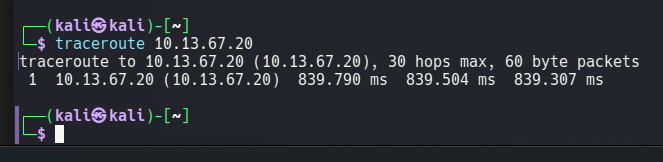

Un `traceroute` de 1 solo salto hacia la víctima muestra una latencia de ~839 ms, muy por encima de lo normal en una red local (<1 ms), evidenciando que el tráfico está siendo interceptado y reenviado por el atacante.

---

## 5. Mitigación

Configuración aplicada en **Switch1** para neutralizar el ataque:

```
enable
configure terminal

ip dhcp snooping
ip dhcp snooping vlan 10

ip arp inspection vlan 10

arp access-list ARP-PERMIT-GW
 permit ip host 10.13.67.1 mac host aabb.cc80.0200
 permit ip host 10.13.67.20 mac host 0242.7f52.f000
 permit ip host 10.13.67.10 mac host 0c61.4749.0000

ip arp inspection filter ARP-PERMIT-GW vlan 10 static

interface e0/0
 switchport port-security
 switchport port-security maximum 1
 switchport port-security violation restrict
 switchport port-security mac-address sticky

interface e0/1
 switchport port-security
 switchport port-security maximum 1
 switchport port-security violation restrict
 switchport port-security mac-address sticky

end
write memory
```

**Explicación de cada comando:**

| Comando | Función |
|---|---|
| `ip dhcp snooping` / `vlan 10` | Activa el filtrado de mensajes DHCP no confiables y construye la tabla de bindings usada como referencia por DAI. |
| `ip arp inspection vlan 10` | Activa Dynamic ARP Inspection (DAI): el switch valida cada paquete ARP contra una fuente confiable y descarta los que no coincidan. |
| `arp access-list ARP-PERMIT-GW` | Define manualmente los pares IP-MAC legítimos de gateway, víctima y atacante, necesario porque no existe un servidor DHCP real en la topología. |
| `ip arp inspection filter ... static` | Aplica el ACL como fuente de verdad **única**: todo lo que no coincida se descarta directamente, sin depender de la tabla de DHCP Snooping (vacía en este escenario). |
| `switchport port-security maximum 1 + sticky + restrict` | Limita cada puerto a una única MAC aprendida, evitando suplantación de MAC en el puerto físico. |

**Verificación de la mitigación aplicada:**

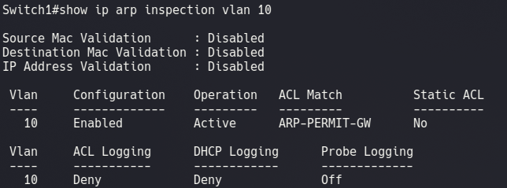
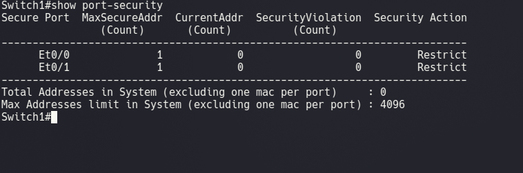

> **Nota de ajuste:** en un primer intento, el ACL solo incluía los pares de gateway y víctima, lo que bloqueó también el tráfico legítimo del atacante y de la propia víctima por defecto (`DHCP Drops`, tabla de bindings vacía). Se corrigió agregando explícitamente el par IP-MAC de cada host y aplicando el filtro en modo `static`, dejando el ACL como única fuente de verdad.

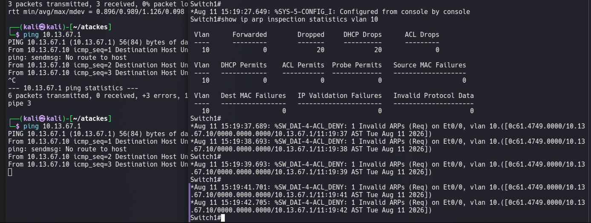

---

## 6. Reintento del ataque tras la mitigación

Se ejecuta nuevamente `arp-mmt.py` desde Kali:

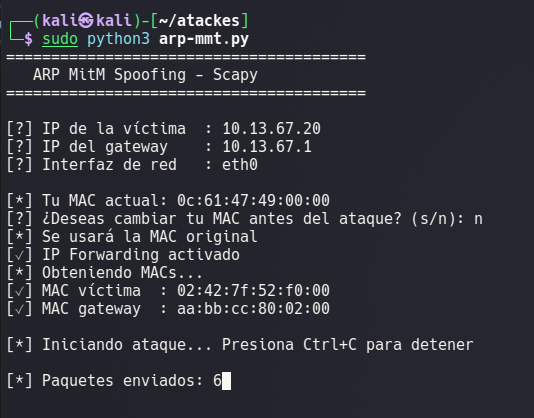

El switch bloquea todos los paquetes ARP falsificados (`%SW_DAI-4-ACL_DENY: Invalid ARPs`), tanto la respuesta falsa hacia la víctima como hacia el gateway:

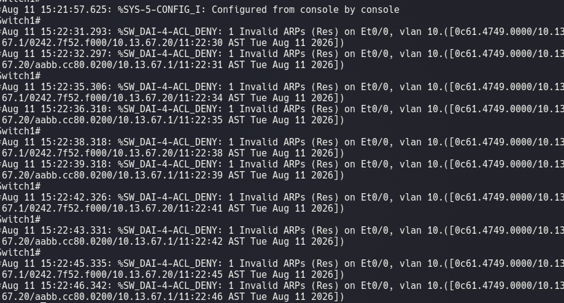

Mientras tanto, el tráfico legítimo del atacante (ping normal a víctima y gateway) sigue funcionando sin problema:

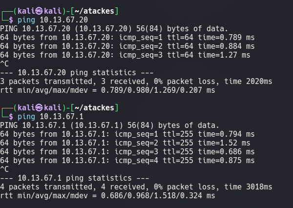

---

## 7. Verificación final post-mitigación

**Tabla ARP de la víctima (limpia, sin envenenar):**


**Tabla ARP y MAC del switch (estado final):**

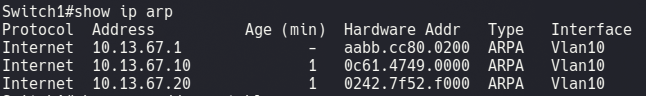
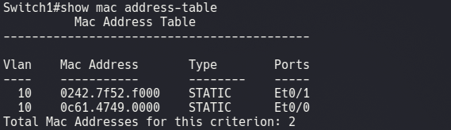

Las entradas MAC ahora son `STATIC` (efecto de `port-security sticky`), reforzando la persistencia de la mitigación.

**Estadísticas finales de DAI:**

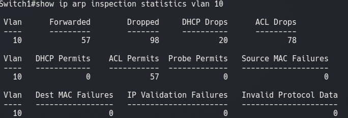

---

## 8. Tabla comparativa — Antes / Durante / Después

| Indicador | Antes del ataque | Durante el ataque | Después de la mitigación |
|---|---|---|---|
| MAC del gateway en la víctima | `aa:bb:cc:80:02:00` (real) | `0c:61:47:49:00:00` (Kali) ❌ | `aa:bb:cc:80:02:00` (real) ✅ |
| DAI (`ip arp inspection`) | Deshabilitado | Deshabilitado | Habilitado, modo `static` |
| DHCP Snooping | Deshabilitado | Deshabilitado | Habilitado |
| Port Security | Deshabilitado | Deshabilitado | Habilitado (1 MAC, sticky, restrict) |
| Tipo de entrada MAC en switch | DYNAMIC | DYNAMIC | STATIC |
| Resultado del ataque (`arpspoof`/`arp-mmt.py`) | N/A | Exitoso (tabla ARP envenenada, MITM confirmado) | Bloqueado (`ACL_DENY`, 0 envenenamiento) |
| Latencia hacia la víctima | Normal (<1 ms) | ~839 ms (tráfico interceptado) | Normal (<1 ms) |
| Tráfico legítimo del atacante | N/A | Funcional (para no delatar el ataque) | Funcional (ping exitoso, 0% pérdida) |

---

## 9. Conclusión

El ataque de **MitM mediante ARP Spoofing** explotó la ausencia de validación de Capa 2 en la VLAN 10: al no existir `Dynamic ARP Inspection` ni `DHCP Snooping`, el switch aceptó y propagó respuestas ARP falsificadas sin ninguna verificación, permitiendo que el atacante se posicionara entre la víctima y el gateway, interceptando el tráfico (confirmado mediante el aumento anómalo de latencia en el `traceroute`).

Es importante señalar que el ataque comprometió las tablas ARP de los **hosts finales**, no la tabla MAC del switch, la cual se mantuvo correcta durante todo el ataque — esto confirma que el ARP Spoofing es una vulnerabilidad de la pila de red de los endpoints, no del dispositivo de conmutación en sí.

La mitigación combinando **DHCP Snooping + Dynamic ARP Inspection (con ACL estático) + Port Security** resultó completamente efectiva: bloqueó cada intento de envenenamiento ARP posterior sin afectar el tráfico legítimo de ningún host, alcanzando el balance correcto entre seguridad y disponibilidad. El ajuste del ACL de estático "solo gateway/víctima" a incluir explícitamente también al atacante evidenció además cómo una política mal configurada puede sobre-bloquear tráfico legítimo, un punto clave a considerar al implementar DAI en producción.

---

**Institución:** ITLA — Seguridad Informática
**Materia:** Seguridad de Redes (TSI-203)
**Profesor:** Jonathan Rondón
**Estudiante:** Miguel Ramirez Meli — Matrícula 2025-1367
