# Laboratorio de Seguridad de Redes: STP Claim Root Attack


---

## Topología de red

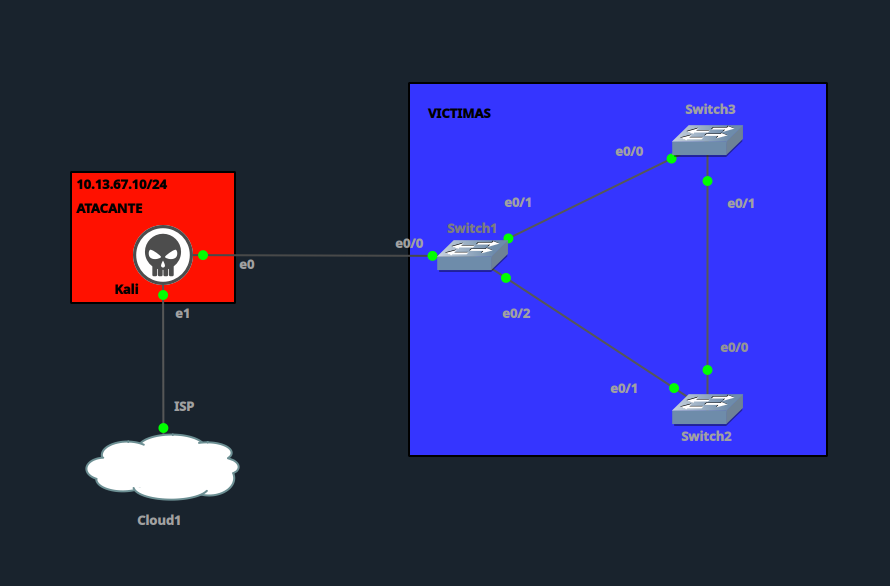

| Dispositivo | Rol | Dirección / Interfaz |
|---|---|---|
| Kali | Atacante | `10.13.67.10/24` — `e0` → Switch1 `e0/0`, `e1` → Cloud1 (ISP) |
| Switch1 | Switch de acceso / Root Bridge legítimo | `e0/0` (Kali), `e0/1` (Switch3), `e0/2` (Switch2) |
| Switch2 | Switch de distribución | `e0/1` (Switch1), `e0/0` (Switch3) |
| Switch3 | Switch de distribución | `e0/0` (Switch1), `e0/1` (Switch2) |
| Víctimas | Segmento VLAN 10 | `10.13.67.20/24` (NIC1) |

Los tres switches forman un **loop físico en triángulo** (Switch1–Switch2–Switch3), resuelto normalmente por STP mediante el bloqueo de un puerto redundante.

---

## 1. Configuración vulnerable inicial

VLAN 10 configurada en los tres switches, sin protecciones STP habilitadas (sin `bpduguard`, sin `guard root`), con prioridad por defecto (`32768`).

**Switch1**
```
hostname Switch1

vlan 10
 name LAN_VICTIMAS
exit

interface Ethernet0/0
 description Enlace hacia Kali (Atacante)
 switchport mode access
 switchport access vlan 10
exit

interface Ethernet0/1
 description Enlace hacia Switch3
 switchport trunk encapsulation dot1q
 switchport mode trunk
 switchport trunk allowed vlan 10
exit

interface Ethernet0/2
 description Enlace hacia Switch2
 switchport trunk encapsulation dot1q
 switchport mode trunk
 switchport trunk allowed vlan 10
exit

spanning-tree mode pvst
spanning-tree vlan 10 priority 32768
```

**Switch2**
```
hostname Switch2

vlan 10
 name LAN_VICTIMAS
exit

interface Ethernet0/1
 description Enlace hacia Switch1
 switchport trunk encapsulation dot1q
 switchport mode trunk
 switchport trunk allowed vlan 10
exit

interface Ethernet0/0
 description Enlace hacia Switch3
 switchport trunk encapsulation dot1q
 switchport mode trunk
 switchport trunk allowed vlan 10
exit

spanning-tree mode pvst
spanning-tree vlan 10 priority 32768
```

**Switch3**
```
hostname Switch3

vlan 10
 name LAN_VICTIMAS
exit

interface Ethernet0/0
 description Enlace hacia Switch1
 switchport trunk encapsulation dot1q
 switchport mode trunk
 switchport trunk allowed vlan 10
exit

interface Ethernet0/1
 description Enlace hacia Switch2
 switchport trunk encapsulation dot1q
 switchport mode trunk
 switchport trunk allowed vlan 10
exit

spanning-tree mode pvst
spanning-tree vlan 10 priority 32768
```

**Puntos vulnerables:**
- Misma prioridad STP por defecto (`32768`) en los tres switches.
- Puerto `Ethernet0/0` de Switch1 (hacia Kali) en modo `access`, sin `spanning-tree bpduguard`.
- Sin `spanning-tree guard root` en ningún puerto.
- Topología en loop, dependiente únicamente del cálculo estándar de STP para evitarlo.

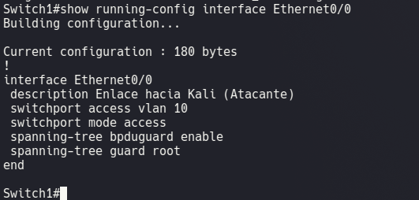

---

## 2. Línea base (estado ANTES del ataque)

**Switch1 — Root Bridge legítimo**

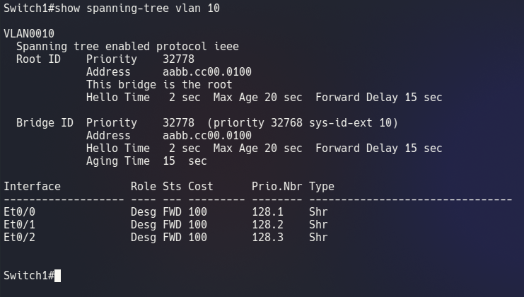

**Switch2 — reconoce a Switch1 como root**

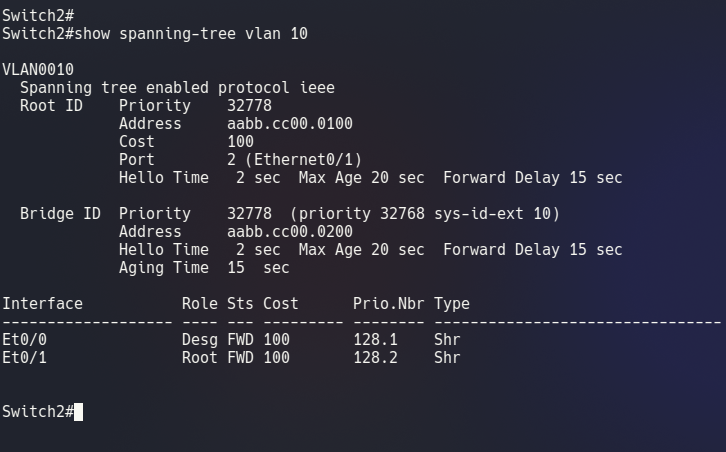

**Switch3 — puerto Et0/1 bloqueado (Altn BLK) por el loop**

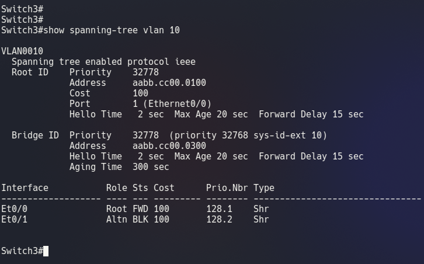

**Switch1 — detalle (contador de topology changes)**

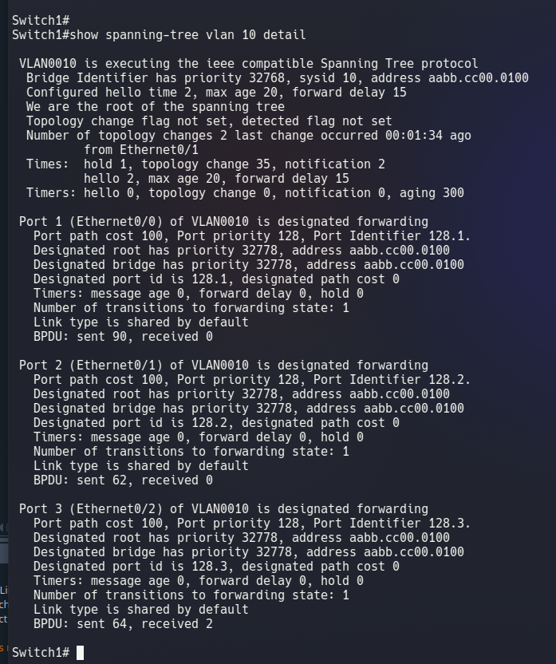

---

## 3. Ejecución del ataque desde Kali

Herramienta: `STP-Claim-Root.py`, interfaz `eth0`, prioridad de bridge falso `0` (la más baja posible), BPDUs infinitas cada 2.0s.

```bash
sudo python3 STP-Claim-Root.py
```

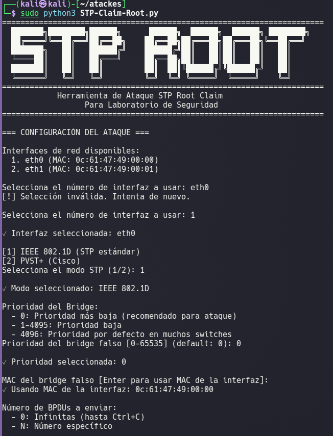
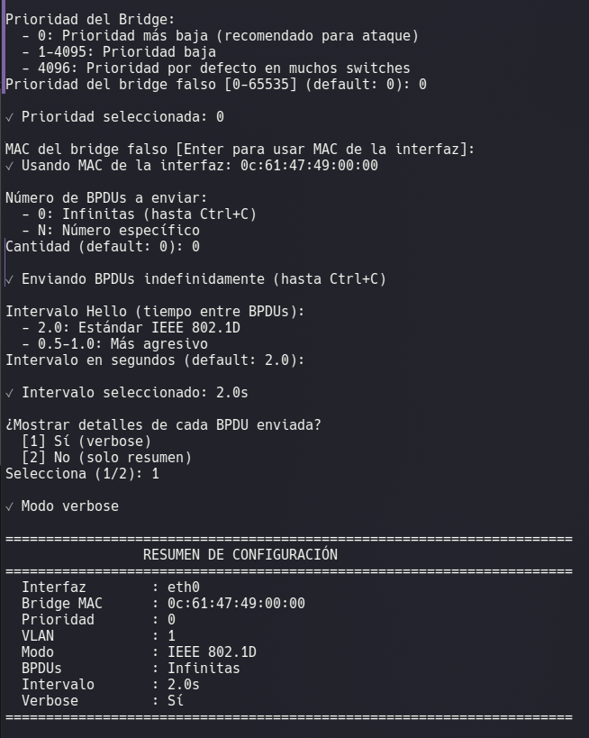
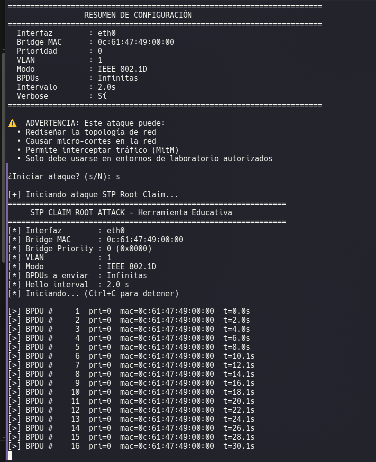

---

## 4. Verificación del ataque (comparación contra línea base)

**Switch1 — pierde el rol de Root Bridge; Et0/0 pasa a `Root`**

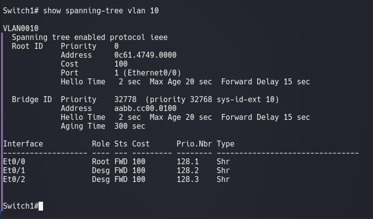

**Switch1 — detalle: 37 BPDUs recibidas en Et0/0**

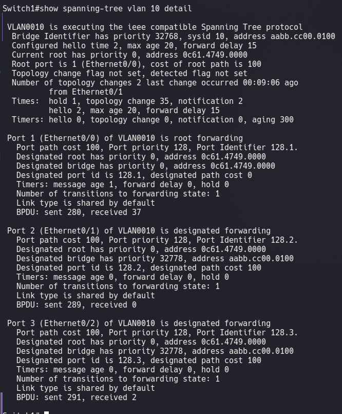

**Switch3 — reconoce a Kali como nuevo root**

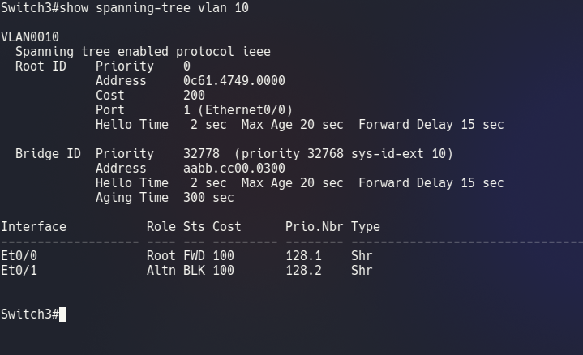

---

## 5. Mitigación

Aplicada en `Ethernet0/0` de Switch1 (puerto conectado al Kali):

```
interface Ethernet0/0
 spanning-tree bpduguard enable
 spanning-tree guard root
exit

spanning-tree vlan 10 priority 4096
```

| Comando | Función |
|---|---|
| `spanning-tree bpduguard enable` | Si el puerto recibe cualquier BPDU (algo anómalo en un puerto de acceso hacia un host final), lo apaga automáticamente (`err-disabled`). |
| `spanning-tree guard root` | Si el puerto recibe una BPDU "superior" (mejor prioridad) que amenace con desplazar al root legítimo, bloquea el puerto en estado `root-inconsistent` en vez de aceptar el cambio. |
| `spanning-tree vlan 10 priority 4096` | Refuerza a Switch1 como Root Bridge legítimo con una prioridad más baja (más competitiva) que el valor por defecto. |

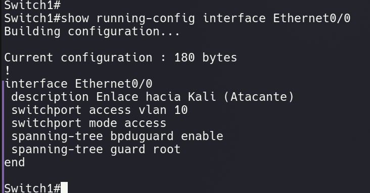

---

## 6. Reintento del ataque después de la mitigación

**Primer reintento (BPDUs generadas para VLAN 1 por error de configuración de la herramienta):** Switch1 mantiene su rol de root sin cambios.

**Log de Switch1 confirmando Root Guard habilitado:**

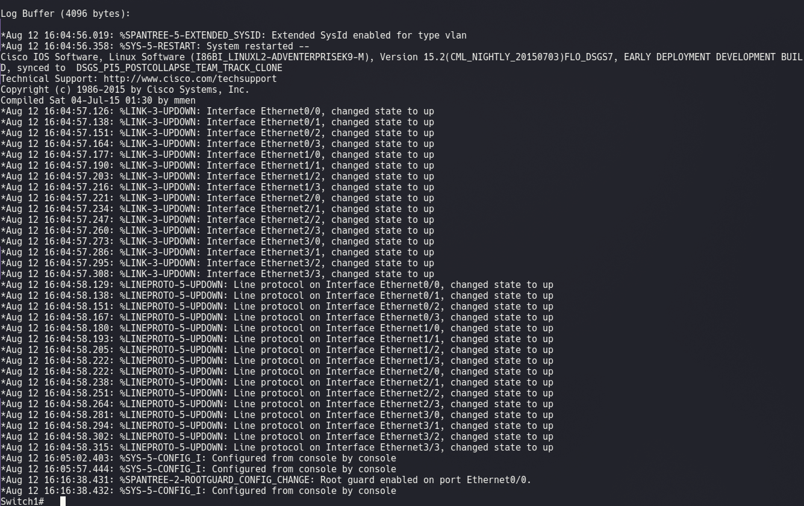

**Segundo reintento (corregido a VLAN 10, la VLAN protegida):**

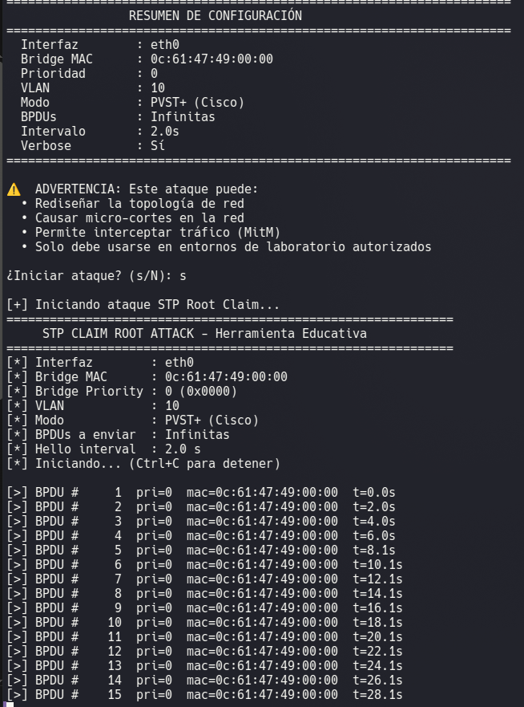

**Resultado en Switch1 — el rol de Root Bridge se mantiene intacto:**

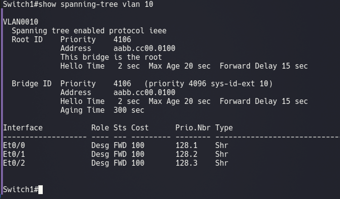

**Log de Switch1 tras el segundo intento:**

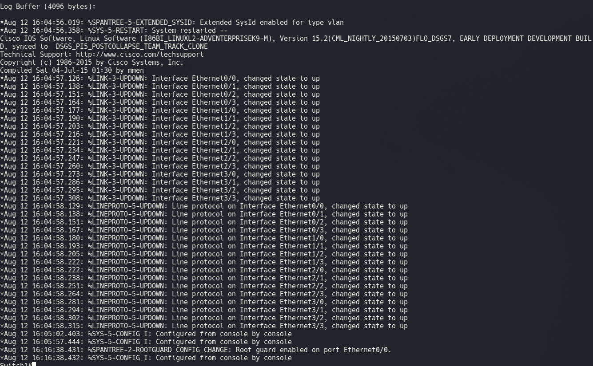

**Verificación adicional — 0 puertos inconsistentes, interfaz estable:**

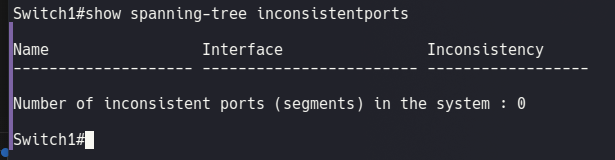
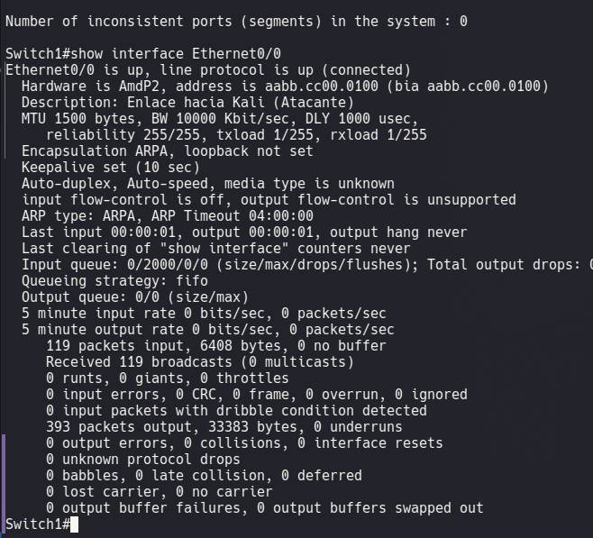

---

## 7. Verificación final post-mitigación

```
show spanning-tree vlan 10 detail
```

Confirma: `We are the root of the spanning tree`, `Bpdu guard is enabled`, `Root guard is enabled on the port`, y 64 BPDUs maliciosas recibidas y neutralizadas sin comprometer el rol de root.

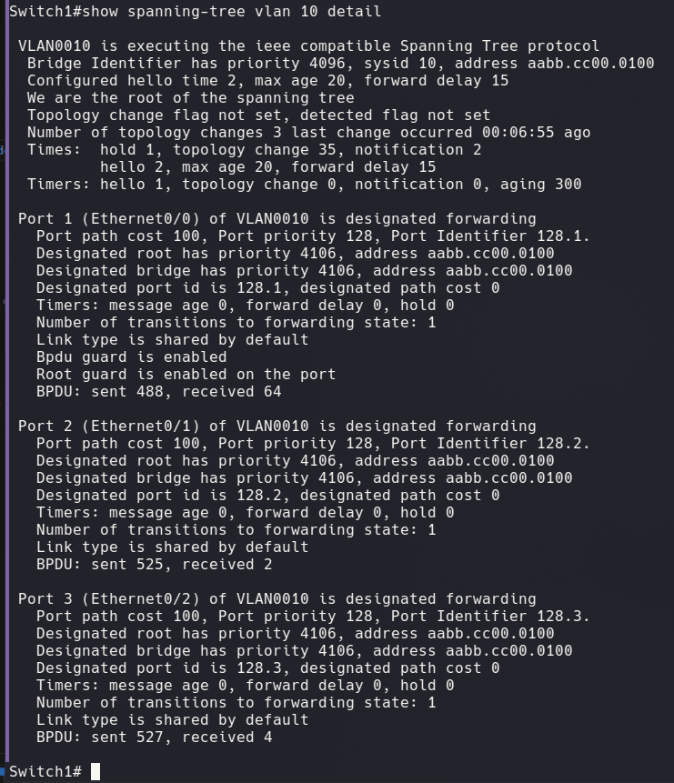

---

## Tabla comparativa: Antes / Durante el ataque / Después de la mitigación

| Métrica | Antes del ataque | Durante el ataque | Después de la mitigación |
|---|---|---|---|
| Root Bridge | Switch1 (`aabb.cc00.0100`) | **Kali** (`0c61.4749.0000`) | Switch1 (`aabb.cc00.0100`) |
| Root Priority | 32778 | **0** | 4106 |
| Rol de Et0/0 en Switch1 | Designado (Desg FWD) | **Root** (tomado por Kali) | Designado (Desg FWD) |
| "This bridge is the root" (Switch1) | Sí | **No** | Sí |
| BPDUs recibidas en Et0/0 | 0 | **37 y en aumento** | 64 (recibidas y neutralizadas) |
| Topology changes (Switch1) | 2 | 2 (puerto raíz ya alterado) | 3 (cambio controlado) |
| Estado de Et0/0 | up/up, connected | up/up, connected | up/up, connected — protegido |
| BPDU Guard | No configurado | No configurado | **Habilitado** |
| Root Guard | No configurado | No configurado | **Habilitado** |

---

## Conclusión

El **STP Claim Root Attack** demostró ser efectivo contra una topología sin protecciones de Spanning Tree: bastó con que Kali inyectara BPDUs con prioridad `0` para que Switch1 perdiera su rol de Root Bridge en segundos, redirigiendo el camino preferente del árbol STP hacia el atacante y dejando la red expuesta a interceptación de tráfico (MITM a nivel de capa 2) y a inestabilidad por recálculos constantes de topología.

La mitigación aplicada —combinación de **BPDU Guard**, **Root Guard** y refuerzo de **prioridad STP** en el puerto y switch legítimos— neutralizó el ataque de forma efectiva: aun con BPDUs maliciosas llegando de forma continua y dirigidas correctamente a la VLAN 10, Switch1 conservó su rol de Root Bridge en todo momento. Esto confirma que las protecciones de borde en los puertos de acceso hacia hosts finales son indispensables en cualquier topología Ethernet con Spanning Tree habilitado, especialmente en segmentos donde se conectan dispositivos no confiables.

---

## Estructura del repositorio

```
.
├── README.md
├── topologia.png
└── capturas/
    ├── 01_config_vulnerable_switch1.png
    ├── 02_baseline_switch1_stp.png
    ├── 03_baseline_switch2_stp.png
    ├── 04_baseline_switch3_stp.png
    ├── 05_baseline_switch1_stp_detail.png
    ├── 06_ataque_kali_config1.png
    ├── 07_ataque_kali_config2.png
    ├── 08_ataque_kali_ejecucion.png
    ├── 09_verificacion_switch1_stp_post_ataque.png
    ├── 10_verificacion_switch1_stp_detail_post_ataque.png
    ├── 11_verificacion_switch3_stp_post_ataque.png
    ├── 12_verificacion_inconsistentports.png
    ├── 13_verificacion_interface_et00_detalle.png
    ├── 14_log_rootguard_config_vlan1.png
    ├── 15_reintento_ataque_vlan10.png
    ├── 16_verificacion_switch1_stp_post_mitigacion.png
    ├── 17_log_switch1_post_mitigacion.png
    ├── 18_running_config_final_et00.png
    └── 19_verificacion_final_stp_detail.png
```
