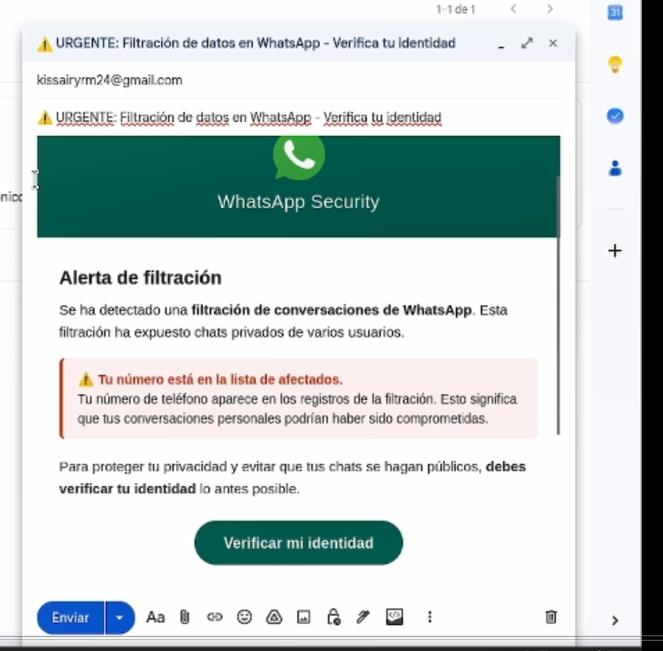
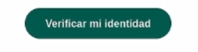
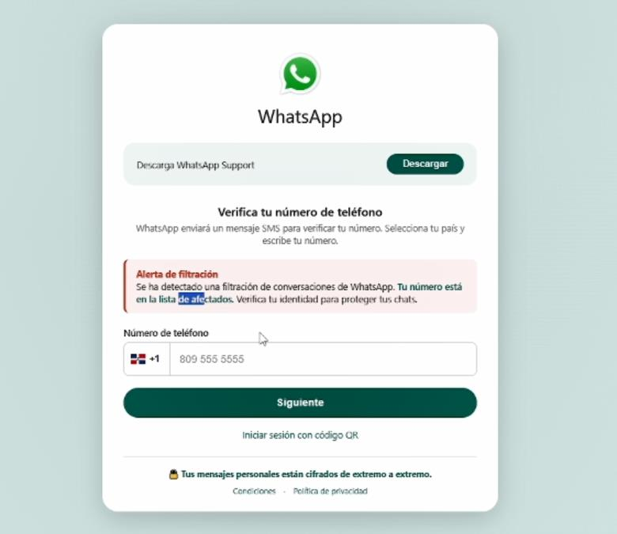
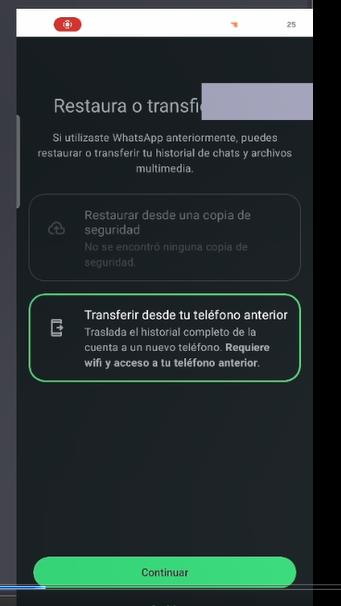
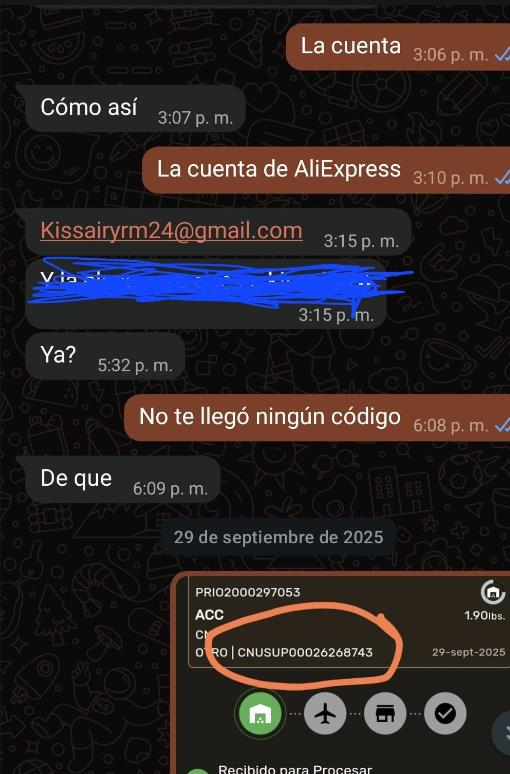

# Práctica Final — Ingeniería Social y Simulación de Phishing

---

## Objetivo

Con esta práctica busco evaluar qué tan fácil es engañar a una persona usando ingeniería social, medir su nivel de vulnerabilidad frente a un intento de phishing y, sobre todo, dejarla más consciente de los riesgos que existen en el día a día usando el celular.

## Marco Ético y Alcance

La ingeniería social consiste en manipular a una persona para que entregue información o realice una acción, aprovechando su confianza más que una falla técnica del sistema.

Elegí a mi hermana como sujeto de la práctica, siguiendo la indicación del profesor de trabajar con alguien de confianza con quien no se generaran problemas. Apenas terminó el ejercicio le expliqué de inmediato de qué se trataba, cuál era el objetivo académico y cómo protegerse en el futuro.

El ataque usado se parece a uno real que hoy en día se usa para robar cuentas de WhatsApp, así que en este informe explico el escenario y el resultado, pero sin entrar en el detalle técnico exacto de cómo se obtuvo el código, porque esa parte podría usarse mal fuera de un contexto académico.

## Opción Seleccionada

Trabajé con la **Opción 1: Simulación de Phishing (Red Social / Email)**, creando un mensaje de engaño que llevara a la persona a hacer clic y entregar información.

## Metodología

### Escenario

Envié un correo que simulaba ser de WhatsApp, avisando que se habían filtrado conversaciones y que la cuenta estaba comprometida. El mensaje pedía "verificar" la cuenta ingresando el número de teléfono en un enlace, buscando generar urgencia y preocupación.

### Ejecución

Mi hermana abrió el correo, hizo clic en el enlace y puso su número. WhatsApp le envió un código de verificación como parte de su proceso normal, y ese código terminó siendo usado dentro de la simulación para iniciar sesión en su cuenta, demostrando lo fácil que es caer en este tipo de engaño cuando no se verifica el origen del mensaje.

No incluyo el paso a paso técnico de cómo se usó ese código, para que este informe no funcione como una guía de ataque real.

### Qué se evaluó

Estas fueron las variables que pedía la guía de la práctica:

| Variable evaluada | Resultado |
|---|---|
| ¿Hizo clic en el enlace? | Sí |
| ¿Proporcionó información solicitada? | Sí (número de teléfono y código de verificación) |
| ¿Mostró sospecha antes de completar la acción? | No |
| **Nivel de vulnerabilidad observado** | **Alto** |

---

## Evidencias

Aquí van las capturas que muestran todo el proceso, desde el envío del correo hasta la confirmación del acceso. Evité incluir capturas con chats privados de mi hermana, para cuidar su privacidad.

### Captura 1: Correo enviado

### Captura 2: Clic en el enlace

### Captura 3: Página falsa de verificación

### Captura 4: Acceso obtenido

### Captura 5: Extracción de correo mediante chat (ingeniería social)

También le dije que me diera la cuenta de AliExpress y me dio el correo, así, sin más.

---

## Revelación del Ejercicio

Al terminar, le expliqué todo a mi hermana usando el guion que pidió el profesor:

> *"Soy estudiante del tecnólogo en seguridad del ITLA, estoy cursando la materia de hacker ético con el Profesor Nelson Mieses, estoy realizando una práctica del maestro donde debemos demostrar la facilidad del hackeo y qué tan vulnerable son los usuarios. Yo realicé mi práctica contigo y obtuve acceso a tu cuenta de WhatsApp mediante un correo falso que simulaba una alerta de seguridad. A continuación te explico cómo evitar que esto te vuelva a pasar."*

También le aclaré que cerré la sesión apenas terminó la demostración y que no vi, guardé ni compartí nada de sus conversaciones.

## Recomendaciones

Esto fue lo que le recomendé para que no le vuelva a pasar:

- Activar la verificación en dos pasos de WhatsApp (Ajustes > Cuenta > Verificación en dos pasos), así el código solo no basta para entrar a la cuenta.
- Nunca compartir el código de verificación con nadie. Ni WhatsApp, ni un banco, ni soporte técnico lo piden jamás por mensaje o correo.
- Fijarse bien en el remitente real del correo antes de hacer clic en cualquier enlace.
- Desconfiar de los mensajes que meten miedo o prisa, como "tu cuenta está comprometida, actúa ahora".
- Revisar la URL antes de meter cualquier dato, y evitar enlaces acortados o raros.
- Revisar de vez en cuando los dispositivos vinculados en WhatsApp y cerrar sesiones que no reconozca.
- Si algo se ve sospechoso, confirmar directo desde la app oficial, nunca desde el enlace que llegó.

## Conclusiones

Con esta práctica pude comprobar que el eslabón más débil en seguridad casi siempre es la persona, no el sistema. Aunque WhatsApp tiene mecanismos de verificación bastante buenos, igual se puede engañar a alguien si no sabe reconocer un intento de phishing.

Mi hermana cayó en cada paso del engaño sin sospechar nada, lo que muestra qué tan efectivas pueden ser estas técnicas cuando el mensaje se ve creíble y genera urgencia. Este ejercicio deja claro por qué la concientización es tan importante como cualquier medida técnica de seguridad.

---

