# Informe de laboratorios de seguridad web

**Plataforma:** PortSwigger Web Security Academy

---

## Introducción

Este informe presenta el trabajo realizado en cuatro laboratorios de la plataforma PortSwigger Web Security Academy, un espacio de práctica en línea pensado para aprender, de forma controlada y sin riesgo real, cómo funcionan algunas de las fallas de seguridad más comunes en aplicaciones web. Cada laboratorio propone un escenario distinto, y el reto consiste en encontrar la manera de aprovechar una debilidad puntual hasta lograr el objetivo marcado por el propio sitio.

A continuación se documenta el proceso seguido en cada caso: qué se buscaba, qué se encontró, cómo se llegó a la solución y la evidencia que demuestra que cada laboratorio quedó resuelto correctamente.

---

## Laboratorio 1: Funcionalidad de administrador sin protección

### ¿De qué se trataba?

El objetivo de este laboratorio era encontrar una sección de administración dentro de una tienda en línea que, en teoría, no debería estar al alcance de cualquier visitante. La idea era comprobar si era posible llegar hasta ahí sin necesidad de iniciar sesión ni tener permisos especiales.

### Qué se encontró

Muchos sitios web tienen un archivo llamado `robots.txt`, que normalmente se usa para indicarle a buscadores como Google qué páginas no deben mostrar en sus resultados. El problema es que, sin querer, ese mismo archivo puede terminar revelando la dirección exacta de páginas que se querían mantener ocultas. Al revisar ese archivo en la tienda del laboratorio, apareció una línea que señalaba la ruta del panel de administración.

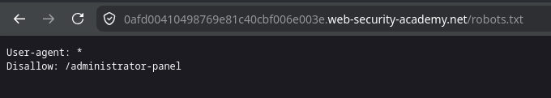

Al escribir esa dirección directamente en el navegador, la página cargó sin pedir usuario ni contraseña. Ahí apareció una lista de usuarios con la opción de eliminarlos, algo que claramente debería estar reservado solo para un administrador autenticado.

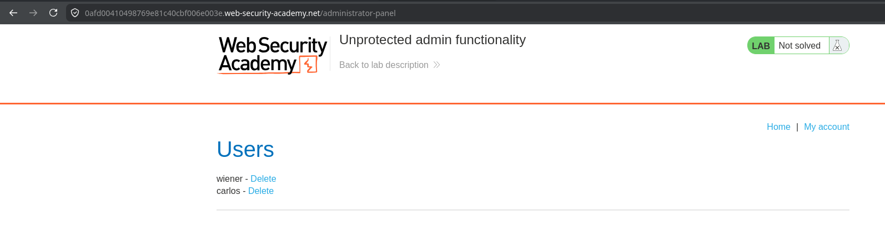

### Cómo se resolvió

Bastó con hacer clic en la opción para eliminar al usuario "carlos", algo que un atacante real podría hacer sin ninguna autorización. El sistema confirmó la eliminación y marcó el laboratorio como resuelto.

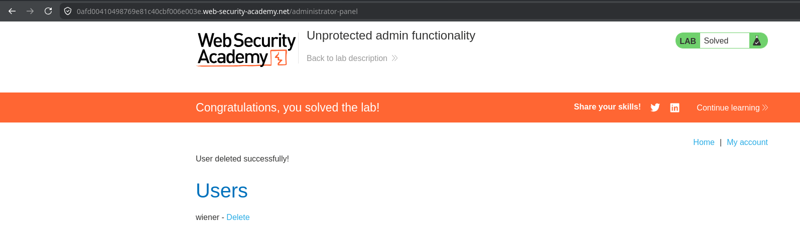

### Payload / técnica utilizada

```
1. Acceder a /robots.txt para descubrir la ruta oculta del panel admin.
2. Navegar directamente a esa ruta sin iniciar sesión.
3. Usar la función "Delete" sobre el usuario carlos.
```

### ¿Por qué pasa esto?

El problema de fondo es que la aplicación decidió "esconder" el panel de administración en vez de protegerlo de verdad. Ocultar una dirección no es lo mismo que restringir el acceso: si alguien la descubre, ya sea por el archivo `robots.txt`, por adivinarla o por cualquier otro medio, puede entrar sin ningún obstáculo. La forma correcta de evitarlo es que el propio servidor verifique, cada vez que alguien intenta entrar, si esa persona inició sesión y si además tiene permisos de administrador.

---

## Laboratorio 2: Averiguar nombres de usuario según la respuesta del sistema

### ¿De qué se trataba?

En este caso el reto era demostrar que, con solo fijarse en cómo responde un formulario de inicio de sesión, es posible descubrir qué nombres de usuario existen realmente en el sistema, aunque no se sepa la contraseña. Para trabajar con más comodidad se usó Burp Suite, una herramienta que permite ver e interceptar el tráfico que viaja entre el navegador y el servidor.

### Qué se encontró

Lo primero fue interceptar un intento normal de inicio de sesión para ver cómo viaja la información del usuario y la contraseña.

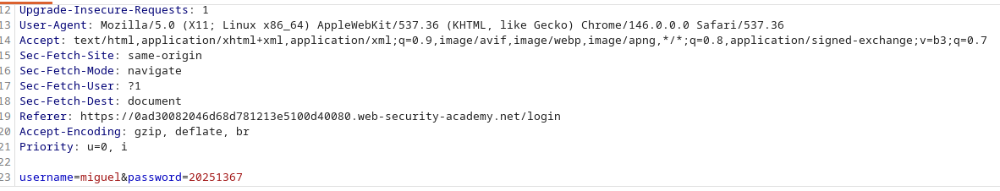

Después, en lugar de probar un solo nombre de usuario, se marcó esa parte de la petición para que Burp pudiera ir reemplazándola automáticamente por una lista larga de nombres posibles (más de cien), y se lanzó esa lista contra el formulario.

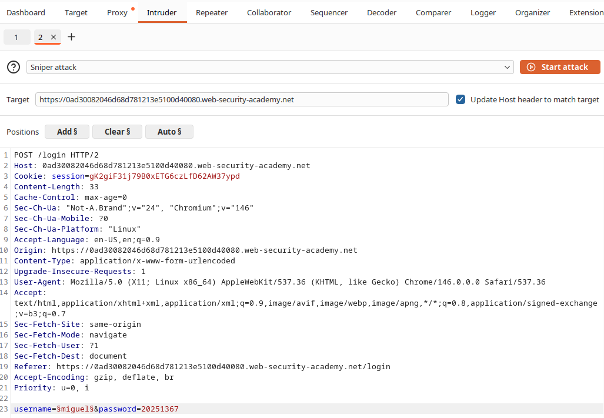

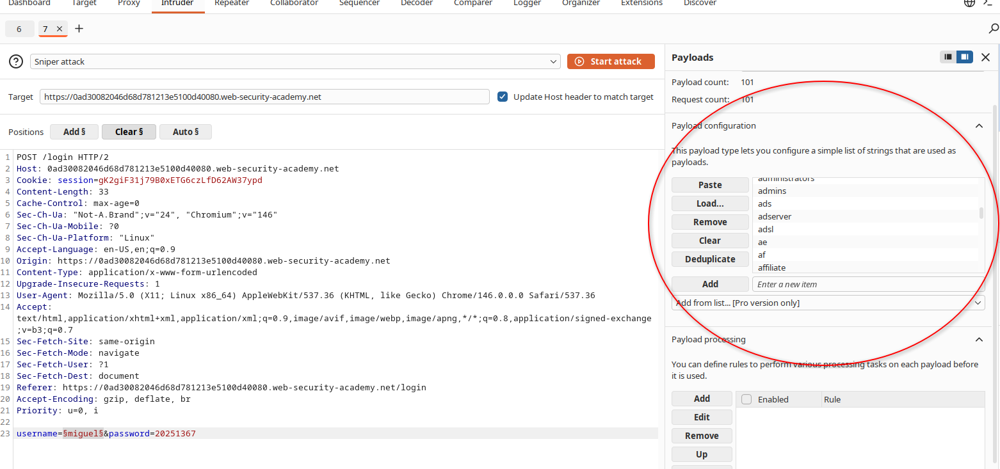

Al revisar los resultados, casi todas las respuestas del servidor tenían exactamente el mismo tamaño, lo que quería decir que el sistema respondía igual para cualquier nombre inventado. Sin embargo, hubo un caso puntual, el del usuario "apollo", cuya respuesta fue un poco más larga que las demás. Esa pequeña diferencia delató que ese nombre sí existía de verdad.


### Encontrando la contraseña

Una vez confirmado que "apollo" era un usuario real, se repitió la misma idea, pero esta vez dejando fijo ese nombre de usuario y probando, una por una, una lista de contraseñas comunes. De nuevo, casi todos los intentos dieron la misma respuesta (un error), salvo uno: la contraseña "starwars", que devolvió un código distinto (302, que normalmente indica una redirección, es decir, que el sistema sí dejó pasar al usuario).


### Cómo se resolvió

Con esas dos piezas de información, usuario "apollo" y contraseña "starwars", se inició sesión de forma manual en el sitio y el acceso fue exitoso, quedando el laboratorio marcado como resuelto.

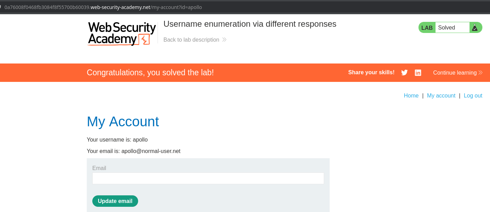

### Payload / técnica utilizada

```
1. Interceptar el login con Burp Suite (Proxy → Intercept).
2. Enviar la petición a Intruder y marcar el parámetro "username".
3. Cargar la lista de usuarios candidatos y lanzar el ataque (Sniper attack).
4. Ordenar por "Length" para detectar la respuesta distinta → usuario: apollo
5. Repetir el proceso marcando el parámetro "password" con el usuario fijo.
6. Buscar el "Status code" distinto (302) → contraseña: starwars
7. Iniciar sesión manualmente con apollo / starwars.
```

### ¿Por qué pasa esto?

El problema aquí es que el sistema le da a un atacante pistas distintas según si el nombre de usuario existe o no. Lo correcto sería que el mensaje de error fuera siempre exactamente igual (mismo texto, mismo tamaño de respuesta, mismo tiempo de respuesta) sin importar si el usuario es real o inventado.

---

## Laboratorio 3: Ejecutar comandos en el servidor a través de un campo vulnerable

### ¿De qué se trataba?

Este laboratorio buscaba demostrar qué pasa cuando una aplicación toma algo que escribe el usuario y lo usa, sin revisarlo, para construir una orden que se ejecuta directamente en el sistema operativo del servidor. La tienda del laboratorio tenía una función para consultar el estado del inventario de un producto.


### Qué se encontró

Al interceptar con Burp Suite la petición que se genera al consultar el inventario, se vio que viajan dos datos: el identificador del producto y el identificador de la tienda.

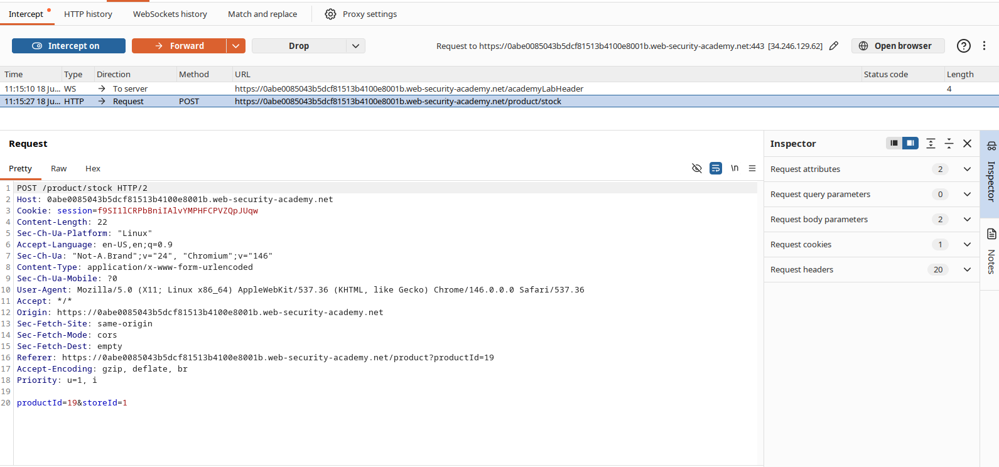

El identificador de la tienda (`storeId`) parecía estarse usando directamente dentro de un comando del sistema. Para comprobarlo, se le agregó al final el texto `|whoami`, un símbolo que en Linux permite encadenar un segundo comando después del primero.

### Cómo se resolvió

Al enviar la petición modificada, la respuesta del servidor incluyó el nombre de un usuario del sistema en vez de un simple número de inventario, lo que confirmó que el comando adicional se había ejecutado sin ningún tipo de bloqueo.

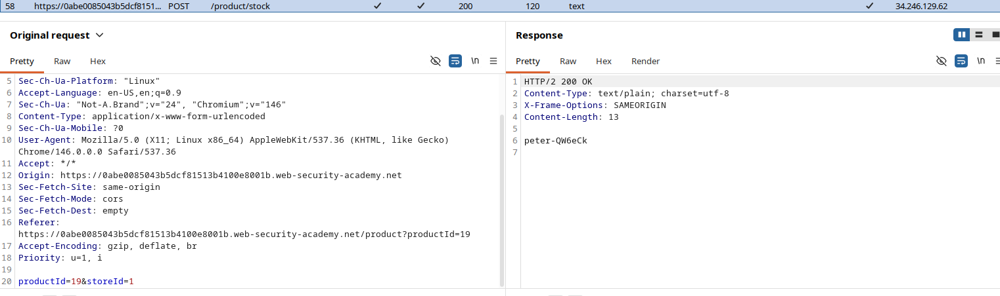


### Payload / técnica utilizada

```
POST /product/stock
productId=1&storeId=1|whoami
```

### ¿Por qué pasa esto?

El problema es que la aplicación toma lo que escribe el usuario y lo pega, sin revisarlo, dentro de un comando real del sistema operativo. La forma de evitarlo es no construir comandos de esa manera, o en su defecto, validar muy estrictamente qué caracteres se permiten en ese campo.

---

## Laboratorio 4: Ejecutar código en el navegador a través de una búsqueda (XSS reflejado)

### ¿De qué se trataba?

El último laboratorio buscaba comprobar qué ocurre cuando una página web toma el texto que alguien escribe, por ejemplo en un buscador, y lo muestra de vuelta en la respuesta sin revisar si ese texto contiene código.

### Cómo se resolvió

En la barra de búsqueda del blog del laboratorio se escribió el siguiente texto:

```html
<script>alert(1)</script>
```

Al buscar, la página devolvió ese mismo texto dentro de su contenido, y como no fue tratado como simple texto sino como código real, el navegador lo interpretó y ejecutó, mostrando una ventana emergente con el número 1.

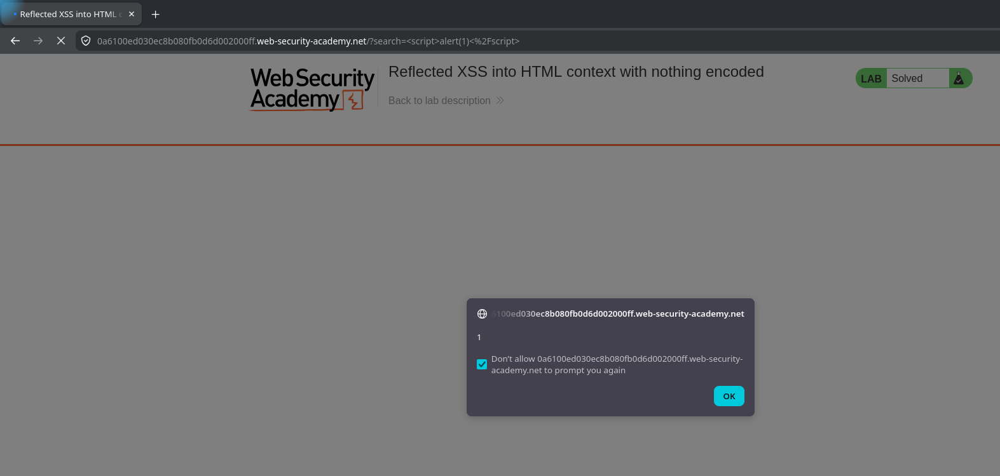

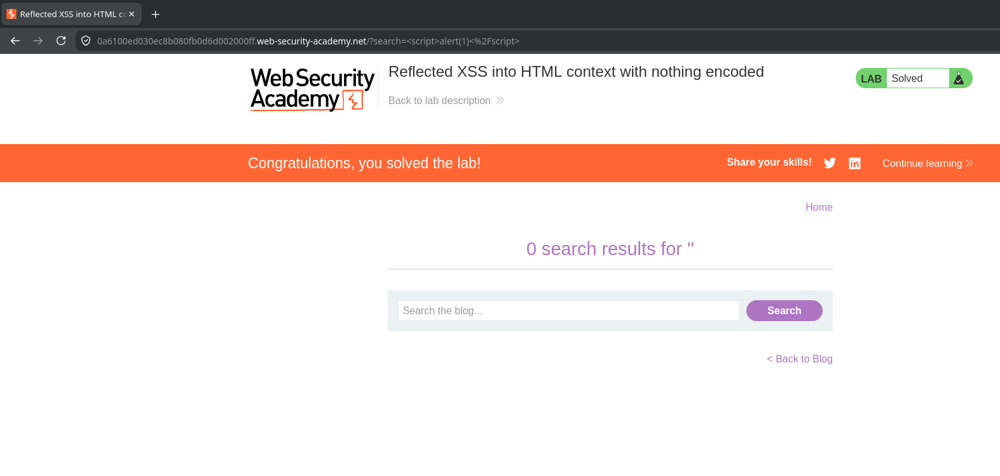

### Payload / técnica utilizada

```html
<script>alert(1)</script>
```

### ¿Por qué pasa esto?

El problema es que la página repite tal cual, dentro del código HTML de la respuesta, lo que la persona escribió en la búsqueda. Si ese texto no se "limpia" antes de mostrarlo, cualquier código que alguien incluya se ejecuta como si fuera parte legítima de la página. Esto se soluciona convirtiendo los caracteres especiales, como `<` y `>`, en su versión de texto plano antes de mostrarlos.

---

## Conclusión

Los cuatro laboratorios, aunque muy distintos entre sí, comparten una misma idea de fondo: en todos los casos la aplicación confió en algo que no debía. En el primero, confió en que nadie encontraría una dirección "escondida". En el segundo, confió en que las diferencias en sus propios mensajes de error no dirían nada útil. En el tercero, confió en que nadie manipularía un dato antes de usarlo en un comando del sistema. Y en el cuarto, confió en que el texto ingresado por un usuario nunca contendría código.

En los cuatro casos la solución pasa por lo mismo: no confiar nunca en lo que llega desde afuera sin antes revisarlo, validarlo o filtrarlo, y proteger cada función sensible con controles reales de autenticación y autorización, y no solamente con la esperanza de que nadie la encuentre.
